# Modern Skill Evaluation and Evolution

## A framework selection guide for models, agent harnesses, and reusable skills

**Final report - 2026-08-29** · **Author:** Guillermo Villarroel
**Primary question:** How can we prove that a versioned skill improved an agent on unseen work without confusing that effect with model, harness, environment, or grader changes?

> The modern unit of progress is not a leaderboard score. It is a controlled,
> reproducible promotion decision backed by task outcomes, trajectories, artifacts,
> uncertainty, and an untouched holdout.


*Conceptual orientation. Immutable traces accumulate into persistent knowledge;
knowledge proposes a versioned skill; an independent evaluation gate either promotes
the candidate or returns its outcome to the evidence base.*

## Executive decision

For open and reproducible evaluation of complete skill directories, the strongest
default is:

1. **Harbor** for isolated task execution, skill provenance, trial artifacts, and
   evaluation-guided candidate search.
2. **Executable task checks plus calibrated semantic review** for scoring.
3. **Disjoint discovery, development, validation, and holdout cohorts** for controlling
   adaptive overfitting.
4. **MLflow or Langfuse** when long-lived experiment tracking, production traces, and
   feedback are required.
5. **An independent promotion gate** that can reject a candidate even when its mean
   reward, cost, or token count improves.

Use **Inspect AI** instead of Harbor when custom evaluation programs, solver
composition, safety controls, rescoring, or heterogeneous sandbox backends matter more
than first-class `SKILL.md` handling. Use **Promptfoo** for provider matrices, CI
assertions, and red teaming; **DeepEval** for Python test ergonomics and agent-path
metrics; **Ragas** for retrieval-centered systems; and **Pydantic Evals** for typed
Python functions and span assertions.

No single product is the complete system. A credible skill-evolution program combines
an execution layer, an evidence layer, and a promotion layer.

## 1. Define the treatment before choosing a framework

Four objects are often called a "harness," but they answer different questions.



*Figure 1. The word rails keep the artifact, its definition, and its causal question on
one line. This prevents the overloaded word "harness" from hiding what changed.*

[D3 authoring source](assets/modern-skill-evaluation/definition-rails.html)

**Text equivalent:** the model is the weights or fixed API plus decoding and context
limits; the agent harness is the loop, tools, memory, parser, recovery, and context
policy; the skill is the versioned instructions, scripts, references, and assets; and
the evaluation harness is the tasks, runner, environments, graders, logs, and
aggregation. Their respective questions are whether model capability, orchestration,
or procedural knowledge changed, and whether the comparison was measured reliably.

In a skill evaluation, the **skill is the declared treatment**. The model, agent
harness, task version, resource policy, and graders must be frozen or their changes must
be modeled explicitly. A run that changes all four objects can describe a product
snapshot, but it cannot attribute causality to the skill.

The complete skill directory must receive an immutable identity. Digest only the
`SKILL.md` file and an optimizer can silently change a helper script, reference, or
asset without changing the recorded treatment.

## 2. How evaluation reached the skill era

The history is cumulative. Each stage retained earlier controls and added a new unit of
observation.


*Figure 2. The unit of evaluation expanded from an answer, to a trajectory, to a changed
world, and finally to a versioned treatment that can be evolved.*

[Animated SVG](assets/modern-skill-evaluation/evaluation-evolution.animated.svg) | [Mermaid source](assets/modern-skill-evaluation/evaluation-evolution.mmd)

### 2.1 Static benchmarks established comparability

A frozen test set and metric made systems comparable, but usually observed only a
final answer. Experiment trackers such as [MLflow](https://github.com/mlflow/mlflow)
made configurations, runs, datasets, and artifacts durable. That provenance remains
foundational.

### 2.2 Holistic evaluation replaced one score with a profile

[HELM](https://arxiv.org/abs/2211.09110) standardized scenarios, exposed raw model
outputs, and evaluated several qualities rather than treating accuracy as sufficient.
The result was a measurement profile: capability alongside robustness, calibration,
fairness, efficiency, and other constraints.

### 2.3 Evals as code made evaluation part of delivery

[OpenAI Evals](https://github.com/openai/evals) helped normalize versioned datasets,
programmable graders, and model-graded checks. These systems are excellent when the
natural unit is a response. They do not automatically create a realistic terminal,
repository, browser, or other stateful world.

### 2.4 Agent benchmarks made trajectories observable

[AgentBench](https://arxiv.org/abs/2308.03688) evaluated agents in interactive
environments. [SWE-bench](https://arxiv.org/abs/2310.06770) connected natural-language
issues to real repositories and executable tests. The agent now had to inspect state,
select tools, modify artifacts, and survive a multi-step loop.

### 2.5 Isolated task worlds made complete work verifiable

[Terminal-Bench 2.0](https://arxiv.org/abs/2601.11868) packages realistic terminal
tasks with task-specific environments and tests. [Harbor](https://www.harborframework.com/docs)
generalizes this style of execution into an agent and model evaluation framework. The
environment becomes part of the experimental boundary, not background plumbing.

This distinction is measurable. Anthropic reported a six-percentage-point spread
between its least- and most-resourced Terminal-Bench 2.0 configurations, with
`p < 0.01`. Small leaderboard gaps can therefore be infrastructure effects rather than
agent improvements. See [Quantifying infrastructure noise in agentic coding evals](https://www.anthropic.com/engineering/infrastructure-noise).

### 2.6 Trace-guided optimizers turned failures into candidates

[DSPy](https://arxiv.org/abs/2310.03714) treats LM programs as optimizable artifacts.
[GEPA](https://arxiv.org/abs/2507.19457) reflects on execution evidence, proposes
textual changes, and keeps complementary candidates on a Pareto frontier.
[Trace2Skill](https://arxiv.org/abs/2603.25158) distills trajectory-local lessons into
transferable skill directories.

An optimizer does not reduce the need for evaluation. It increases it. Repeatedly
searching against visible feedback creates selection bias, which is why the final
promotion evidence must come from a sealed cohort that the optimizer did not inspect.

### 2.7 Persistent knowledge turned discarded trials into cumulative evidence

[WikiSkill](https://arxiv.org/abs/2608.27454), a Google Research and Virginia Tech
preprint submitted on 2026-08-27, adds a durable learning layer between execution traces
and executable skills. Its workspace separates an immutable **Raw Layer**, a persistent
**Wiki Layer**, and a gated **Skills Layer**. A Wiki Maintainer consolidates failure
patterns, successful strategies, proposal history, and validation outcomes. A Skill
Proposer uses that accumulated knowledge plus recent traces to produce candidates.
Validation can roll a skill back, but it does not roll the wiki back.


*Figure 3. WikiSkill makes accumulated knowledge a separately governed artifact. The
inference agent receives active skills during training but cannot read the wiki; the
optimizer can learn from both accepted and rejected proposals.*
[Animated SVG](assets/modern-skill-evaluation/wikiskill-loop.animated.svg) | [Mermaid source](assets/modern-skill-evaluation/wikiskill-loop.mmd)

The separation is empirically consequential within the paper's protocol. In a
four-benchmark Gemini-3.5-Flash ablation, giving the Skill Proposer wiki access while
withholding it from the Inference Agent raised the reported average from **48.7% to
63.7%**. Giving the Inference Agent wiki access during training reduced that result to
**60.9%**. The paper also reports that evolved skills can transfer across models and
sometimes outperform self-evolved skills. This distinguishes the ability to **discover
procedural knowledge** from the ability to **execute it**.

WikiSkill should currently be treated as a research design, not a drop-in open-source
evaluation framework. The study directly injects active skills, so it does not evaluate
skill retrieval or triggering; validation accepts only immediately improving proposals;
the wiki has no automated pruning mechanism; and the arXiv record does not link a public
implementation or code license as of this report.

## 3. The architecture of a modern skill evaluation



*Figure 4. One declared treatment enters a frozen comparison boundary. Execution
evidence is scored, paired, and gated before an independent promotion decision.*

[Animated SVG](assets/modern-skill-evaluation/evaluation-system.animated.svg) | [Mermaid source](assets/modern-skill-evaluation/evaluation-system.mmd)

A credible system has ten pillars.

1. **One declared treatment.** Vary the skill while freezing the model, agent harness,
   task version, environment, resources, and graders.
2. **Realistic isolated tasks.** Evaluate the work the skill is intended to improve.
   Repository skills need repositories and tests; browser skills need browser state;
   RAG skills need a controlled evidence corpus.
3. **Immutable identity.** Digest the complete skill bundle, task, image, verifier,
   dataset manifest, model settings, and harness commit.
4. **Layered scoring.** Prefer deterministic checks for observable outcomes. Add model
   or human judgment only where correctness cannot be encoded completely.
5. **Disjoint data roles.** Separate discovery, development, validation, and holdout.
   Once inspected, a holdout becomes development data for the next generation.
6. **Trajectory evidence.** Preserve messages, tool calls, state transitions, produced
   artifacts, verifier output, time, tokens, and cost.
7. **Hard gates plus tradeoffs.** Correctness, safety, and semantic quality are gates.
   Cost, latency, and token use can be Pareto objectives.
8. **Uncertainty and pairing.** Pair baseline and candidate on the same tasks and seeds
   when possible. Use repeated runs or paired resampling when stochasticity matters.
9. **Failure taxonomy.** Separate semantic failure from provider, infrastructure,
   evaluator, authentication, and environment failure. Never retry meaning until it
   passes and then count only the success.
10. **Independent promotion.** Keep the mutator, executor, evaluator, selector, and
    release authority conceptually separate.

The [Reusable Holdout](https://arxiv.org/abs/1506.02629) formalizes the broader problem:
adaptive reuse of evaluation data can overfit the evaluation itself. Agent and skill
optimizers make this risk operational rather than theoretical.

WikiSkill sharpens the evidence pillar: immutable traces, accumulated learning memory,
and the executable skill should have independent identities. Only the skill is the
test-time treatment. The wiki is optimizer state whose contents and access policy must
be recorded so that a gain is not misattributed to hidden execution context.

## 4. Framework capability landscape


*Figure 5. D3-generated ordinal capability map. `N` means native or first-class,
`S` means strong documented support, `A` means an adapter or manual convention, and
`-` means outside the framework's center of gravity. The figure is not a quality score
and row totals are intentionally meaningless.*
[D3 authoring source](assets/modern-skill-evaluation/capability-landscape.html)

### 4.1 Task runners

| Framework | Native center of gravity | Skill-evaluation advantage | Critical caveat |
| --- | --- | --- | --- |
| [Harbor](https://github.com/harbor-framework/harbor) | Containerized agent/model trials, task verifiers, artifacts, and optimization | A local or Git skill directory is a first-class input; source, digest, and resolved commit can be locked | Provenance does not create correct dataset splits or an independent promotion policy |
| [Inspect AI](https://inspect.aisi.org.uk/) | Python evaluation programs, solvers, scorers, logs, limits, and multiple sandbox backends | Strong control over custom agents, safety studies, rescoring, and heterogeneous execution | A skill bundle is an experiment convention or adapter rather than the native unit |

**Decision:** choose Harbor when the object being evolved is a complete skill directory
and tasks change a stateful world. Choose Inspect AI when evaluation-program
flexibility, safety controls, or sandbox diversity is the primary requirement.

### 4.2 Evaluation libraries

| Framework | Best fit | Evidence and scoring | Skill-evolution limit |
| --- | --- | --- | --- |
| [Promptfoo](https://github.com/promptfoo/promptfoo) | Prompt/provider matrices, CI assertions, and red teaming | Declarative assertions, custom code, model graders, latency, and cost | Provider runtime is not a general isolated task world |
| [OpenAI Evals](https://github.com/openai/evals) | Response datasets and custom graders | Exact, custom, and model-graded evaluation | No general skill bundle or agent sandbox in the OSS runner |
| [DeepEval](https://github.com/confident-ai/deepeval) | Python and pytest workflows, including agent-path evaluation | Task metrics, tool/sub-agent behavior, custom DAGs, and model judges | Prompt optimization is not a generic population search over complete skill directories |
| [Ragas](https://github.com/vibrantlabsai/ragas) | Retrieval, RAG, and context quality | Retrieval/generation metrics plus message and tool evaluation | Pair with a task runner when the agent changes external state |
| [Pydantic Evals](https://ai.pydantic.dev/evals/) | Typed Python applications | Typed evaluators and OpenTelemetry span assertions | Function runtime is not an isolated task-world abstraction |

### 4.3 Lifecycle and observability platforms

| Framework | Best fit | What it adds | What it does not replace |
| --- | --- | --- | --- |
| [MLflow](https://github.com/mlflow/mlflow) | Broad experiment and model lifecycle | Runs, datasets, artifacts, traces, scorers, registry, and production feedback | A clean terminal or browser task world |
| [Langfuse](https://github.com/langfuse/langfuse) | Self-hosted or managed LLM observability | Traces, datasets, experiments, scores, and user feedback | First-class skill locking and holdout governance |
| [Phoenix](https://github.com/Arize-ai/phoenix) | OpenInference/OpenTelemetry tracing and evaluation | Spans, datasets, code/model/human evaluation | OSI-open licensing and isolated task execution |
| [LangSmith](https://docs.langchain.com/langsmith/evaluation) | Managed LangChain-centered evaluation | Datasets, trajectories, pairwise evaluators, online traces, and feedback | An open-source, portable task runner |

These platforms complement Harbor or Inspect AI. They answer how experiments and
production behavior are stored, compared, and monitored; they do not automatically
prove that a candidate skill caused a result.

### 4.4 License and community snapshot

GitHub stars are a rough adoption signal, not evidence of evaluation validity. Counts
below are a dated snapshot from the GitHub API on **2026-08-29**.

| Framework | License posture | GitHub stars | Operational implication |
| --- | --- | ---: | --- |
| Harbor | Apache-2.0 | 4,765 | Open task runner and optimization substrate |
| Inspect AI | MIT | 2,661 | Open Python research and evaluation runtime |
| Promptfoo | MIT | 24,664 | Large JS/TS and CI-oriented community |
| OpenAI Evals repository | MIT code; individual datasets retain their own terms | 19,307 | OSS runner is distinct from proprietary hosted services |
| DeepEval | Apache-2.0 | 17,953 | Python/pytest evaluation ecosystem |
| Ragas | Apache-2.0 | 15,541 | Retrieval and RAG-centered ecosystem |
| Pydantic AI repository | MIT | 19,578 | Count covers the wider repository, including Pydantic Evals |
| MLflow | Apache-2.0 | 27,728 | Broad lifecycle and observability platform |
| Langfuse | MIT core; enterprise directories have separate terms | 33,908 | Open core with self-hosting and managed options |
| Phoenix | Elastic License 2.0 | 11,243 | Source available, but not OSI open source; managed-service restrictions apply |
| LangSmith | Proprietary | Not comparable | Managed service and LangChain integration |

"Public on GitHub" is not a license. Without an explicit license, default copyright
applies. Review the [Open Source Definition](https://opensource.org/osd) and the exact
license file before adopting, modifying, or redistributing any framework.

### 4.5 Evolution methods are not evaluation frameworks

| Method | Distinctive evolution state | Evaluation it still requires | Adoption posture |
| --- | --- | --- | --- |
| [GEPA](https://arxiv.org/abs/2507.19457) | Reflective textual proposals plus a Pareto frontier | A task runner, case-level feedback, disjoint validation, and a sealed holdout | Available through open DSPy tooling; integrate with the task world that matches the skill |
| [Trace2Skill](https://arxiv.org/abs/2603.25158) | Trajectory-local lessons consolidated into transferable skill directories | Independent execution and promotion evidence beyond the traces used to distill | Research method; verify the implementation and license selected for use |
| [WikiSkill](https://arxiv.org/abs/2608.27454) | Immutable raw traces, a persistent wiki, proposal impact history, and gated skills | Real task worlds, calibrated graders, holdout governance, and skill retrieval evaluation | Public preprint; no implementation or code license is linked from the arXiv record as of 2026-08-29 |

The distinction matters: an optimizer proposes or selects treatments; it does not prove
that they generalize. WikiSkill can sit above Harbor or Inspect AI, with MLflow or
Langfuse preserving lifecycle evidence, but the evaluator and promotion authority must
remain independently specified.

## 5. Select from the artifact that must be correct


*Figure 6. Start with the artifact that must be correct, not with a vendor feature
list. An evolving skill requires response, trajectory, and changed-world evidence.*

[Animated SVG](assets/modern-skill-evaluation/selection-guide.animated.svg) | [Mermaid source](assets/modern-skill-evaluation/selection-guide.mmd)

Use these six factors to select or compose the stack.

### 5.1 Treatment boundary

- Can the framework identify the complete skill directory by digest and source commit?
- Can it keep the model and harness constant while injecting baseline and candidate?
- Can it preserve parent-child lineage across generations?

### 5.2 World fidelity

- Is the task answer-only, function-level, terminal-based, repository-based,
  browser-based, or multi-agent?
- Can CPU, RAM, time, network, images, credentials, and external services be pinned?
- Does the final verifier inspect the changed world rather than trusting the agent's
  final message?

### 5.3 Grader strength

- Are executable checks available for outcomes that can be observed directly?
- Does semantic review cite the evidence it used?
- Has any model judge been calibrated against blinded human review?
- Can old logs be rescored when the rubric changes?

### 5.4 Evidence and statistics

- Are trajectories, artifacts, verifier output, errors, time, tokens, and cost retained?
- Are baseline and candidate paired by task and seed?
- Are counts, effect sizes or intervals, and worst-domain cells reported?
- Are missing trials and infrastructure failures visible rather than silently dropped?

### 5.5 Optimization and governance

- Is the search budget fixed before results are known?
- Are discovery, development, validation, and holdout identities disjoint?
- Can a hard gate reject a lower-cost or higher-mean candidate?
- Is holdout release one-way and promotion independently reviewed?

### 5.6 Deployment, license, and ecosystem

- Can the system run locally, air-gapped, in CI, or in the required cloud?
- Is the license compatible with internal modification, redistribution, and hosted use?
- Does the community maintain adapters for the models, sandboxes, and telemetry stack
  already in use?
- What is the exit strategy for datasets, traces, scorers, and candidate bundles?

## 6. Promotion protocol for evolving a skill


*Figure 7. Visible feedback is restricted to development. Validation filters finalists;
the sealed holdout decides whether a candidate may replace the baseline.*

[Animated SVG](assets/modern-skill-evaluation/promotion-loop.animated.svg) | [Mermaid source](assets/modern-skill-evaluation/promotion-loop.mmd)

### Stage 1: Freeze the study

Record task manifests, split membership, model and decoding, harness commit, container
digests, resource policy, verifier and rubric digests, baseline skill digest, retry
policy, budgets, and promotion rules before evaluating a candidate.

### Stage 2: Discover representative failures

Run the frozen baseline. Preserve case-level rewards, trajectories, produced artifacts,
verifier diagnostics, and failure classes. Discovery evidence identifies mutation
hypotheses; it does not establish generalization.

### Stage 3: Search within a fixed budget

Generate candidates with GEPA, trace distillation, Pareto search, operator coevolution,
or human review. The optimizer may inspect only the cohorts assigned to development.
Keep every candidate's complete bundle and parent lineage.

### Stage 4: Validate hard constraints

Use validation to reject unsafe, semantically weak, or domain-regressing candidates.
Do not compensate for a critical regression with an unrelated gain in cost or mean
reward.

### Stage 5: Release the sealed holdout once

Compare the finalist with the frozen baseline on identical unseen tasks. Pair runs when
possible, report uncertainty, and show every task cell. After release, retire that
holdout from future promotion claims.

### Stage 6: Promote independently

Promotion should require all hard gates, no prohibited subgroup regression, acceptable
uncertainty, valid lineage, and reviewer approval. The new winner becomes the next
frozen baseline; rejected candidates remain useful evidence.

## 7. Lessons from the local Harbor evolution program

The local work is valuable because it records non-promotions rather than presenting
only winners.

The frozen [Skill Arena Harbor comparison](https://github.com/mvk-001/skill-arena/blob/main/evaluations/harbor-evolution-comparison/results/20260716/report.md)
contains **24 Harbor jobs and 78 trials** across development and holdout, with no
recorded errors or retries. Trace distillation and reflective Pareto search tied for the
strongest selected holdout mean. That is evidence for those tasks and budgets, not a
universal ranking of optimizers.

The [Knowledge skill-evolution index](https://github.com/gvillarroel/knowledge/blob/main/evaluations/SKILL-EXPLORATION-AND-EVOLUTION.md)
shows three failure modes that a mean score would miss:

- A candidate won both development datasets and the mean holdout, but regressed one
  critical holdout cell. A zero-regression rule retained the baseline.
- A candidate passed all four development trials and then failed to qualify on the
  two-question holdout.
- A token-optimized candidate reduced recorded tokens by **98.674426%** and passed its
  numeric thresholds, but independent semantic review found regressions in four of six
  cases. It was rejected.

The conclusion is not that optimization is unreliable. It is that development selects
what deserves scrutiny while holdout evidence decides what may be promoted.

Both local repositories are public but, as of this report, their GitHub license
endpoints return no detected license. Their methods can be cited, but their code should
not be treated as an open-source dependency until the owner grants reuse rights.

## 8. Minimal auditable study contract

```yaml
objective: improve-the-skill-without-quality-regression

treatment:
  kind: skill-directory
  baseline_digest: sha256:...

frozen:
  - model-and-decoding
  - agent-harness-commit
  - task-and-environment-digests
  - verifier-and-rubric-digests
  - cpu-ram-time-network-policy

splits:
  discovery: visible
  development: visible-to-optimizer
  validation: one-way-release
  holdout: sealed-until-finalist

metrics:
  gates: [task-correctness, safety, semantic-quality]
  objectives: [success-rate, latency, tokens, cost]

retries:
  semantic_failure: 0
  verified_external_failure: bounded-and-lineage-preserving

evolution_memory:
  raw_traces: immutable
  persistent_knowledge: separately-versioned
  rejected_proposals: retained

report:
  - paired-case-results
  - worst-domain-result
  - uncertainty
  - trajectories-and-artifacts
  - failure-taxonomy
  - candidate-lineage

promotion:
  rule: all-gates-pass-and-no-critical-cell-regresses
  authority: independent-reviewer
```

This contract blocks three common errors: optimizing against the final test set,
counting retries as independent successes, and hiding a critical regression inside a
blended score.

## 9. Recommended reference stacks

| Workload | Execution and evaluation | Lifecycle evidence | Candidate generation |
| --- | --- | --- | --- |
| Coding, terminal, data transformation, artifact production | Harbor with executable verifiers | MLflow or Langfuse when needed | Harbor GEPA, trace distillation, Pareto search, or a bounded custom mutator |
| Safety studies, custom loops, multi-agent research | Inspect AI with selected sandbox backend | MLflow, Langfuse, Phoenix, or LangSmith | External optimizer with explicit skill identity |
| Provider and prompt CI, red teaming | Promptfoo | Native reports or lifecycle platform | Matrix search or external optimizer |
| Python application and agent tests | DeepEval or Pydantic Evals | OpenTelemetry-compatible platform | Prompt optimizer or external skill mutator |
| RAG and retrieval systems | Ragas plus Harbor or Inspect when external state changes | MLflow, Langfuse, Phoenix, or LangSmith | Retrieval/prompt optimizer with sealed corpus holdout |

For the central use case in this report, the practical default is:

> **Harbor for isolated execution + deterministic tests and calibrated semantic review
> for scoring + MLflow or Langfuse for lifecycle evidence + a sealed holdout and
> independent reviewer for promotion.**

## 10. Final review checklist

Before calling a candidate skill better, verify all of the following.

- [ ] The complete baseline and candidate skill bundles have different, recorded
      digests.
- [ ] Model, harness, task, environment, resource, verifier, and rubric identities are
      frozen.
- [ ] Discovery, development, validation, and holdout manifests are disjoint.
- [ ] The optimizer never received holdout prompts, labels, rewards, or traces.
- [ ] Semantic failures were not retried until they passed.
- [ ] Infrastructure recovery retained the original attempt and exact provenance.
- [ ] Raw traces, accumulated knowledge, and the executable skill have separate
      identities and access policies.
- [ ] Rejected candidate outcomes remain available to the optimizer without entering
      the test-time context.
- [ ] Every promoted claim includes task-level baseline and candidate results.
- [ ] Uncertainty is reported when sampling or model behavior is stochastic.
- [ ] Worst-domain and safety gates pass; the mean does not conceal a critical
      regression.
- [ ] Licensing permits the intended modification, redistribution, and deployment.
- [ ] An authority independent from candidate generation approved promotion.

## References

- Carnegie Mellon Software Engineering Institute. [Architecture Tradeoff Analysis Method collection](https://www.sei.cmu.edu/library/architecture-tradeoff-analysis-method-collection/).
- Liang et al. [Holistic Evaluation of Language Models](https://arxiv.org/abs/2211.09110).
- OpenAI. [OpenAI Evals repository](https://github.com/openai/evals) and [Evals API reference](https://platform.openai.com/docs/api-reference/evals).
- Liu et al. [AgentBench: Evaluating LLMs as Agents](https://arxiv.org/abs/2308.03688).
- Jimenez et al. [SWE-bench: Can Language Models Resolve Real-World GitHub Issues?](https://arxiv.org/abs/2310.06770).
- The Terminal-Bench team. [Terminal-Bench: Benchmarking Agents on Hard, Realistic Tasks in Command Line Interfaces](https://arxiv.org/abs/2601.11868).
- Anthropic. [Quantifying infrastructure noise in agentic coding evals](https://www.anthropic.com/engineering/infrastructure-noise).
- Harbor. [Documentation](https://www.harborframework.com/docs), [skill configuration](https://www.harborframework.com/docs/run-jobs/skills), and [repository](https://github.com/harbor-framework/harbor).
- UK AI Security Institute. [Inspect AI documentation](https://inspect.aisi.org.uk/) and [repository](https://github.com/UKGovernmentBEIS/inspect_ai).
- Promptfoo. [Repository](https://github.com/promptfoo/promptfoo).
- DeepEval. [Repository](https://github.com/confident-ai/deepeval).
- Ragas. [Repository](https://github.com/vibrantlabsai/ragas).
- Pydantic. [Pydantic Evals documentation](https://ai.pydantic.dev/evals/).
- MLflow. [Repository](https://github.com/mlflow/mlflow).
- Langfuse. [Repository and license](https://github.com/langfuse/langfuse/blob/main/LICENSE).
- Arize AI. [Phoenix repository](https://github.com/Arize-ai/phoenix) and [Elastic License 2.0](https://github.com/Arize-ai/phoenix/blob/main/LICENSE).
- LangChain. [LangSmith evaluation documentation](https://docs.langchain.com/langsmith/evaluation).
- Khattab et al. [DSPy: Compiling Declarative Language Model Calls into Self-Improving Pipelines](https://arxiv.org/abs/2310.03714).
- Agrawal et al. [GEPA: Reflective Prompt Evolution Can Outperform Reinforcement Learning](https://arxiv.org/abs/2507.19457).
- Qian et al. [Trace2Skill: Distill Trajectory-Local Lessons into Transferable Agent Skills](https://arxiv.org/abs/2603.25158).
- Tang et al. [WikiSkill: Compiling Agent Experience into Persistent Knowledge for Skill Evolution](https://arxiv.org/abs/2608.27454).
- Dwork et al. [The Reusable Holdout: Preserving Validity in Adaptive Data Analysis](https://arxiv.org/abs/1506.02629).
- Skill Arena. [Harbor skill evolution repository](https://github.com/mvk-001/skill-arena) and [frozen comparison report](https://github.com/mvk-001/skill-arena/blob/main/evaluations/harbor-evolution-comparison/results/20260716/report.md).
- Knowledge. [Skill exploration and evolution index](https://github.com/gvillarroel/knowledge/blob/main/evaluations/SKILL-EXPLORATION-AND-EVOLUTION.md).
- Open Source Initiative. [The Open Source Definition](https://opensource.org/osd).

---

**Bottom line:** skill evolution is experimental software engineering. The optimizer
may be creative. The evaluator must be versioned, skeptical, independently governed,
and difficult to game.
