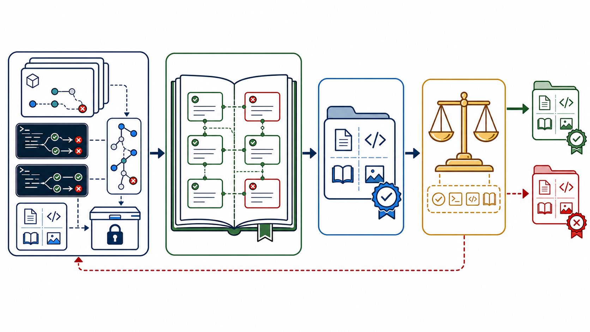
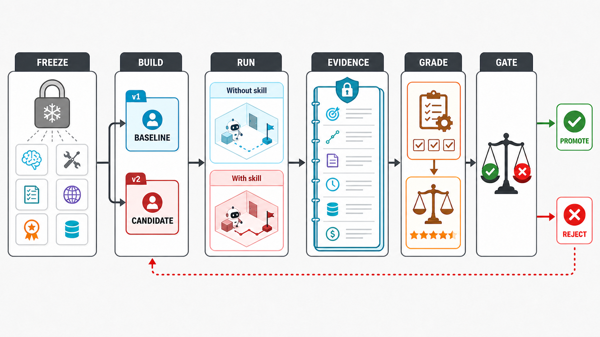
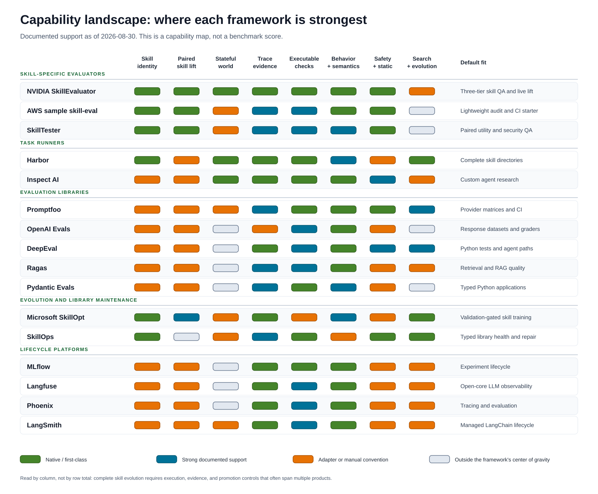

# Modern Skill Evaluation and Evolution

## A framework selection guide for models, agent harnesses, and reusable skills

**Revised final report - 2026-08-30** · **Author:** Guillermo Villarroel
**Primary question:** How can we estimate whether a versioned skill improved an agent on
unseen work strongly enough to justify promotion, without confusing that effect with
model, harness, environment, or grader changes?
([NVIDIA SkillEvaluator reports](https://docs.nvidia.com/skills/skillevaluator/reports),
[Harness-Bench](https://arxiv.org/abs/2605.27922)).

> The modern unit of progress is not a leaderboard score. It is a controlled,
> reproducible promotion decision backed by task outcomes, trajectories, artifacts,
> uncertainty, and an untouched holdout. ([Reusable Holdout](https://arxiv.org/abs/1506.02629),
> [Harbor results and artifacts](https://www.harborframework.com/docs/run-jobs/results-and-artifacts)).



*Conceptual orientation. Immutable traces accumulate into persistent knowledge;
knowledge proposes a versioned skill; an independent evaluation gate either promotes
the candidate or returns its outcome to the evidence base. This is an editorial
synthesis, not a result reported by either source. ([WikiSkill](https://arxiv.org/abs/2608.27454),
[Harbor results and artifacts](https://www.harborframework.com/docs/run-jobs/results-and-artifacts)).*

**Attribution convention.** Substantive prose ends with primary public sources wherever
possible. Two links at a paragraph end indicate the evidence basis, not necessarily two
independent replications. Editorial taxonomies, reconstructions, and recommendations are
identified as synthesis; framework capability rows link to their official documentation
or repositories. ([Agent Skills specification](https://agentskills.io/specification),
[Harness-Bench](https://arxiv.org/abs/2605.27922)).

**Evidence boundary.** Framework capabilities, licenses, and repository activity were
checked against primary documentation on **2026-08-30**. They can change after that
date. Recommendations are conditional on the declared model, harness, task population,
environment, grader, and budget; this report does not claim that any framework or skill
is universally best. ([NIST AI measurement science](https://www.nist.gov/blogs/caisi-research-blog/accelerating-ai-innovation-through-measurement-science),
[GitHub repository API](https://docs.github.com/en/rest/repos/repos#get-a-repository)).

## Executive decision

For open and reproducible evaluation of complete skill directories, the **most complete
ready-made composition identified under this report's criteria** is the following. This
is a conditional recommendation, not a head-to-head vendor benchmark result.
([NVIDIA SkillEvaluator reports](https://docs.nvidia.com/skills/skillevaluator/reports),
[Harbor evaluation runs](https://www.harborframework.com/docs/run-jobs/run-evals)).

1. **NVIDIA SkillEvaluator** for skill-native static checks, safety scanning,
   duplication analysis, and paired live trials that report the incremental **Skill
   Lift** of a skill.
2. **Harbor** underneath those live trials—or directly when a custom task world is
   required—for isolated execution, skill provenance, and trial artifacts.
3. **Executable task checks plus calibrated semantic review** for scoring.
4. **A predeclared availability-effect estimand and task/cluster-level paired analysis**
   that reports absolute arm scores, uncertainty, trigger/adherence, and worst strata.
5. **Disjoint discovery, development, validation, and holdout cohorts** for controlling
   adaptive overfitting.
6. **Full-bundle provenance, scanning, and least-privilege sandboxing** with restricted
   egress and no production secrets during candidate trials.
7. **MLflow, Langfuse, or Opik** when long-lived experiment tracking, production traces, and
   feedback are required.
8. **An independent promotion gate** that can reject a candidate even when its mean
   reward, cost, or token count improves.

This default composes a skill-native evaluator with a stateful runner because neither
layer alone supplies treatment isolation, realistic execution, evidence retention, and
promotion governance. ([NVIDIA SkillEvaluator reports](https://docs.nvidia.com/skills/skillevaluator/reports),
[Harbor evaluation runs](https://www.harborframework.com/docs/run-jobs/run-evals)).

Use **Inspect AI** instead of Harbor when custom evaluation programs, solver
composition, safety controls, rescoring, or heterogeneous sandbox backends matter more
than first-class `SKILL.md` handling. Use **agent-skill-eval** when the main question is
whether Claude Code, Codex, or OpenCode discovers and applies the skill in a real CLI;
use **Skillgrade** for Docker-backed, unit-test-like capability checks across several
agent adapters; and use **agent-skills-eval** for a portable TypeScript/API response
runner with paired artifacts. These options answer different questions and are not
drop-in statistical substitutes. ([agent-skill-eval](https://github.com/tardigrde/agent-skill-eval),
[Skillgrade](https://github.com/mgechev/skillgrade)).

Use the **AWS sample skill-eval** as a lightweight static/CI starter; **Promptfoo** for
provider matrices, assertions, and red teaming; **DeepEval** for Python test ergonomics
and agent-path metrics; **Ragas** for retrieval-centered systems; and **Pydantic Evals**
for typed Python functions and span assertions. ([AWS sample
skill-eval](https://github.com/aws-samples/sample-agent-skill-eval),
[Pydantic Evals](https://ai.pydantic.dev/evals/)).

No single product is the complete system. A credible skill-evolution program combines
an execution layer, an evidence layer, and a promotion layer. This three-layer framing is
the report's synthesis of task execution, experiment evidence, and adaptive-data
governance. ([Harbor results and artifacts](https://www.harborframework.com/docs/run-jobs/results-and-artifacts),
[Reusable Holdout](https://arxiv.org/abs/1506.02629)).

## 1. Define the treatment before choosing a framework

Four objects are often called a "harness," but they answer different questions. The
taxonomy below is a working synthesis, not a universal standard. ([Agent Skills
specification](https://agentskills.io/specification),
[Harness-Bench](https://arxiv.org/abs/2605.27922)).


*Figure 1. Editorial reconstruction: **SKILL** is the treatment; **MODEL**, **HARNESS**,
and **EVALUATION** are frozen. Exact definitions follow. ([Agent Skills
specification](https://agentskills.io/specification),
[Harness-Bench](https://arxiv.org/abs/2605.27922)).*

[Formal RoadRails SVG](assets/modern-skill-evaluation/definition-railroads.static.svg) | [Animated SVG](assets/modern-skill-evaluation/definition-railroads.animated.svg) | [Mermaid source](assets/modern-skill-evaluation/definition-railroads.mmd)

| Artifact | Operational definition used in this report | Control in a skill evaluation | Source basis |
| --- | --- | --- | --- |
| **Model** | Parameterized predictor plus decoding and context-window settings | Freeze the model identity, endpoint/version, context limit, and decoding settings | [Harness-Bench](https://arxiv.org/abs/2605.27922); [HELM](https://arxiv.org/abs/2211.09110) |
| **Agent harness** | Execution layer that manages context, tools, state, constraints, permissions, tracing, verification, and recovery around the model | Freeze the harness commit, configuration, tool policy, permissions, and resource envelope | [Harness-Bench](https://arxiv.org/abs/2605.27922); [Inspect AI](https://inspect.aisi.org.uk/) |
| **Skill** | Versioned directory rooted in `SKILL.md`, with optional scripts, references, and assets | Vary the complete directory as the declared treatment and record its digest | [Agent Skills specification](https://agentskills.io/specification); [Harbor skill configuration](https://www.harborframework.com/docs/run-jobs/skills) |
| **Evaluation protocol** | Versioned tasks, task worlds, scorers, repetitions, budgets, evidence policy, and promotion rule | Freeze task and grader identities, split roles, retry policy, and release gate | [Harbor evaluation runs](https://www.harborframework.com/docs/run-jobs/run-evals); [Reusable Holdout](https://arxiv.org/abs/1506.02629) |

In a skill evaluation, the **skill is the declared treatment**. The model, agent
harness, task version, resource policy, and graders must be frozen or their changes must
be modeled explicitly. A run that changes all four objects can describe a product
snapshot, but it cannot attribute causality to the skill. ([Harness-Bench](https://arxiv.org/abs/2605.27922),
[NVIDIA SkillEvaluator reports](https://docs.nvidia.com/skills/skillevaluator/reports)).

The complete skill directory must receive an immutable identity. Digest only the
`SKILL.md` file and an optimizer can silently change a helper script, reference, or
asset without changing the recorded treatment. ([Agent Skills specification](https://agentskills.io/specification),
[Harbor skill configuration](https://www.harborframework.com/docs/run-jobs/skills)).

## 2. How evaluation reached the skill era

The history is cumulative. Each stage retained earlier controls and added a new unit of
observation. The sequence is an editorial synthesis of benchmark, evaluation-library,
agent-runtime, and skill-evolution milestones. ([HELM](https://arxiv.org/abs/2211.09110),
[NVIDIA SkillEvaluator](https://github.com/NVIDIA/SkillEvaluator)).



*Figure 2. Each generation adds a new observable or control while retaining the useful
components of earlier systems. Icons identify the new unit; the matrix makes persistence
across generations explicit. The figure is a synthesis rather than a chronology claimed
by either source. ([AgentBench](https://arxiv.org/abs/2308.03688),
[Trace2Skill](https://arxiv.org/abs/2603.25158)).*

[D3 authoring source](assets/modern-skill-evaluation/evaluation-evolution.html)

### 2.1 Static benchmarks established comparability

A frozen test set and metric made systems comparable, but usually observed only a
final answer. Experiment trackers such as [MLflow](https://github.com/mlflow/mlflow)
made configurations, runs, datasets, and artifacts durable. That provenance remains
foundational. ([MLflow datasets](https://mlflow.org/docs/latest/genai/datasets/),
[HELM](https://arxiv.org/abs/2211.09110)).

### 2.2 Holistic evaluation replaced one score with a profile

[HELM](https://arxiv.org/abs/2211.09110) standardized scenarios, exposed raw model
outputs, and evaluated several qualities rather than treating accuracy as sufficient.
The result was a measurement profile: capability alongside robustness, calibration,
fairness, efficiency, and other constraints. ([HELM](https://arxiv.org/abs/2211.09110),
[OpenAI Evals](https://github.com/openai/evals)).

### 2.3 Evals as code made evaluation part of delivery

[OpenAI Evals](https://github.com/openai/evals) helped normalize versioned datasets,
programmable graders, and model-graded checks. These systems are excellent when the
natural unit is a response. They do not automatically create a realistic terminal,
repository, browser, or other stateful world. ([OpenAI Evals](https://github.com/openai/evals),
[Harbor evaluation runs](https://www.harborframework.com/docs/run-jobs/run-evals)).

### 2.4 Agent benchmarks made trajectories observable

[AgentBench](https://arxiv.org/abs/2308.03688) ([paper](https://arxiv.org/pdf/2308.03688))
evaluated agents in interactive environments. [SWE-bench](https://arxiv.org/abs/2310.06770)
([paper](https://arxiv.org/pdf/2310.06770)) connected natural-language issues to real
repositories and executable tests. The agent now had to inspect state, select tools,
modify artifacts, and survive a multi-step loop. ([AgentBench](https://arxiv.org/abs/2308.03688),
[SWE-bench](https://arxiv.org/abs/2310.06770)).

### 2.5 Isolated task worlds made complete work verifiable

[Terminal-Bench 2.0](https://arxiv.org/abs/2601.11868)
([paper](https://arxiv.org/pdf/2601.11868)) packages realistic terminal tasks with
task-specific environments and tests. [Harbor](https://www.harborframework.com/docs)
([repository](https://github.com/harbor-framework/harbor)) generalizes this style of
execution into an agent and model evaluation framework. Harbor is documented as a
framework rather than by a canonical Harbor-framework paper; similarly named HARBOR
papers describe different systems. The environment becomes part of the experimental
boundary, not background plumbing. ([Terminal-Bench 2.0](https://arxiv.org/abs/2601.11868),
[Harbor](https://github.com/harbor-framework/harbor)).

This distinction is measurable. Anthropic reported a six-percentage-point spread
between its least- and most-resourced Terminal-Bench 2.0 configurations, with
`p < 0.01`. Small leaderboard gaps can therefore be infrastructure effects rather than
agent improvements. ([Anthropic infrastructure-noise study](https://www.anthropic.com/engineering/infrastructure-noise),
[Terminal-Bench 2.0](https://arxiv.org/abs/2601.11868)).

### 2.6 Trace-guided optimizers turned failures into candidates

[DSPy](https://arxiv.org/abs/2310.03714) treats LM programs as optimizable artifacts.
[GEPA](https://arxiv.org/abs/2507.19457) reflects on execution evidence, proposes
textual changes, and keeps complementary candidates on a Pareto frontier.
[Trace2Skill](https://arxiv.org/abs/2603.25158) distills trajectory-local lessons into
transferable skill directories. ([GEPA](https://arxiv.org/abs/2507.19457),
[Trace2Skill](https://arxiv.org/abs/2603.25158)).

An optimizer does not reduce the need for evaluation. It increases it. Repeatedly
searching against visible feedback creates selection bias, which is why the final
promotion evidence must come from a sealed cohort that the optimizer did not inspect.
([GEPA](https://arxiv.org/abs/2507.19457),
[Reusable Holdout](https://arxiv.org/abs/1506.02629)).

### 2.7 Controlled skill benchmarks isolated marginal utility

[SkillsBench](https://arxiv.org/abs/2602.12670) made the skill intervention explicit by
running matched no-Skills and curated-Skills conditions with deterministic verifiers
across stateful tasks. Its v4 inventory reports 87 tasks, eight domains, 18
model–harness configurations, and a mean pass-rate increase from 33.9% to 50.5%, while
configuration-level gains varied from +4.1 to +25.7 percentage points. Those are
benchmark-conditional results, not a universal prior that any new skill will help.
([SkillsBench paper](https://arxiv.org/abs/2602.12670),
[SkillsBench repository](https://github.com/benchflow-ai/skillsbench)).

[SWE-Skills-Bench](https://arxiv.org/abs/2603.15401) narrowed the question to authentic
software repositories, pinned commits, requirements, and execution-based acceptance
tests. It reports only +1.2% average gain, 39 of 49 skills with zero pass-rate
improvement, token overhead as high as 451% without a pass-rate gain, and three skills
that reduced success. The contrast with SkillsBench demonstrates why domain fit,
task sampling, and harness identity belong inside every claim. ([SWE-Skills-Bench](https://arxiv.org/abs/2603.15401),
[SkillsBench](https://arxiv.org/abs/2602.12670)).

The minimum attribution control is therefore a matched no-skill/with-skill contrast on
the same task world. A strong total agent score cannot show that the skill helped, and
an average lift must retain negative task-level effects and cost regressions rather
than hiding them. A later differential study found 307 skill-induced failures across
SkillsBench and SWE-Skills-Bench, including 125 functional failures and 182 efficiency
regressions. ([Agent Skills Can Be Harmful](https://arxiv.org/abs/2608.11888),
[NIST AI 800-3](https://www.nist.gov/publications/expanding-ai-evaluation-toolbox-statistical-models)).

### 2.8 Continuous skill evaluation packaged the control loop

The [ACES paper](https://arxiv.org/abs/2608.20614) and its open-source
[NVIDIA SkillEvaluator](https://github.com/NVIDIA/SkillEvaluator) implementation combine
deterministic structure and safety checks with paired live trials under a fixed task,
model, harness, workspace, and scorer. They normalize trajectories, report triggering,
behavior, cost, and **Skill Lift**, and make repository-local evaluation an iterative
workflow rather than only a fixed benchmark release. ([ACES](https://arxiv.org/abs/2608.20614),
[NVIDIA SkillEvaluator reports](https://docs.nvidia.com/skills/skillevaluator/reports)).

This contribution builds on, rather than originates, the paired design. The 2026
skill-evaluation survey likewise describes a plural field of benchmarks, execution
feedback, trajectory distillation, compression, and reinforcement-learning approaches;
no single runner defines the entire category. ([Agent Skill Evaluation and Evolution
survey](https://arxiv.org/abs/2606.11435),
[SkillsBench](https://arxiv.org/abs/2602.12670)).

### 2.9 Persistent knowledge turned discarded trials into cumulative evidence

[WikiSkill](https://arxiv.org/abs/2608.27454), a Google Research and Virginia Tech
preprint submitted on 2026-08-27, adds a durable learning layer between execution traces
and executable skills. Its workspace separates an immutable **Raw Layer**, a persistent
**Wiki Layer**, and a gated **Skills Layer**. A Wiki Maintainer consolidates failure
patterns, successful strategies, proposal history, and validation outcomes. A Skill
Proposer uses that accumulated knowledge plus recent traces to produce candidates.
Validation can roll a skill back, but it does not roll the wiki back.
([WikiSkill](https://arxiv.org/abs/2608.27454),
[Google Research ReasoningBank](https://research.google/blog/reasoningbank-enabling-agents-to-learn-from-experience/)).


*Figure 3. Original reconstruction of the control flow in WikiSkill Figure 2. Immutable
traces feed a persistent wiki; the proposer converts accumulated knowledge into gated
skills; and the inference agent receives active skills but never the wiki itself. The
paper is the source for this topology; ReasoningBank supplies adjacent Google Research
context for persistent experience. ([WikiSkill](https://arxiv.org/abs/2608.27454),
[ReasoningBank](https://research.google/blog/reasoningbank-enabling-agents-to-learn-from-experience/)).*
[Animated SVG](assets/modern-skill-evaluation/wikiskill-loop.animated.svg) | [Mermaid source](assets/modern-skill-evaluation/wikiskill-loop.mmd)

The separation is empirically consequential within the paper's protocol. In a
four-benchmark Gemini-3.5-Flash ablation, giving the Skill Proposer wiki access while
withholding it from the Inference Agent raised the reported average from **48.7% to
63.7%**. Giving the Inference Agent wiki access during training reduced that result to
**60.9%**. The paper also reports that evolved skills can transfer across models and
sometimes outperform self-evolved skills. This distinguishes the ability to **discover
procedural knowledge** from the ability to **execute it**. ([WikiSkill abstract and
record](https://arxiv.org/abs/2608.27454),
[WikiSkill paper PDF](https://arxiv.org/pdf/2608.27454)).

WikiSkill should currently be treated as a research design, not a drop-in open-source
evaluation framework. The study directly injects active skills, so it does not evaluate
skill retrieval or triggering; validation accepts only immediately improving proposals;
the wiki has no automated pruning mechanism; and the arXiv record does not link a public
implementation or code license as of 2026-08-30. ([WikiSkill](https://arxiv.org/abs/2608.27454),
[Agent Skills specification](https://agentskills.io/specification)).

## 3. The architecture of a modern skill evaluation



*Figure 4. ImageGen-assisted editorial reconstruction of the controlled evaluation
flow. The image is explanatory: the table below is the exact semantic contract. A study
freezes identities, runs baseline and candidate in equivalent task worlds, records
evidence, grades in layers, and promotes only through an independent gate. ([Harbor
evaluation runs](https://www.harborframework.com/docs/run-jobs/run-evals),
[Reusable Holdout](https://arxiv.org/abs/1506.02629)).*

[PlantUML C4 source](assets/modern-skill-evaluation/evaluation-system-c4.puml)

| Layer | Exact responsibility | Boundary that must remain explicit | Source basis |
| --- | --- | --- | --- |
| **Execution** | Freeze model, harness, task, environment, graders, resources, and baseline; build an isolated candidate; run paired baseline/candidate trials | Only the complete skill bundle varies as treatment | [Harness-Bench](https://arxiv.org/abs/2605.27922); [Harbor skill configuration](https://www.harborframework.com/docs/run-jobs/skills) |
| **Evidence** | Preserve outcomes, trajectories, artifacts, errors, time, tokens, and cost; apply deterministic checks before semantic judgment | Raw evidence is immutable; regrading creates a new evaluation view rather than rewriting execution | [Harbor results and artifacts](https://www.harborframework.com/docs/run-jobs/results-and-artifacts); [Harbor regrading](https://www.harborframework.com/docs/run-jobs/regrade) |
| **Promotion** | Filter on validation, release the sealed holdout once, enforce hard gates and uncertainty rules, then approve or reject independently | Candidate generation cannot inspect holdout evidence or control release authority | [Reusable Holdout](https://arxiv.org/abs/1506.02629); [GEPA](https://arxiv.org/abs/2507.19457) |

### 3.1 Define the estimand before calculating Skill Lift

**Skill Lift is not one universal number.** The primary deployment-relevant estimand in
this report is the effect of *making the exact skill bundle available* under a frozen
model–harness configuration. For task `i`, average repeated attempts inside each arm,
then compute the paired task difference. Aggregate those task differences using weights
fixed before results are observed. ([ACES](https://arxiv.org/abs/2608.20614),
[NIST AI 800-3](https://www.nist.gov/publications/expanding-ai-evaluation-toolbox-statistical-models)).

```text
baseline_i       = mean score for task i with the target skill withheld
candidate_i      = mean score for task i with the target skill available
task_lift_i      = candidate_i - baseline_i
benchmark_lift   = weighted mean of task_lift_i over the frozen task manifest
target_skill_lift = expected task_lift over the declared target task distribution
```

This availability-effect convention is analogous to intention-to-treat: failure to
discover, read, or follow the skill remains part of the effect. A triggered-only or
skill-read-only slice is valuable as a mechanism diagnostic, but conditioning on a
post-treatment event can bias a causal claim. If the protocol directly injects the
active skill—as WikiSkill does—the result is conditional on forced exposure and cannot
support a discoverability or triggering claim. ([NVIDIA agents and sandboxes](https://docs.nvidia.com/skills/skillevaluator/agents-and-sandboxes),
[WikiSkill](https://arxiv.org/pdf/2608.27454)).

Natural-routing studies need both **trigger-positive** cases and close
**trigger-negative** cases where the skill should remain dormant. Report successful
discovery and adherence on the positive set, plus false activation, downstream failure,
latency, and cost on the negative set. The no-skill arm estimates the total availability
effect. An optional semantically matched alternate-skill or placebo arm can test whether
the content is specifically useful rather than merely adding context or procedure, but
that is a separate mechanism estimand. ([NVIDIA evaluation datasets](https://docs.nvidia.com/skills/skillevaluator/eval-datasets),
[Agent Skills Can Be Harmful](https://arxiv.org/abs/2608.11888)).

The **benchmark estimand** describes only the tested manifest. The **target-population
estimand** additionally assumes that the tasks and predeclared weights represent the
workload to which the claim will be applied. The report must name which estimand it is
using; otherwise a precise interval around an unrepresentative benchmark is still an
invalid generalization. ([NIST AI 800-3](https://www.nist.gov/publications/expanding-ai-evaluation-toolbox-statistical-models),
[NIST AI measurement science](https://www.nist.gov/blogs/caisi-research-blog/accelerating-ai-innovation-through-measurement-science)).

### 3.2 Preserve the statistical unit

Repeated attempts estimate nondeterminism **within a task**; they do not create more
independent tasks. Treat the task—or a higher-level repository, user, or scenario when
tasks share state—as the sampling cluster. Average attempts within each task and use a
paired task/cluster bootstrap, a stratified paired randomization procedure, or a
correctly specified mixed-effects model. Pooling all `tasks × attempts` and dividing by
its square root is pseudoreplication and yields intervals that are too confident.
([NIST AI 800-3](https://www.nist.gov/publications/expanding-ai-evaluation-toolbox-statistical-models),
[NVIDIA SkillEvaluator reports](https://docs.nvidia.com/skills/skillevaluator/reports)).

For binary case-level `pass@k`, SkillEvaluator's exact paired McNemar diagnostic and
discordant-pair counts are useful. Its per-arm Wilson intervals and its McNemar result
answer different questions, however, and neither fixes heterogeneous tasks, leakage, or
an unrepresentative manifest. Very few discordant pairs can make the exact test
resolution-limited; “not significant” then means insufficient resolution, not proof of
equivalence. ([NVIDIA SkillEvaluator reports](https://docs.nvidia.com/skills/skillevaluator/reports),
[NIST AI 800-3](https://www.nist.gov/publications/expanding-ai-evaluation-toolbox-statistical-models)).

Missingness is also an outcome. Classify a retry as external only from provider or
infrastructure evidence that is independent of semantic success, retain the original
attempt, and apply the same capped rule to both arms. Report arm-specific completion,
timeout, and recovery rates because a skill-induced crash or budget exhaustion is part
of its effect. If classification is ambiguous, fail closed rather than rerunning until
an evaluable result appears. ([Harbor results and
artifacts](https://www.harborframework.com/docs/run-jobs/results-and-artifacts),
[NVIDIA SkillEvaluator reports](https://docs.nvidia.com/skills/skillevaluator/reports)).

Before execution, declare the target task population, strata and weights, primary
metric, practically meaningful lift threshold, task and attempt budgets, candidate
budget, and stopping rule. Use variance from an independent pilot or conservative
assumptions to simulate whether the task/cluster budget can resolve the decision
threshold; label an underpowered study exploratory rather than reading “no significant
difference” as equivalence. Randomize or interleave baseline/candidate order when
provider or infrastructure drift is plausible. Report absolute arm scores, paired lift,
a 95% interval at the correct cluster level, task and attempt counts, unresolved or
missing cases, trigger/adherence rates, and the worst predeclared stratum. ([How Many
Tasks Are Enough?](https://arxiv.org/abs/2607.12338),
[NIST AI 800-3](https://www.nist.gov/publications/expanding-ai-evaluation-toolbox-statistical-models)).

Keep the promotion claim singular even when the report is broad. Predeclare one primary
utility decision and the hard gates. If many secondary metrics, strata, framework cells,
or candidate contrasts are used to claim improvement, use simultaneous intervals or a
declared multiplicity procedure; otherwise label them descriptive or exploratory. A
sealed holdout does not make post-hoc mining of many endpoints valid. When the proposal
trades quality for lower cost or latency, predeclare a quality floor and require the
paired interval to clear it; failure to detect a loss is not evidence of non-inferiority.
([NIST multiple comparisons](https://www.itl.nist.gov/div898/handbook/prc/section4/prc47.htm),
[NIST tests and confidence intervals](https://www.itl.nist.gov/div898/handbook/prc/section1/prc15.htm)).

### 3.3 Maintain a validity ledger

A score becomes decision evidence only after its plausible failure modes are explicit.
The ledger below separates what is being measured, whether the treatment caused it,
whether uncertainty is honest, whether graders are trustworthy, whether the claim
travels beyond the test, and whether the executable artifact is safe. ([NIST automated
benchmark practices](https://www.nist.gov/news-events/news/2026/01/towards-best-practices-automated-benchmark-evaluations),
[NIST evaluation cheating](https://www.nist.gov/caisi/cheating-ai-agent-evaluations)).

| Validity dimension | Required question | Common invalidating failure | Minimum evidence |
| --- | --- | --- | --- |
| **Construct** | Do tasks and rubrics represent the work the skill claims to improve? | Generated tasks merely restate the skill, or a proxy reward omits the intended outcome | Task specification, coverage map, expert review, and negative/adversarial cases |
| **Internal / attribution** | Did only the declared skill bundle vary? | Model, harness, support skills, permissions, state, or grader changed between arms | Paired run manifest and immutable identities for both arms |
| **Statistical conclusion** | Does the interval respect nesting and candidate selection? | Attempts treated as independent tasks, optional stopping, or winner-only reporting | Cluster-aware interval, fixed stopping rule, and complete candidate ledger |
| **Evaluator** | Does the grader recognize real success and resist gaming? | Judge drift, rubric leakage, contaminated expected answers, or exploitable tests | Executable checks, blinded calibration sample, disagreement/error analysis, and transcript audit |
| **External** | To which task, model, harness, and environment population can the result generalize? | One generated cohort or runtime is presented as universal evidence | Declared target population, stratified results, and replication across required runtime cells |
| **Security / integrity** | Can the skill or its dependencies escape the intended authority? | Malicious scripts, mutable references, secret access, or unrestricted network egress | Full-bundle provenance, static scan, least-privilege sandbox, and dynamic behavior evidence |

A credible system has ten pillars. The list is this report's synthesis of open skill
packaging, realistic agent execution, layered evaluation, experiment provenance, and
adaptive-data controls. ([Agent Skills specification](https://agentskills.io/specification),
[Harness-Bench](https://arxiv.org/abs/2605.27922)).

1. **One declared treatment.** Vary the skill while freezing the model, agent harness,
   task version, environment, resources, and graders.
2. **Realistic isolated tasks.** Evaluate the work the skill is intended to improve.
   Repository skills need repositories and tests; browser skills need browser state;
   RAG skills need a controlled evidence corpus. Reset workspace state, caches, and
   persistent agent memory between arms unless carryover is the declared target.
3. **Immutable identity and integrity.** Digest the complete skill bundle, task, image,
   verifier, dataset manifest, model settings, harness commit, and resolved dependencies.
4. **Layered scoring.** Prefer deterministic checks for observable outcomes. Add model
   or human judgment only where correctness cannot be encoded completely.
5. **Disjoint data roles.** Separate discovery, development, validation, and holdout.
   Once inspected, a holdout becomes development data for the next generation.
6. **Trajectory evidence.** Preserve messages, tool calls, state transitions, produced
   artifacts, verifier output, time, tokens, and cost.
7. **Hard gates plus tradeoffs.** Correctness, safety, and semantic quality are gates.
   Cost, latency, and token use can be Pareto objectives.
8. **Uncertainty at the correct unit.** Pair baseline and candidate on the same tasks
   and seeds when possible. Treat attempts as nested within tasks; resample tasks or
   declared higher-level clusters rather than pooling every attempt as independent.
9. **Failure taxonomy.** Separate semantic failure from provider, infrastructure,
   evaluator, authentication, and environment failure. Never retry meaning until it
   passes and then count only the success.
10. **Independent promotion.** Keep the mutator, executor, evaluator, selector, and
    release authority conceptually separate.

The [Reusable Holdout](https://arxiv.org/abs/1506.02629) formalizes the broader problem:
adaptive reuse of evaluation data can overfit the evaluation itself. Agent and skill
optimizers make this risk operational rather than theoretical. ([Reusable
Holdout](https://arxiv.org/abs/1506.02629),
[GEPA](https://arxiv.org/abs/2507.19457)).

The paper's **Reusable Holdout** is a controlled disclosure mechanism—Thresholdout—not
a requirement to reveal a conventional holdout only once. This report deliberately
chooses the simpler one-finalist, one-release policy when no formal reusable-holdout
mechanism exists. After detailed outcomes are exposed, the cohort is retired from future
promotion claims and a new sealed cohort is required. ([Reusable
Holdout](https://arxiv.org/abs/1506.02629),
[NIST sequestered evaluation](https://pages.nist.gov/ai-technology-evaluation/)).

Because a skill directory may contain executable scripts and mutable references, a
content digest is necessary but not sufficient. Scan the entire resolved bundle, pin
dependencies and external content, execute candidates with least privilege and no
production secrets, restrict network egress by default, and retain observed filesystem,
tool, and network behavior. When the task requires authentication or a remote service,
use synthetic or narrowly scoped non-production credentials and an explicit destination
allowlist. Static quality checks and sandboxed dynamic trials answer different security
questions. ([Agent Skills specification](https://agentskills.io/specification),
[OWASP Agentic Skills Top 10](https://owasp.org/www-project-agentic-skills-top-10/)).

WikiSkill sharpens the evidence pillar: immutable traces, accumulated learning memory,
and the executable skill should have independent identities. Only the skill is the
test-time treatment. The wiki is optimizer state whose contents and access policy must
be recorded so that a gain is not misattributed to hidden execution context.
([WikiSkill](https://arxiv.org/abs/2608.27454),
[Agent Skills specification](https://agentskills.io/specification)).

Model judges must also be treated as measurement instruments. Freeze their model,
prompt, rubric, evidence window, and decoding settings; calibrate them on a blinded,
representative human-reviewed sample; retain disagreements and false-positive/negative
rates; and create a new grading view rather than rewriting old execution when the judge
changes. ([NIST transcript-review practices](https://www.nist.gov/caisi/cheating-ai-agent-evaluations/4-practices-detecting-and-preventing-evaluation-cheating),
[Harbor regrading](https://www.harborframework.com/docs/run-jobs/regrade)).

## 4. Framework capability landscape



*Figure 5. D3-generated ordinal capability map. Color encodes native/first-class,
strong documented, adapter/manual, or outside-center-of-gravity support. Repeated cell
letters were removed for legibility. The figure is a dated documentation synthesis, not
a benchmark score, and row totals are intentionally meaningless. ([NVIDIA
SkillEvaluator](https://github.com/NVIDIA/SkillEvaluator),
[Harbor](https://github.com/harbor-framework/harbor)).*
[D3 authoring source](assets/modern-skill-evaluation/capability-landscape.html)

Each cell was coded from official documentation or the project's primary repository as
of 2026-08-30. Figure 5 deliberately uses 17 reference frameworks to span architectural
roles; it is not the complete tool catalogue. Categories are ordinal judgments about
center of gravity, not measured performance. Section 4.1 adds the broader skill-native
set without forcing a dense visual to imply false equivalence. ([Agent Skill Evaluation
and Evolution survey](https://arxiv.org/abs/2606.11435),
[NVIDIA SkillEvaluator](https://github.com/NVIDIA/SkillEvaluator)).

The exact coding behind Figure 5 is reproduced below so the comparison remains
auditable without reading color or SVG tooltips. **N** means native/first-class, **S**
means strong documented support, **A** means adapter or manual protocol, and **—** means
outside the framework's primary center of gravity. The symbols describe product scope,
not implementation quality, and must not be totaled into a rank. ([NVIDIA
SkillEvaluator](https://github.com/NVIDIA/SkillEvaluator),
[Harbor](https://github.com/harbor-framework/harbor)).

| Framework | Skill artifact | Paired lift | Stateful world | Trace evidence |
| --- | :---: | :---: | :---: | :---: |
| [NVIDIA SkillEvaluator](https://github.com/NVIDIA/SkillEvaluator) | N | N | N | N |
| [AWS sample skill-eval](https://github.com/aws-samples/sample-agent-skill-eval) | N | N | A | S |
| [SkillTester](https://github.com/skilltester-ai/skilltester) | N | N | A | S |
| [Harbor](https://github.com/harbor-framework/harbor) | N | A | N | N |
| [Inspect AI](https://inspect.aisi.org.uk/) | A | A | N | N |
| [Promptfoo](https://github.com/promptfoo/promptfoo) | A | A | A | S |
| [OpenAI Evals](https://github.com/openai/evals) | A | A | — | A |
| [DeepEval](https://github.com/confident-ai/deepeval) | A | A | — | N |
| [Ragas](https://github.com/vibrantlabsai/ragas) | A | A | — | S |
| [Pydantic Evals](https://ai.pydantic.dev/evals/) | A | A | — | S |
| [Microsoft SkillOpt](https://github.com/microsoft/SkillOpt) | N | S | A | N |
| [SkillOps](https://github.com/Hik289/SkillOps) | N | — | A | S |
| [MLflow](https://github.com/mlflow/mlflow) | A | A | — | N |
| [Langfuse](https://github.com/langfuse/langfuse) | A | A | — | N |
| [Phoenix](https://github.com/Arize-ai/phoenix) | A | A | — | N |
| [Opik](https://github.com/comet-ml/opik) | A | A | — | N |
| [LangSmith](https://docs.langchain.com/langsmith/evaluation) | A | A | A | N |

| Framework | Executable checks | Behavior / semantics | Safety / static | Search / evolution |
| --- | :---: | :---: | :---: | :---: |
| [NVIDIA SkillEvaluator](https://github.com/NVIDIA/SkillEvaluator) | N | N | N | A |
| [AWS sample skill-eval](https://github.com/aws-samples/sample-agent-skill-eval) | S | N | N | — |
| [SkillTester](https://github.com/skilltester-ai/skilltester) | S | S | N | — |
| [Harbor](https://github.com/harbor-framework/harbor) | N | S | A | N |
| [Inspect AI](https://inspect.aisi.org.uk/) | N | N | S | A |
| [Promptfoo](https://github.com/promptfoo/promptfoo) | N | N | N | S |
| [OpenAI Evals](https://github.com/openai/evals) | S | N | A | — |
| [DeepEval](https://github.com/confident-ai/deepeval) | S | N | S | S |
| [Ragas](https://github.com/vibrantlabsai/ragas) | S | N | A | A |
| [Pydantic Evals](https://ai.pydantic.dev/evals/) | N | S | A | — |
| [Microsoft SkillOpt](https://github.com/microsoft/SkillOpt) | A | S | A | N |
| [SkillOps](https://github.com/Hik289/SkillOps) | N | A | N | N |
| [MLflow](https://github.com/mlflow/mlflow) | N | N | A | A |
| [Langfuse](https://github.com/langfuse/langfuse) | S | N | A | A |
| [Phoenix](https://github.com/Arize-ai/phoenix) | S | N | A | A |
| [Opik](https://github.com/comet-ml/opik) | S | N | A | N |
| [LangSmith](https://docs.langchain.com/langsmith/evaluation) | S | N | A | A |

### 4.1 Dedicated skill evaluators

| Framework | Native center of gravity | Skill-evaluation advantage | Critical caveat |
| --- | --- | --- | --- |
| [NVIDIA SkillEvaluator](https://github.com/NVIDIA/SkillEvaluator) | Tier 1 deterministic structure, safety, and script checks; Tier 2 similarity and deduplication; Tier 3 live paired trials through Harbor | Treats directories as first-class artifacts; reports triggering, behavior, cost, Skill Lift, case-level Wilson intervals, paired outcome counts, and exact McNemar diagnostics for identified `pass@k` cases | Young project; task-population sampling, cluster-aware lift inference, disjoint splits, and promotion authority remain study responsibilities |
| [agent-skill-eval](https://github.com/tardigrde/agent-skill-eval) | Real Claude Code, Codex, and OpenCode CLIs in fresh per-case Git workspaces; paired arms; repeated runs; state-delta and rubric grading | Measures natural discovery as well as forced invocation; records effective harness/model config, trajectories, budgets, negative controls, and live side effects | A fresh workspace is not process or credential isolation; add a sandbox and restricted credentials for untrusted skills; inference and holdout policy remain external |
| [agent-skills-eval](https://github.com/darkrishabh/agent-skills-eval) | TypeScript CLI/SDK over OpenAI-compatible model APIs; paired outputs; judge and tool-call assertions; JSON/JSONL artifacts and HTML reports | Low-friction, provider-portable CI for response and declared tool-call skills | The skill is loaded into model context rather than discovered by a product harness; no general stateful sandbox, cluster-aware inference, or holdout authority |
| [Skillgrade](https://github.com/mgechev/skillgrade) | Repeated real-agent trials through Gemini, Claude, Codex, ACP, OpenCode, or a custom command; Docker/local workspaces; deterministic and rubric graders | Strong unit-test-like runner for discovery, file changes, live checks, grader validation, CI thresholds, and pluggable agents | Primarily tests the skill-present condition; a paired no-skill estimand, immutable study manifest, and independent holdout must be added by the study |
| [SkillPortrait](https://github.com/SkillAudit/skillaudit) | LLM-generated utility and adversarial-security schemes executed in Harbor, with trajectories, deterministic task tests, and LLM verdicts | Combines capability lift and exploitability evidence; publishes a 226-skill artifact corpus and resolved checksums | Schemes, static findings, and judges are model-generated from the inspected skill; use independent tasks and calibrated graders for promotion claims |
| [AWS sample skill-eval](https://github.com/aws-samples/sample-agent-skill-eval) | Lightweight safety, quality, reliability, and cost checks | Small MIT-0 starter that is easy to place in authoring or CI workflows | Sample implementation rather than a general stateful task runner or mature benchmark ecosystem |
| [SkillTester](https://github.com/skilltester-ai/skilltester) | Paired utility and security probes for skills | Makes baseline-versus-skill comparison and adversarial behavior explicit | Repository has no detected license; source visibility alone does not grant reuse rights |
| [SkillBenchmark](https://github.com/TiesPetersen/SkillBenchmark) | Text-only paired model calls, blind rubric judges, repeated runs, token counts, and confidence intervals | Simple pilot for skills whose complete outcome is one textual response | Forced system-prompt injection does not test discovery or tools; its documented analysis pools runs × judge scores and uses an unpaired Welch interval despite matched arms, so use task-level paired inference instead |

**Decision:** choose NVIDIA SkillEvaluator for a composed static-plus-live skill gate;
agent-skill-eval for real cross-harness discovery and state deltas; Skillgrade for
Docker-backed unit-style agent testing; agent-skills-eval for portable TypeScript/API
response evaluation; and SkillPortrait when generated utility and adversarial security
probes are the research objective. Use the AWS sample as a small static CI starter.
Treat SkillTester as research/service software until it receives an explicit license.
([agent-skill-eval](https://github.com/tardigrde/agent-skill-eval),
[Skillgrade](https://github.com/mgechev/skillgrade)).

This catalogue includes a public project when it supplies a distinct runnable
skill-evaluation path, or when a paper/service has enough market relevance to affect a
selection decision. It does not equate maturity: repository activity is reported
separately, and a runnable CLI still needs an experimentally valid protocol. Static
scorecards and optimization systems appear later because they answer authoring or
search questions rather than independently measuring deployment lift. ([Agent Skill
Evaluation and Evolution survey](https://arxiv.org/abs/2606.11435),
[NIST automated benchmark practices](https://www.nist.gov/news-events/news/2026/01/towards-best-practices-automated-benchmark-evaluations)).

#### Early or authoring-focused utilities

| Utility | Useful current scope | Why it is not in the primary runner shortlist | License / repository signal on 2026-08-30 |
| --- | --- | --- | --- |
| [waxa](https://github.com/mizchi/skills) | Claude-CLI `with_skill`/`without_skill` comparisons, self-report or model grading, variant comparison, and an iteration ledger | Nested 0.x tool in a broad skills monorepo; no general isolated task-world or independent promotion layer | [npm package](https://www.npmjs.com/package/@mizchi/waxa) reports MIT v0.1.1; parent repository 323 stars, 3 forks, pushed 2026-07-14 |
| [Effector skill-eval](https://github.com/effectorHQ/skill-eval) | Static structure, documentation, efficiency, dependency, and composability scoring | v0.1 is explicitly static-only; Docker execution and functional metrics remain roadmap items | 7 stars, 0 forks, pushed 2026-03-23; root license text says Apache-2.0 while [npm metadata](https://www.npmjs.com/package/@effectorhq/skill-eval) says MIT—resolve before reuse |
| [skill-evaluator](https://github.com/huajielong/skill-evaluator) | Agent-invoked five-dimension scorecard plus shell-based structure, security, line-count, and integrity checks | No matched live task execution, deployment-harness discovery evidence, or calibrated uncertainty | MIT; 6 stars, 1 fork, pushed 2026-06-10 |

These projects may be useful inside authoring, linting, or rapid-iteration workflows.
Their scores should become features or preflight gates in a larger study, not substitutes
for paired task outcomes. A license-metadata conflict is itself a release-engineering
finding and should block redistribution until clarified. ([Effector
skill-eval](https://github.com/effectorHQ/skill-eval),
[GitHub licensing guidance](https://docs.github.com/en/repositories/managing-your-repositorys-settings-and-features/customizing-your-repository/licensing-a-repository)).

The independent [framework-at-scale study](https://arxiv.org/abs/2606.17819) reinforces
the paired design: it evaluated 500 skills, 1,000 generated tasks, and 19 agent-model
configurations, finding that adherence and gains vary materially by runtime. A skill is
therefore not universally “good”; its effect is conditional on the model and harness in
which it executes. ([framework-at-scale study](https://arxiv.org/abs/2606.17819),
[Harness-Bench](https://arxiv.org/abs/2605.27922)).

Task generation from the skill body is useful for authoring smoke tests and checking
whether the artifact communicates its own specification, but it is not independent
evidence that the skill improves the target workload. For promotion, derive the sealed
cohort from workload requirements, blinded expert cases, or production-like demand that
was not created from the candidate text; disclose when a generated cohort measures
specification conformance rather than external utility. This is the report's validity
rule, not a limitation claimed by the tools themselves. ([SkillEvaluator eval
datasets](https://docs.nvidia.com/skills/skillevaluator/eval-datasets),
[NIST sequestered evaluation](https://pages.nist.gov/ai-technology-evaluation/)).

#### Reusable skill benchmark suites

| Suite | Public evaluation asset | Best use | Boundary to preserve |
| --- | --- | --- | --- |
| [SkillsBench](https://github.com/benchflow-ai/skillsbench) | Apache-2.0 task repository; 87 current tasks with skills, stateful environments, and deterministic verifiers; matched no-skill/with-skill research protocol | Cross-domain comparison across several model–harness configurations; source of reusable BenchFlow task worlds | A fixed benchmark estimates performance on its manifest; it is not automatically representative of an arbitrary private workload or an independent holdout after repeated tuning |
| [SWE-Skills-Bench](https://arxiv.org/abs/2603.15401) | 49-skill MIT dataset with repository commits, requirements, test code, Docker images, and paired conditions; [dataset mirror](https://huggingface.co/datasets/GeniusHTX/SWE-Skills-Bench) remained accessible at the cutoff | Requirement-driven software-engineering replication and investigation of version-mismatched guidance | The GitHub implementation linked by the paper returned unavailable on 2026-08-30; pin the surviving dataset and independently reconstruct/audit the runner before adoption |

A benchmark suite supplies reusable tasks and reference evidence; an evaluator supplies
the machinery for running a study. A team can execute SkillsBench through its supported
runner, but should not treat benchmark reuse, runner choice, and the validity of a local
promotion claim as the same decision. ([SkillsBench](https://arxiv.org/abs/2602.12670),
[NIST AI measurement science](https://www.nist.gov/blogs/caisi-research-blog/accelerating-ai-innovation-through-measurement-science)).

### 4.2 Task runners

| Framework | Native center of gravity | Skill-evaluation advantage | Critical caveat |
| --- | --- | --- | --- |
| [Harbor](https://github.com/harbor-framework/harbor) | Containerized agent/model trials, task verifiers, artifacts, and optimization | A local or Git skill directory is a first-class input; source, digest, and resolved commit can be locked | Provenance does not create correct dataset splits or an independent promotion policy |
| [Inspect AI](https://inspect.aisi.org.uk/) | Python evaluation programs, solvers, scorers, logs, limits, and multiple sandbox backends | Strong control over custom agents, safety studies, rescoring, and heterogeneous execution | A skill bundle is an experiment convention or adapter rather than the native unit |

**Decision:** choose Harbor when the object being evolved is a complete skill directory
and tasks change a stateful world. Choose Inspect AI when evaluation-program
flexibility, safety controls, or sandbox diversity is the primary requirement.
([Harbor](https://github.com/harbor-framework/harbor),
[Inspect AI](https://inspect.aisi.org.uk/)).

### 4.3 Evaluation libraries

| Framework | Best fit | Evidence and scoring | Skill-evolution limit |
| --- | --- | --- | --- |
| [Promptfoo](https://github.com/promptfoo/promptfoo) | Prompt/provider matrices, CI assertions, and red teaming | Declarative assertions, custom code, model graders, latency, and cost | Provider runtime is not a general isolated task world |
| [OpenAI Evals](https://github.com/openai/evals) | Response datasets and custom graders | Exact, custom, and model-graded evaluation | No general skill bundle or agent sandbox in the OSS runner |
| [DeepEval](https://github.com/confident-ai/deepeval) | Python and pytest workflows, including agent-path evaluation | Task metrics, tool/sub-agent behavior, custom DAGs, and model judges | Prompt optimization is not a generic population search over complete skill directories |
| [Ragas](https://github.com/vibrantlabsai/ragas) | Retrieval, RAG, and context quality | Retrieval/generation metrics plus message and tool evaluation | Pair with a task runner when the agent changes external state |
| [Pydantic Evals](https://ai.pydantic.dev/evals/) | Typed Python applications | Typed evaluators and OpenTelemetry span assertions | Function runtime is not an isolated task-world abstraction |

### 4.4 Lifecycle and observability platforms

| Framework | Best fit | What it adds | What it does not replace |
| --- | --- | --- | --- |
| [MLflow](https://github.com/mlflow/mlflow) | Broad experiment and model lifecycle | Runs, datasets, artifacts, traces, scorers, registry, and production feedback | A clean terminal or browser task world |
| [Langfuse](https://github.com/langfuse/langfuse) | Self-hosted or managed LLM observability | Traces, datasets, experiments, scores, and user feedback | First-class skill locking and holdout governance |
| [Phoenix](https://github.com/Arize-ai/phoenix) | OpenInference/OpenTelemetry tracing and evaluation | Spans, datasets, code/model/human evaluation | OSI-open licensing and isolated task execution |
| [Opik](https://github.com/comet-ml/opik) | Open-source LLM and agent evaluation lifecycle | Traces, datasets, experiments, online evaluation, prompt/agent optimization, and self-hosting | First-class skill identity, isolated task worlds, and independent holdout governance |
| [LangSmith](https://docs.langchain.com/langsmith/evaluation) | Managed LangChain-centered evaluation | Datasets, trajectories, pairwise evaluators, online traces, and feedback | An open-source, portable task runner |

These platforms complement a dedicated evaluator and a task runner. They answer how
experiments and production behavior are stored, compared, and monitored; they do not
automatically prove that a candidate skill caused a result. ([MLflow
datasets](https://mlflow.org/docs/latest/genai/datasets/),
[NVIDIA SkillEvaluator reports](https://docs.nvidia.com/skills/skillevaluator/reports)).

### 4.5 Scope and adjacent alternatives

The D3 matrix is intentionally **representative, not exhaustive**: it keeps one or more
reference implementations for each architectural role, while the dedicated catalogue
in Section 4.1 covers overlapping skill-native runners. The adjacent lifecycle tools
below are credible alternatives, but they do not change the requirement for an explicit
skill treatment, realistic runner, and independent promotion protocol. ([Opik](https://github.com/comet-ml/opik),
[Braintrust evaluations](https://www.braintrust.dev/docs/evaluation-quickstart)).

| Adjacent tool | License / deployment posture | Useful capabilities | Limit for causal skill evaluation | Repository signal on 2026-08-30 |
| --- | --- | --- | --- | --- |
| [W&B Weave](https://github.com/wandb/weave) | Apache-2.0 toolkit connected to the W&B service | Function and agent traces, datasets, evaluations, scorers, and production workflow evidence | No native complete-skill treatment, isolated task world, or holdout authority | 1,122 stars; 166 forks; pushed 2026-08-28 |
| [TruLens](https://github.com/truera/trulens) | MIT; OpenTelemetry-native Python stack | Step-level tracing, dataset/online evaluation, explanatory judges, and version comparison | No native skill-bundle locking, paired Skill Lift protocol, or promotion governance | 3,530 stars; 334 forks; pushed 2026-08-28 |
| [Braintrust](https://www.braintrust.dev/docs/evaluation-quickstart) | Managed platform with open SDKs | Immutable experiments, datasets, code/model scorers, CI, remote evaluations, and sandboxes | Skill identity, paired arms, task-world isolation, and holdout policy remain user-defined | Platform adoption is not comparable to one SDK repository |

These products can replace or complement the lifecycle layer when their ecosystem,
hosted workflow, or telemetry integration is a better fit. Their omission from the D3
core does not mean lower quality; it means their documented center of gravity does not
add a distinct skill-native treatment or promotion boundary beyond categories already
represented. ([W&B Weave](https://github.com/wandb/weave),
[TruLens](https://github.com/truera/trulens)).

### 4.6 License and community snapshot

GitHub stars and forks are rough attention signals, not evidence of evaluation validity
or a count of active users. Counts and latest repository pushes below were read from the
GitHub API on **2026-08-30**; they can change immediately. “Last push” indicates source
activity, not release quality, maintainer capacity, or backward compatibility. License
terms govern reuse; none of these columns establishes causal validity. ([GitHub
repository API](https://docs.github.com/en/rest/repos/repos#get-a-repository),
[Open Source Definition](https://opensource.org/osd)).

| Framework | License posture | Stars | Forks | Last push (UTC) | Operational implication |
| --- | --- | ---: | ---: | --- | --- |
| NVIDIA SkillEvaluator | Apache-2.0 | 361 | 34 | 2026-08-30 | Open, dedicated skill-evaluation implementation |
| agent-skills-eval | MIT | 713 | 35 | 2026-08-05 | TypeScript/API paired-output runner; substantial early attention |
| Skillgrade | MIT | 692 | 47 | 2026-08-26 | Multi-agent Docker/local skill test runner |
| agent-skill-eval | MIT | 0 | 0 | 2026-07-10 | Feature-rich but adoption-immature cross-harness runner |
| SkillPortrait | Apache-2.0 | 7 | 0 | 2026-07-31 | Research harness and published utility/security artifacts |
| SkillBenchmark | MIT | 13 | 1 | 2026-05-26 | Early text-only paired evaluator; statistical protocol needs correction |
| AWS sample skill-eval | MIT-0 | 14 | 3 | 2026-05-27 | Small, permissive reference implementation |
| SkillTester | No detected repository license | 36 | 2 | 2026-07-01 | Source-visible; seek permission before reuse |
| SkillsBench | Apache-2.0 | 1,733 | 363 | 2026-07-23 | Open benchmark/task community rather than a general lifecycle platform |
| Hugging Face upskill | Apache-2.0 | 738 | 91 | 2026-05-26 | Skill generation, evaluation, and remote-run workflow |
| SkillCompass | MIT | 216 | 8 | 2026-04-23 | Local authoring scorecard and guided evolution workflow |
| Microsoft SkillLens | MIT | 159 | 19 | 2026-05-25 | Research framework for extraction and cross-benchmark consumption |
| Harbor | Apache-2.0 | 4,783 | 1,686 | 2026-08-29 | Open task runner and optimization substrate |
| Inspect AI | MIT | 2,664 | 681 | 2026-08-30 | Open Python research and evaluation runtime |
| Promptfoo | MIT | 24,678 | 2,250 | 2026-08-30 | Large JS/TS and CI-oriented community |
| OpenAI Evals repository | MIT code; individual datasets retain their own terms | 19,307 | 3,069 | 2026-04-14 | OSS runner is distinct from proprietary hosted services |
| DeepEval | Apache-2.0 | 17,971 | 1,878 | 2026-08-30 | Python/pytest evaluation ecosystem |
| Ragas | Apache-2.0 | 15,547 | 1,663 | 2026-02-24 | Retrieval and RAG-centered ecosystem |
| Pydantic AI repository | MIT | 19,592 | 2,617 | 2026-08-30 | Count covers the wider repository, including Pydantic Evals |
| Microsoft SkillOpt | MIT | 16,494 | 1,550 | 2026-08-29 | Large early community around skill optimization |
| SkillOps | MIT | 63 | 6 | 2026-07-28 | Early project for typed skill-library operations |
| MLflow | Apache-2.0 | 27,739 | 6,234 | 2026-08-30 | Broad lifecycle and observability platform |
| Langfuse | MIT core; enterprise directories have separate terms | 33,938 | 3,666 | 2026-08-30 | Open core with self-hosting and managed options |
| Phoenix | Elastic License 2.0 | 11,248 | 1,084 | 2026-08-29 | Source available, not OSI open source; hosted-service restrictions apply |
| Opik | Apache-2.0 | 21,694 | 1,741 | 2026-08-30 | Open, self-hostable evaluation, tracing, and optimization platform |
| LangSmith | Proprietary | Not comparable | Not comparable | Not comparable | Managed service and LangChain integration |

“Public on GitHub” is not a license. Without an explicit license, default copyright
applies. Review the [Open Source Definition](https://opensource.org/osd) and the exact
license file before adopting, modifying, or redistributing any framework. ([GitHub
licensing guidance](https://docs.github.com/en/repositories/managing-your-repositorys-settings-and-features/customizing-your-repository/licensing-a-repository),
[Open Source Definition](https://opensource.org/osd)).

### 4.7 Evolution and library operations are not evaluation frameworks

| Method | Distinctive evolution state | Evaluation it still requires | Adoption posture |
| --- | --- | --- | --- |
| [Microsoft SkillOpt](https://github.com/microsoft/SkillOpt) | Bounded add/delete/replace edits, rejected-edit memory, validation gates, and slow meta-updates | Real task execution, independent splits, calibrated scoring, and an untouched promotion holdout | MIT implementation and [paper](https://arxiv.org/abs/2605.23904) from Microsoft Research |
| [SkillOps](https://github.com/Hik289/SkillOps) | Typed skill contracts plus graph health, merge, repair, retirement, validators, and adapters for skill libraries | Runtime utility, triggering, behavior, safety, and generalization evidence | Separate MIT project from Emory/UIUC; [paper](https://arxiv.org/abs/2605.13716) |
| [Hugging Face upskill](https://github.com/huggingface/upskill) | Teacher-to-student skill generation, synthetic tests, refinement, run history, and local or Hugging Face Jobs execution | Independent tasks, paired inference at the task level, and a sealed promotion cohort | Apache-2.0; its documented simple mode supports a baseline, but multi-model or repeated-run benchmark mode disables baseline comparison |
| [Microsoft SkillLens](https://github.com/microsoft/SkillLens) | Experience generation, sequential/parallel extraction, and skill consumption across ALFWorld, PDDL, WebShop, and SpreadsheetBench | Deployment-matched triggering, external tasks, and promotion governance beyond the committed research splits | MIT research framework with held-out test pools and with/without-injection inference |
| [SkillCompass](https://github.com/Evol-ai/SkillCompass) | Six-dimension local scorecard, usage signals, guided edits, version tracking, and iterative improvement | Independent executable task outcomes and a paired deployment-effect estimate | MIT authoring/lifecycle assistant; its model-mediated score should be treated as a diagnostic, not promotion evidence |
| [GEPA](https://arxiv.org/abs/2507.19457) | Reflective textual proposals plus a Pareto frontier | A task runner, case-level feedback, disjoint validation, and a sealed holdout | Available through open DSPy tooling; integrate with the task world that matches the skill |
| [Trace2Skill](https://arxiv.org/abs/2603.25158) | Trajectory-local lessons consolidated into transferable skill directories | Independent execution and promotion evidence beyond the traces used to distill | Research method; verify the implementation and license selected for use |
| [WikiSkill](https://arxiv.org/abs/2608.27454) | Immutable raw traces, a persistent wiki, proposal impact history, and gated skills | Real task worlds, calibrated graders, holdout governance, and skill-retrieval evaluation | Public preprint; no implementation or code license is linked from the arXiv record as of 2026-08-30 |

**Naming clarification:** **SkillOpt** is Microsoft’s optimizer. **SkillOps** is the
separate Emory/UIUC skill-library project. Microsoft also has an unrelated ACES
cyber-evaluation repository; the **ACES skill-evaluation method** discussed here is the
paper implemented by NVIDIA SkillEvaluator. ([Microsoft
SkillOpt](https://github.com/microsoft/SkillOpt),
[NVIDIA SkillEvaluator](https://github.com/NVIDIA/SkillEvaluator)).

The distinction matters: an optimizer proposes or selects treatments; it does not prove
that they generalize. These methods can sit above Harbor or Inspect AI, with MLflow,
Langfuse, or Opik preserving lifecycle evidence, but the evaluator and promotion
authority must remain independently specified. ([GEPA](https://arxiv.org/abs/2507.19457),
[Reusable Holdout](https://arxiv.org/abs/1506.02629)).

## 5. Select from the artifact that must be correct


*Figure 6. Start with the artifact that must be correct, not with a vendor feature
list. An evolving skill requires response, trajectory, and changed-world evidence. The
decision tree is an editorial synthesis. ([AgentBench](https://arxiv.org/abs/2308.03688),
[Harbor evaluation runs](https://www.harborframework.com/docs/run-jobs/run-evals)).*

[Animated SVG](assets/modern-skill-evaluation/selection-guide.animated.svg) | [Mermaid source](assets/modern-skill-evaluation/selection-guide.mmd)

Use these six factors to select or compose the stack. They operationalize treatment
identity, environmental realism, scoring, evidence, governance, and adoption constraints.
([Harness-Bench](https://arxiv.org/abs/2605.27922),
[ATAM collection](https://www.sei.cmu.edu/library/architecture-tradeoff-analysis-method-collection/)).

### 5.1 Treatment boundary

- Can the framework identify the complete skill directory by digest and source commit?
- Can it keep the model and harness constant while injecting baseline and candidate?
- Does the baseline preserve identical support/decoy skills while withholding only the
  target, and does the report say whether exposure was routed or forced?
- Can it preserve parent-child lineage across generations?

### 5.2 World fidelity

- Is the task answer-only, function-level, terminal-based, repository-based,
  browser-based, or multi-agent?
- Can CPU, RAM, time, network, images, credentials, and external services be pinned?
- Are workspace state, caches, agent memory, and prior tool sessions reset between
  arms—or explicitly modeled when carryover is the object of study?
- Can baseline and candidate order be randomized or interleaved to reduce temporal and
  provider drift?
- Does the final verifier inspect the changed world rather than trusting the agent's
  final message?

### 5.3 Grader strength

- Are executable checks available for outcomes that can be observed directly?
- Does semantic review cite the evidence it used?
- Has any model judge been calibrated against blinded human review?
- Are judge version, prompt, rubric, evidence window, decoding, disagreement, and error
  rates recorded?
- Can old logs be rescored when the rubric changes?

### 5.4 Evidence and statistics

- Are trajectories, artifacts, verifier output, errors, time, tokens, and cost retained?
- Is the estimand explicitly the tested manifest or a declared target task population?
- Are baseline and candidate paired by task and seed?
- Are repeated attempts nested inside tasks rather than counted as independent samples?
- Are the task/cluster resampling unit, practical lift threshold, task budget, attempt
  budget, and stopping rule declared before results?
- Are absolute arm scores, paired effect and interval, trigger/adherence, unresolved
  cases, and worst-domain cells reported?
- Are missing trials and infrastructure failures visible rather than silently dropped?

### 5.5 Optimization and governance

- Is the search budget fixed before results are known?
- Are every candidate and comparison retained so winner selection is visible?
- Are discovery, development, validation, and holdout identities disjoint?
- Can a hard gate reject a lower-cost or higher-mean candidate?
- Is holdout disclosure governed by an explicit one-release or formal reusable-holdout
  mechanism, and is promotion independently reviewed?

### 5.6 Deployment, license, and ecosystem

- Can the system run locally, air-gapped, in CI, or in the required cloud?
- Is the license compatible with internal modification, redistribution, and hosted use?
- Are all skill files, resolved dependencies, and mutable external references covered by
  provenance and security policy?
- Can candidate execution default to least privilege, restricted egress, no production
  secrets, and an isolated disposable world?
- Does the community maintain adapters for the models, sandboxes, and telemetry stack
  already in use?
- What is the exit strategy for datasets, traces, scorers, and candidate bundles?

## 6. Promotion protocol for evolving a skill



*Figure 7. Visible feedback is restricted to development. Validation filters finalists;
the sealed holdout decides whether a candidate may replace the baseline. The loop is a
governance synthesis grounded in adaptive holdout control and evaluation-guided search.
([Reusable Holdout](https://arxiv.org/abs/1506.02629),
[GEPA](https://arxiv.org/abs/2507.19457)).*

[Animated SVG](assets/modern-skill-evaluation/promotion-loop.animated.svg) | [Mermaid source](assets/modern-skill-evaluation/promotion-loop.mmd)

### Stage 1: Freeze the study

Record task manifests, split membership, model and decoding, harness commit, container
digests, resource policy, verifier and rubric digests, baseline skill digest, retry
policy, target task population, estimand, cluster/resampling unit, practically meaningful
lift threshold, task and attempt budgets, candidate budget, stopping rule, and promotion
rules before evaluating a candidate. ([NIST AI 800-3](https://www.nist.gov/publications/expanding-ai-evaluation-toolbox-statistical-models),
[Harbor evaluation runs](https://www.harborframework.com/docs/run-jobs/run-evals)).

### Stage 2: Discover representative failures

Run the frozen baseline. Preserve case-level rewards, trajectories, produced artifacts,
verifier diagnostics, and failure classes. Discovery evidence identifies mutation
hypotheses; it does not establish generalization. ([Harbor results and
artifacts](https://www.harborframework.com/docs/run-jobs/results-and-artifacts),
[Trace2Skill](https://arxiv.org/abs/2603.25158)).

### Stage 3: Search within a fixed budget

Generate candidates with GEPA, trace distillation, Pareto search, operator coevolution,
or human review. The optimizer may inspect only the cohorts assigned to development.
Keep every candidate's complete bundle, parent lineage, evaluation result, and selection
decision; hiding losing candidates conceals the multiplicity created by adaptive search.
([GEPA](https://arxiv.org/abs/2507.19457),
[Reusable Holdout](https://arxiv.org/abs/1506.02629)).

### Stage 4: Validate hard constraints

Use validation to reject unsafe, semantically weak, or domain-regressing candidates.
Do not compensate for a critical regression with an unrelated gain in cost or mean
reward. Audit a representative set of trajectories for unintended solutions and grader
gaming, including disagreements between deterministic checks, model judges, and humans.
([NIST evaluation cheating](https://www.nist.gov/caisi/cheating-ai-agent-evaluations),
[NVIDIA SkillEvaluator](https://github.com/NVIDIA/SkillEvaluator)).

### Stage 5: Release the sealed holdout once

Compare the finalist with the frozen baseline on identical unseen tasks. Pair runs when
possible, calculate uncertainty over tasks or declared clusters rather than pooled
attempts, and show every task cell. This report's one-release rule is an operational
policy for an ordinary sealed cohort—not a claim that formal reusable-holdout mechanisms
cannot support controlled reuse. After detailed release, retire the cohort from future
promotion claims. ([Reusable Holdout](https://arxiv.org/abs/1506.02629),
[NIST sequestered evaluation](https://pages.nist.gov/ai-technology-evaluation/)).

### Stage 6: Promote independently

Promotion should require all hard gates, no prohibited subgroup regression, acceptable
uncertainty at the declared sampling unit, valid lineage and security evidence, and
reviewer approval. The new winner becomes the next frozen baseline; rejected candidates
remain useful evidence. ([SkillOpt](https://arxiv.org/abs/2605.23904),
[WikiSkill](https://arxiv.org/abs/2608.27454)).

## 7. Lessons from the local Harbor evolution program

The local work is valuable because it records non-promotions rather than presenting
only winners. ([Skill Arena comparison](https://github.com/mvk-001/skill-arena/blob/main/evaluations/harbor-evolution-comparison/results/20260716/report.md),
[Knowledge evaluation index](https://github.com/gvillarroel/knowledge/blob/main/evaluations/SKILL-EXPLORATION-AND-EVOLUTION.md)).

The frozen [Skill Arena Harbor comparison](https://github.com/mvk-001/skill-arena/blob/main/evaluations/harbor-evolution-comparison/results/20260716/report.md)
contains **24 Harbor jobs and 78 trials** across development and holdout, with no
recorded errors or retries. Trace distillation and reflective Pareto search tied for the
strongest selected holdout mean. That is evidence for those tasks and budgets, not a
universal ranking of optimizers. ([Skill Arena comparison](https://github.com/mvk-001/skill-arena/blob/main/evaluations/harbor-evolution-comparison/results/20260716/report.md),
[Harbor results and artifacts](https://www.harborframework.com/docs/run-jobs/results-and-artifacts)).

The [Knowledge skill-evolution index](https://github.com/gvillarroel/knowledge/blob/main/evaluations/SKILL-EXPLORATION-AND-EVOLUTION.md)
shows three failure modes that a mean score would miss. ([Knowledge evaluation
index](https://github.com/gvillarroel/knowledge/blob/main/evaluations/SKILL-EXPLORATION-AND-EVOLUTION.md),
[Reusable Holdout](https://arxiv.org/abs/1506.02629)).

- A candidate won both development datasets and the mean holdout, but regressed one
  critical holdout cell. A zero-regression rule retained the baseline.
- A candidate passed all four development trials and then failed to qualify on the
  two-question holdout.
- A token-optimized candidate reduced recorded tokens by **98.7%** and passed its
  numeric thresholds, but independent semantic review found regressions in four of six
  cases. It was rejected.

The conclusion is not that optimization is unreliable. It is that development selects
what deserves scrutiny while holdout evidence decides what may be promoted. ([Knowledge
evaluation index](https://github.com/gvillarroel/knowledge/blob/main/evaluations/SKILL-EXPLORATION-AND-EVOLUTION.md),
[Reusable Holdout](https://arxiv.org/abs/1506.02629)).

Both supporting repositories and the reports cited above are public. No private
knowledge-corpus text, retrieval output, or unpublished evaluation artifact is copied
into this report. ([Skill Arena](https://github.com/mvk-001/skill-arena),
[Knowledge evaluation index](https://github.com/gvillarroel/knowledge/blob/main/evaluations/SKILL-EXPLORATION-AND-EVOLUTION.md)).

## 8. Recommended reference stacks

| Workload | Execution and evaluation | Lifecycle evidence | Candidate generation |
| --- | --- | --- | --- |
| Dedicated authoring-time and CI quality gate for a skill directory | NVIDIA SkillEvaluator; Harbor for Tier 3 paired execution | Native reports, optionally MLflow, Langfuse, or Opik | SkillOpt, GEPA, trace distillation, or a bounded custom mutator |
| Coding, terminal, data transformation, artifact production | NVIDIA SkillEvaluator over Harbor, or direct Harbor for a bespoke evaluator | MLflow, Langfuse, or Opik when needed | SkillOpt, Harbor GEPA, trace distillation, Pareto search, or a bounded custom mutator |
| Real discovery in Claude Code, Codex, or OpenCode | agent-skill-eval inside an added least-privilege sandbox; natural-trigger, forced-invocation, and negative-control cohorts | Native JSON/Markdown/HTML/JUnit artifacts; optionally an observability platform | External mutator; preserve every candidate and add disjoint validation/holdout |
| Multi-agent unit-style capability tests | Skillgrade with Docker/local provider; add an explicit no-skill arm and paired task analysis | Native result UI plus exported evidence | External mutator or SkillCompass for authoring hints only |
| Text/API response or declared tool-call skill | agent-skills-eval; SkillBenchmark only with corrected paired task/cluster statistics | Portable JSON/JSONL/HTML plus optional lifecycle platform | External prompt/skill optimizer with sealed tasks |
| Public cross-domain or SWE benchmark replication | SkillsBench; SWE-Skills-Bench after pinning and auditing the surviving dataset/runner | Preserve benchmark commit, task image, full trials, and local analysis code | None during final replication; exploration must use a separate cohort |
| Safety studies, custom loops, multi-agent research | Inspect AI with selected sandbox backend | MLflow, Langfuse, Opik, Phoenix, or LangSmith | External optimizer with explicit skill identity |
| Provider and prompt CI, red teaming | Promptfoo | Native reports or lifecycle platform | Matrix search or external optimizer |
| Python application and agent tests | DeepEval or Pydantic Evals | OpenTelemetry-compatible platform | Prompt optimizer or external skill mutator |
| RAG and retrieval systems | Ragas plus Harbor or Inspect when external state changes | MLflow, Langfuse, Opik, Phoenix, or LangSmith | Retrieval/prompt optimizer with sealed corpus holdout |
| Teacher-to-student skill generation research | Hugging Face upskill or Microsoft SkillLens, with a deployment-matched external evaluator for promotion | Native histories/artifacts plus MLflow, Langfuse, or Opik | Built-in generator/extractor; keep benchmark and promotion arms distinct |

For the central use case in this report, the practical default below is a composition
judgment, not a vendor benchmark result. It
prioritizes complete-skill identity, paired lift, realistic stateful execution, layered
grading, sealed holdout evidence, and independent promotion. ([NVIDIA SkillEvaluator
reports](https://docs.nvidia.com/skills/skillevaluator/reports),
[Harbor evaluation runs](https://www.harborframework.com/docs/run-jobs/run-evals)).

> **NVIDIA SkillEvaluator for the ready-made skill gate + Harbor for isolated paired
> execution + deterministic tests and calibrated semantic review for scoring +
> task/cluster-level paired inference + least-privilege candidate execution + a sealed
> holdout and independent reviewer for promotion.** Use Harbor directly when the task
> world or evaluator must be bespoke. ([NVIDIA SkillEvaluator](https://github.com/NVIDIA/SkillEvaluator),
> [Harbor](https://github.com/harbor-framework/harbor)).

## 9. Final review checklist

Before calling a candidate skill better, verify all of the following. The checklist
turns the report's treatment, evidence, and promotion controls into reviewable release
criteria. ([NVIDIA SkillEvaluator reports](https://docs.nvidia.com/skills/skillevaluator/reports),
[Reusable Holdout](https://arxiv.org/abs/1506.02629)).

- [ ] The complete baseline and candidate skill bundles have different, recorded
      digests.
- [ ] A paired no-skill/with-skill condition isolates Skill Lift from total agent
      capability whenever the research question is whether the skill helped.
- [ ] The report states whether Skill Lift estimates availability under natural routing
      or performance conditional on forced skill exposure.
- [ ] Natural-routing cohorts include trigger-positive and trigger-negative cases;
      discovery, adherence, false activation, downstream failure, latency, and cost are
      reported separately.
- [ ] Model, harness, task, environment, resource, verifier, and rubric identities are
      frozen.
- [ ] The target task population, estimand, strata weights, practically meaningful lift,
      and promotion decision rule were declared before observing candidate results.
- [ ] One primary utility decision and every hard gate were predeclared; secondary
      comparison families are adjusted or explicitly labeled exploratory.
- [ ] A lower-cost or lower-latency candidate clears a predeclared quality floor; a
      nonsignificant loss is not treated as non-inferiority.
- [ ] Discovery, development, validation, and holdout manifests are disjoint.
- [ ] The optimizer never received holdout prompts, labels, rewards, or traces.
- [ ] Every attempted candidate and selection decision is retained; only one declared
      finalist reaches the ordinary sealed holdout.
- [ ] Semantic failures were not retried until they passed.
- [ ] Infrastructure recovery retained the original attempt and exact provenance.
- [ ] Raw traces, accumulated knowledge, and the executable skill have separate
      identities and access policies.
- [ ] Rejected candidate outcomes remain available to the optimizer without entering
      the test-time context.
- [ ] Every promoted claim includes task-level baseline and candidate results.
- [ ] Repeated attempts are nested within tasks; uncertainty is calculated over the
      declared task, repository, user, or scenario cluster rather than pooled attempts.
- [ ] Absolute arm scores, paired lift, a cluster-aware interval, case/attempt counts,
      trigger/adherence, missing cases, and the worst declared stratum are reported.
- [ ] Model judges were frozen and calibrated against blinded representative human
      review; disagreement and error evidence is retained.
- [ ] The entire resolved skill bundle and dependencies were scanned and dynamically
      tested with least privilege, restricted egress, and no production secrets.
- [ ] Worst-domain and safety gates pass; the mean does not conceal a critical
      regression.
- [ ] Licensing permits the intended modification, redistribution, and deployment.
- [ ] An authority independent from candidate generation approved promotion.

## References

- Carnegie Mellon Software Engineering Institute. [Architecture Tradeoff Analysis Method collection](https://www.sei.cmu.edu/library/architecture-tradeoff-analysis-method-collection/).
- Agent Skills. [Open specification for reusable agent skills](https://agentskills.io/specification).
- Yao et al. [Harness-Bench: Measuring Harness Effects across Models in Realistic Agent Workflows](https://arxiv.org/abs/2605.27922).
- Liang et al. [Holistic Evaluation of Language Models](https://arxiv.org/abs/2211.09110).
- OpenAI. [OpenAI Evals repository](https://github.com/openai/evals) and [Evals API reference](https://platform.openai.com/docs/api-reference/evals).
- Liu et al. [AgentBench: Evaluating LLMs as Agents](https://arxiv.org/abs/2308.03688).
- Jimenez et al. [SWE-bench: Can Language Models Resolve Real-World GitHub Issues?](https://arxiv.org/abs/2310.06770).
- The Terminal-Bench team. [Terminal-Bench: Benchmarking Agents on Hard, Realistic Tasks in Command Line Interfaces](https://arxiv.org/abs/2601.11868).
- Anthropic. [Quantifying infrastructure noise in agentic coding evals](https://www.anthropic.com/engineering/infrastructure-noise).
- Harbor. [Documentation](https://www.harborframework.com/docs), [skill configuration](https://www.harborframework.com/docs/run-jobs/skills), [evaluation runs](https://www.harborframework.com/docs/run-jobs/run-evals), [results and artifacts](https://www.harborframework.com/docs/run-jobs/results-and-artifacts), [regrading](https://www.harborframework.com/docs/run-jobs/regrade), and [repository](https://github.com/harbor-framework/harbor).
- Kevin et al. [Evaluating Skills, Not Just Agents: Agentic Continuous Evaluation of Skills](https://arxiv.org/abs/2608.20614), [NVIDIA SkillEvaluator](https://github.com/NVIDIA/SkillEvaluator), and [report semantics](https://docs.nvidia.com/skills/skillevaluator/reports).
- NVIDIA. [SkillEvaluator evaluation-dataset documentation](https://docs.nvidia.com/skills/skillevaluator/eval-datasets) and [agents and sandboxes](https://docs.nvidia.com/skills/skillevaluator/agents-and-sandboxes).
- Shaposhnikov et al. [A Framework for Evaluating Agentic Skills at Scale](https://arxiv.org/abs/2606.17819).
- Li et al. [SkillsBench: Benchmarking How Well Agent Skills Work Across Diverse Tasks](https://arxiv.org/abs/2602.12670) and [repository](https://github.com/benchflow-ai/skillsbench).
- Han et al. [SWE-Skills-Bench: Do Agent Skills Actually Help in Real-World Software Engineering?](https://arxiv.org/abs/2603.15401) and [dataset mirror](https://huggingface.co/datasets/GeniusHTX/SWE-Skills-Bench).
- Dong et al. [Agent Skills Can Be Harmful: An Empirical Study of Skill-Induced Failures in LLM Agents](https://arxiv.org/abs/2608.11888).
- Ding et al. [Agent Skill Evaluation and Evolution: Frameworks and Benchmarks](https://arxiv.org/abs/2606.11435).
- tardigrde. [agent-skill-eval](https://github.com/tardigrde/agent-skill-eval).
- darkrishabh. [agent-skills-eval](https://github.com/darkrishabh/agent-skills-eval).
- Minko Gechev. [Skillgrade](https://github.com/mgechev/skillgrade).
- SkillAudit. [SkillPortrait](https://github.com/SkillAudit/skillaudit).
- Ties Petersen. [SkillBenchmark](https://github.com/TiesPetersen/SkillBenchmark).
- Hugging Face. [upskill](https://github.com/huggingface/upskill).
- Microsoft. [SkillLens](https://github.com/microsoft/SkillLens).
- Evol AI. [SkillCompass](https://github.com/Evol-ai/SkillCompass).
- mizchi. [waxa parent repository](https://github.com/mizchi/skills).
- npm. [waxa package metadata](https://www.npmjs.com/package/@mizchi/waxa).
- Effector. [skill-eval](https://github.com/effectorHQ/skill-eval) and [npm package metadata](https://www.npmjs.com/package/@effectorhq/skill-eval).
- huajielong. [skill-evaluator](https://github.com/huajielong/skill-evaluator).
- AWS Samples. [Agent skill evaluation sample](https://github.com/aws-samples/sample-agent-skill-eval).
- SkillTester. [Paper](https://arxiv.org/abs/2603.28815) and [repository](https://github.com/skilltester-ai/skilltester).
- UK AI Security Institute. [Inspect AI documentation](https://inspect.aisi.org.uk/) and [repository](https://github.com/UKGovernmentBEIS/inspect_ai).
- Promptfoo. [Repository](https://github.com/promptfoo/promptfoo).
- DeepEval. [Repository](https://github.com/confident-ai/deepeval).
- Ragas. [Repository](https://github.com/vibrantlabsai/ragas).
- Pydantic. [Pydantic Evals documentation](https://ai.pydantic.dev/evals/).
- MLflow. [Repository](https://github.com/mlflow/mlflow) and [GenAI datasets](https://mlflow.org/docs/latest/genai/datasets/).
- Langfuse. [Repository and license](https://github.com/langfuse/langfuse/blob/main/LICENSE).
- Arize AI. [Phoenix repository](https://github.com/Arize-ai/phoenix) and [Elastic License 2.0](https://github.com/Arize-ai/phoenix/blob/main/LICENSE).
- Comet. [Opik repository](https://github.com/comet-ml/opik).
- Weights & Biases. [Weave repository](https://github.com/wandb/weave).
- TruEra. [TruLens repository](https://github.com/truera/trulens).
- Braintrust. [Evaluation documentation](https://www.braintrust.dev/docs/evaluation-quickstart) and [Python SDK](https://github.com/braintrustdata/braintrust-sdk-python).
- LangChain. [LangSmith evaluation documentation](https://docs.langchain.com/langsmith/evaluation).
- Khattab et al. [DSPy: Compiling Declarative Language Model Calls into Self-Improving Pipelines](https://arxiv.org/abs/2310.03714).
- Agrawal et al. [GEPA: Reflective Prompt Evolution Can Outperform Reinforcement Learning](https://arxiv.org/abs/2507.19457).
- Qian et al. [Trace2Skill: Distill Trajectory-Local Lessons into Transferable Agent Skills](https://arxiv.org/abs/2603.25158).
- Yang et al. [SkillOpt: Executive Strategy for Self-Evolving Agent Skills](https://arxiv.org/abs/2605.23904), [Microsoft Research overview](https://www.microsoft.com/en-us/research/blog/skillopt-agent-skills-as-trainable-parameters/), and [repository](https://github.com/microsoft/SkillOpt).
- Song et al. [SkillOps: Towards Automated Skill Library Management](https://arxiv.org/abs/2605.13716) and [repository](https://github.com/Hik289/SkillOps).
- Tang et al. [WikiSkill: Compiling Agent Experience into Persistent Knowledge for Skill Evolution](https://arxiv.org/abs/2608.27454) ([paper PDF](https://arxiv.org/pdf/2608.27454)); Google Research, [ReasoningBank](https://research.google/blog/reasoningbank-enabling-agents-to-learn-from-experience/).
- NIST. [Expanding the AI Evaluation Toolbox with Statistical Models (NIST AI 800-3)](https://www.nist.gov/publications/expanding-ai-evaluation-toolbox-statistical-models), [AI measurement science questions](https://www.nist.gov/blogs/caisi-research-blog/accelerating-ai-innovation-through-measurement-science), [multiple-comparison guidance](https://www.itl.nist.gov/div898/handbook/prc/section4/prc47.htm), [tests and confidence intervals](https://www.itl.nist.gov/div898/handbook/prc/section1/prc15.htm), [sequestered AI Technology Evaluation](https://pages.nist.gov/ai-technology-evaluation/), and [evaluation-cheating analysis](https://www.nist.gov/caisi/cheating-ai-agent-evaluations).
- Huang. [How Many Tasks Are Enough for Agent Benchmark Decisions?](https://arxiv.org/abs/2607.12338).
- OWASP. [Agentic Skills Top 10](https://owasp.org/www-project-agentic-skills-top-10/).
- Dwork et al. [The Reusable Holdout: Preserving Validity in Adaptive Data Analysis](https://arxiv.org/abs/1506.02629).
- Skill Arena. [Harbor skill evolution repository](https://github.com/mvk-001/skill-arena) and [frozen comparison report](https://github.com/mvk-001/skill-arena/blob/main/evaluations/harbor-evolution-comparison/results/20260716/report.md).
- Knowledge. [Skill exploration and evolution index](https://github.com/gvillarroel/knowledge/blob/main/evaluations/SKILL-EXPLORATION-AND-EVOLUTION.md).
- GitHub. [Licensing a repository](https://docs.github.com/en/repositories/managing-your-repositorys-settings-and-features/customizing-your-repository/licensing-a-repository) and [repository API](https://docs.github.com/en/rest/repos/repos#get-a-repository).
- Open Source Initiative. [The Open Source Definition](https://opensource.org/osd).

---

**Bottom line:** skill evolution is experimental software engineering. The optimizer
may be creative. The evaluator must be versioned, skeptical, independently governed,
and difficult to game. ([Reusable Holdout](https://arxiv.org/abs/1506.02629),
[Harness-Bench](https://arxiv.org/abs/2605.27922)).
