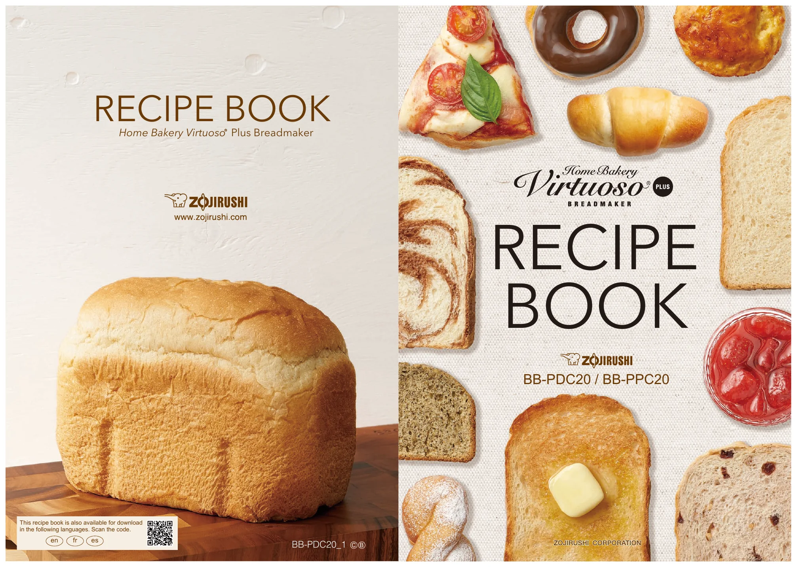

# Home Bakery Virtuoso Plus Recipe Book

Models: **BB-PDC20 / BB-PPC20** 
Language: English 
Source: Zojirushi recipe booklet supplied as `BBPDC_BBPPC_Recipe_en.pdf` 
Conversion: semantic Markdown transcription, prepared 2026-08-10

## Transcription notes

- The source PDF contains 36 PDF pages, but every interior spread is duplicated. This transcription uses the 18 unique source images - the cover plus 17 interior spreads - and preserves the printed page numbers 2-35.
- Metric weights and source volume equivalents are both retained. Prefer the metric weights.
- Photographs are serving suggestions. Page facsimiles are included under `assets/pages/` for layout, illustrations, and visual verification.
- `Timer unavailable` means the delayed timer function cannot be used for that recipe.
- `Add beep` means the machine signals when extra ingredients should be added.
- Fractions that were stored as unmapped PDF glyphs have been visually verified and restored: ½, ¼, ⅓, ⅔, ¾, and ⅛.
- The original PDF remains the authority if this transcription and the facsimile disagree.

## Contents

- [Before getting started](#before-getting-started)
- [Bread courses and standard procedures](#bread-courses-and-standard-procedures)
- [Course 1 - White](#course-1---white)
- [Course 2 - Whole Wheat](#course-2---whole-wheat)
- [Course 3 - European](#course-3---european)
- [Course 4 - Multigrain](#course-4---multigrain)
- [Course 5 - Gluten Free](#course-5---gluten-free)
- [Course 6 - Salt Free](#course-6---salt-free)
- [Course 7 - Sugar Free](#course-7---sugar-free)
- [Course 8 - Vegan](#course-8---vegan)
- [Course 9 - Rapid White](#course-9---rapid-white)
- [Course 10 - Rapid Whole Wheat](#course-10---rapid-whole-wheat)
- [Course 11 - Dough](#course-11---dough)
- [Course 12 - Sourdough Starter](#course-12---sourdough-starter)
- [Course 13 - Cake](#course-13---cake)
- [Course 14 - Jam](#course-14---jam)
- [Course 15 - Homemade](#course-15---homemade)

## Before getting started

[Facsimile: printed pages 2-3](assets/pages/page-02.webp) | [page 3](assets/pages/page-03.webp) 
[Facsimile: printed pages 4-5](assets/pages/page-04.webp) | [page 5](assets/pages/page-05.webp)

### About the icons

- Select the course number shown with each recipe.
- When `Timer unavailable` is shown, delayed start cannot be used.
- When `Crust control` is shown, choose LIGHT, MEDIUM, or DARK.
- The supplied large measuring spoon is approximately 15 mL; the small spoon is approximately 5 mL.
- Approximate source conversions: 1 Tbsp. dry milk = 4 g; 1 Tbsp. sugar = 12 g; 1 tsp. dry yeast = 3 g; 1 tsp. salt = 5 g.

### Basic bread setup

1. Remove the Baking Pan and attach both Kneading Blades to the rotating shafts.
2. Add ingredients to the Baking Pan in the recipe's listed order. The usual order is liquids, flour, sugar, dry milk, salt, butter, and finally yeast.
3. Keep the dry yeast from direct contact with water or other liquid before the course starts.
4. Return the Baking Pan to the Main Body, select the required course, and press START.

### Measuring

- Use a digital kitchen scale capable of 0.1 g increments when possible.
- For liquids, use the supplied Liquid Measuring Cup.
- For dry ingredients, use the supplied Nested Measuring Cups. Fill loosely and level with the back of a knife. Do not tap, shake, or scoop directly from a container.
- For small quantities, fill the supplied Measuring Spoon to a rounded measure and level it.
- One supplied dry measuring cup is approximately 237 mL.

## Bread courses and standard procedures

### Procedure A - Standard loaf

1. Add the ingredients to the Baking Pan in the order listed.
2. Select the specified course and press START.

### Procedure B - Add-beep loaf

1. Prepare the extra ingredients as noted by the recipe.
2. Add all ingredients except `Extra Ingredients` to the Baking Pan in the order listed.
3. Select the specified course and press START.
4. At the Add Beep, add the `Extra Ingredients` to the dough.

### Procedure C - Gluten-free loaf

1. Combine the ingredients marked `A` in a bowl and mix well.
2. Add all ingredients to the Baking Pan in the listed order, except any `Extra Ingredients`.
3. Select Course 5 and press START.
4. At the Add Beep, scrape flour and other ingredients from the sides of the pan to the bottom with a rubber spatula. For the raisin recipe, add the raisins at this time.

## Course 1 - White

[Facsimile: printed pages 6-7](assets/pages/page-06.webp) | [page 7](assets/pages/page-07.webp)

Cycle: Rest, Knead, Rise with two punch-downs, Bake. Add beep after approximately 45 minutes. Crust control: LIGHT 3:15, MEDIUM 3:25, DARK 3:35.

### 1. Basic White Bread

Procedure: [A - Standard loaf](#procedure-a---standard-loaf)

| Weight | Volume | Ingredient |
|---:|---:|---|
| 320 g | Approx. 320 mL | Water |
| 553 g | 4-¼ cups | Bread flour |
| 48 g | 4 Tbsp. | Sugar |
| 8 g | 2 Tbsp. | Dry milk |
| 10 g | 2 tsp. | Salt |
| 35 g | 2-½ Tbsp. | Unsalted butter |
| 6 g | 2 tsp. | Rapid rise yeast |

### 2. Italian Herb Bread

Procedure: [A - Standard loaf](#procedure-a---standard-loaf)

| Weight | Volume | Ingredient |
|---:|---:|---|
| 320 g | Approx. 320 mL | Water |
| 24 g | 2 Tbsp. | Olive oil |
| 553 g | 4-¼ cups | Bread flour |
| 36 g | 3 Tbsp. | Sugar |
| 10 g | 2 tsp. | Salt |
| 1 g | 1 tsp. | Dried basil |
| 6 g | 2 tsp. | Rapid rise yeast |

### 3. Honey Bread

Timer unavailable. Procedure: [A - Standard loaf](#procedure-a---standard-loaf)

| Weight | Volume | Ingredient |
|---:|---:|---|
| 320 g | Approx. 320 mL | Water, chilled to 41°F / 5°C |
| 60 g | 3 Tbsp. | Honey |
| 553 g | 4-¼ cups | Bread flour |
| 10 g | 2 tsp. | Salt |
| 35 g | 2-½ Tbsp. | Unsalted butter |
| 6 g | 2 tsp. | Rapid rise yeast |

### 4. Raisin Bread

Timer unavailable. Procedure: [B - Add-beep loaf](#procedure-b---add-beep-loaf). Break apart the raisins before use.

| Weight | Volume | Ingredient | Group |
|---:|---:|---|---|
| 300 g | Approx. 300 mL | Water | Dough |
| 520 g | 4 cups | Bread flour | Dough |
| 36 g | 3 Tbsp. | Sugar | Dough |
| 8 g | 2 Tbsp. | Dry milk | Dough |
| 10 g | 2 tsp. | Salt | Dough |
| 2 g | 1 tsp. | Cinnamon | Dough |
| 35 g | 2-½ Tbsp. | Unsalted butter | Dough |
| 6 g | 2 tsp. | Rapid rise yeast | Dough |
| 140 g | 1 cup | Raisins | Extra ingredients |

### 5. Chocolate Bread

Timer unavailable. Procedure: [B - Add-beep loaf](#procedure-b---add-beep-loaf).

| Weight | Volume | Ingredient | Group |
|---:|---:|---|---|
| 320 g | Approx. 320 mL | Milk | Dough |
| 50 g | 1 | Large egg, beaten | Dough |
| 545 g | 4 cups + 3 Tbsp. | Bread flour | Dough |
| 36 g | 3 Tbsp. | Sugar | Dough |
| 10 g | 2 tsp. | Salt | Dough |
| 35 g | 2-½ Tbsp. | Unsalted butter | Dough |
| 10 g | 2 Tbsp. | Unsweetened cocoa powder | Dough |
| 6 g | 2 tsp. | Rapid rise yeast | Dough |
| 90 g | 9 Tbsp. | Chocolate chips | Extra ingredients |

### 6. Cranberry & Walnut Bread

Timer unavailable. Procedure: [B - Add-beep loaf](#procedure-b---add-beep-loaf). Cut the walnuts and dried cranberries into ¼-inch / approximately 6 mm pieces.

| Weight | Volume | Ingredient | Group |
|---:|---:|---|---|
| 320 g | Approx. 320 mL | Water | Dough |
| 553 g | 4-¼ cups | Bread flour | Dough |
| 48 g | 4 Tbsp. | Sugar | Dough |
| 8 g | 2 Tbsp. | Dry milk | Dough |
| 10 g | 2 tsp. | Salt | Dough |
| 35 g | 2-½ Tbsp. | Unsalted butter | Dough |
| 6 g | 2 tsp. | Rapid rise yeast | Dough |
| 55 g | ½ cup | Walnuts | Extra ingredients |
| 40 g | 5 Tbsp. | Dried cranberries | Extra ingredients |

## Course 2 - Whole Wheat

[Facsimile: printed page 8](assets/pages/page-08.webp)

Cycle: Rest, Knead, Rise with two punch-downs, Bake. Add beep after approximately 48-58 minutes. Total time: 3:20.

### 7. 100% Whole Wheat Bread

Procedure: [A - Standard loaf](#procedure-a---standard-loaf)

| Weight | Volume | Ingredient |
|---:|---:|---|
| 370 g | Approx. 370 mL | Water |
| 40 g | 2 Tbsp. | Honey |
| 553 g | 4-¼ cups | Whole wheat flour |
| 36 g | 3 Tbsp. | Sugar |
| 8 g | 2 Tbsp. | Dry milk |
| 10 g | 2 tsp. | Salt |
| 32 g | 4 Tbsp. | Vital wheat gluten |
| 28 g | 2 Tbsp. | Unsalted butter |
| 6 g | 2 tsp. | Rapid rise yeast |

### 8. 100% Whole Wheat Walnut Bread

Timer unavailable. Procedure: [B - Add-beep loaf](#procedure-b---add-beep-loaf). Cut walnuts into ¼-inch / approximately 6 mm pieces.

| Weight | Volume | Ingredient | Group |
|---:|---:|---|---|
| 450 g | Approx. 450 mL | Water, chilled to 41°F / 5°C | Dough |
| 20 g | 1 Tbsp. | Honey | Dough |
| 563 g | 4-⅓ cups | Whole wheat flour | Dough |
| 48 g | 4 Tbsp. | Sugar | Dough |
| 8 g | 2 Tbsp. | Dry milk | Dough |
| 10 g | 2 tsp. | Salt | Dough |
| 32 g | 4 Tbsp. | Vital wheat gluten | Dough |
| 28 g | 2 Tbsp. | Unsalted butter | Dough |
| 6 g | 2 tsp. | Rapid rise yeast | Dough |
| 73 g | ⅔ cup | Walnuts | Extra ingredients |

### 9. Light Rye Bread

Timer unavailable. Procedure: [A - Standard loaf](#procedure-a---standard-loaf)

| Weight | Volume | Ingredient |
|---:|---:|---|
| 330 g | Approx. 330 mL | Water, chilled to 41°F / 5°C |
| 358 g | 2-¾ cups | Bread flour |
| 65 g | ½ cup | Whole wheat flour |
| 130 g | 1 cup | Rye flour |
| 24 g | 2 Tbsp. | Sugar |
| 8 g | 2 Tbsp. | Dry milk |
| 10 g | 2 tsp. | Salt |
| 28 g | 2 Tbsp. | Unsalted butter |
| 6 g | 2 tsp. | Rapid rise yeast |

### 10. Pumpernickel Bread

Procedure: [A - Standard loaf](#procedure-a---standard-loaf)

| Weight | Volume | Ingredient |
|---:|---:|---|
| 380 g | Approx. 380 mL | Water |
| 2 g | 2 tsp. | Instant coffee |
| 10 g | 2 Tbsp. | Unsweetened cocoa powder |
| 24 g | 2 Tbsp. | Vegetable oil |
| 40 g | 2 Tbsp. | Honey |
| 260 g | 2 cups | Bread flour |
| 130 g | 1 cup | Whole wheat flour |
| 98 g | ¾ cup | Rye flour |
| 35 g | 4 Tbsp. | Cornmeal |
| 48 g | 4 Tbsp. | Sugar |
| 10 g | 2 tsp. | Salt |
| 32 g | 4 Tbsp. | Vital wheat gluten |
| 6 g | 2 tsp. | Rapid rise yeast |

## Course 3 - European

[Facsimile: printed page 9](assets/pages/page-09.webp)

Cycle: Rest, Knead, Rise with two punch-downs, Bake. Add beep after approximately 43 minutes. Total time: 3:15.

If the room temperature is above 77°F / 25°C, use water chilled to 41°F / 5°C. Results may be less satisfactory if delayed start is used.

### 11. French Bread

Procedure: [A - Standard loaf](#procedure-a---standard-loaf)

| Weight | Volume | Ingredient |
|---:|---:|---|
| 320 g | Approx. 320 mL | Water |
| 553 g | 4-¼ cups | Bread flour |
| 12 g | 1 Tbsp. | Sugar |
| 12 g | 3 Tbsp. | Dry milk |
| 10 g | 2 tsp. | Salt |
| 3 g | 1 tsp. | Rapid rise yeast |

### 12. Rustic Herb Bread

Timer unavailable. Procedure: [A - Standard loaf](#procedure-a---standard-loaf)

| Weight | Volume | Ingredient |
|---:|---:|---|
| 320 g | Approx. 320 mL | Water, chilled to 41°F / 5°C |
| 24 g | 2 Tbsp. | Olive oil |
| 553 g | 4-¼ cups | Bread flour |
| 12 g | 1 Tbsp. | Sugar |
| 12 g | 3 Tbsp. | Dry milk |
| 10 g | 2 tsp. | Salt |
| 2 g | 2 tsp. | Dried basil |
| 6 g | 2 tsp. | Rapid rise yeast |

### 13. Sesame Bread

Procedure: [A - Standard loaf](#procedure-a---standard-loaf)

| Weight | Volume | Ingredient |
|---:|---:|---|
| 320 g | Approx. 320 mL | Water |
| 553 g | 4-¼ cups | Bread flour |
| 12 g | 1 Tbsp. | Sugar |
| 12 g | 3 Tbsp. | Dry milk |
| 10 g | 2 tsp. | Salt |
| 16 g | 2 Tbsp. | Sesame seeds |
| 3 g | 1 tsp. | Rapid rise yeast |

### 14. Bacon Bread

Timer unavailable. Procedure: [B - Add-beep loaf](#procedure-b---add-beep-loaf). Cut the cooked bacon into ½-inch / approximately 1.3 cm pieces. Weigh the extra bacon after frying and draining its grease.

| Weight | Volume | Ingredient | Group |
|---:|---:|---|---|
| 360 g | Approx. 360 mL | Water, chilled to 41°F / 5°C | Dough |
| 553 g | 4-¼ cups | Bread flour | Dough |
| 12 g | 1 Tbsp. | Sugar | Dough |
| 12 g | 3 Tbsp. | Dry milk | Dough |
| 10 g | 2 tsp. | Salt | Dough |
| As needed | - | Coarse black pepper | Dough |
| 28 g | 1.0 oz. | Thick-sliced bacon, chopped | Dough |
| 6 g | 2 tsp. | Rapid rise yeast | Dough |
| 57 g | 2.0 oz. | Thick-sliced bacon, fried and grease drained | Extra ingredients |

## Course 4 - Multigrain

[Facsimile: printed page 10](assets/pages/page-10.webp)

Cycle: Rest, Knead, Rise with two punch-downs, Bake. Add beep after approximately 45 minutes. Crust control: LIGHT 3:15, MEDIUM 3:25, DARK 3:35.

### 15. 7 Grain Bread

Procedure: [A - Standard loaf](#procedure-a---standard-loaf)

| Weight | Volume | Ingredient |
|---:|---:|---|
| 310 g | Approx. 310 mL | Water |
| 228 g | 1-¾ cups | Whole wheat flour |
| 217 g | 1-⅔ cups | Bread flour |
| 100 g | ⅔ cup | 7 grain cereal |
| 36 g | 3 Tbsp. | Sugar |
| 10 g | 2 tsp. | Salt |
| 28 g | 2 Tbsp. | Unsalted butter |
| 6 g | 2 tsp. | Rapid rise yeast |

### 16. 12 Grain Bread

Timer unavailable. Procedure: [A - Standard loaf](#procedure-a---standard-loaf)

| Weight | Volume | Ingredient |
|---:|---:|---|
| 330 g | Approx. 330 mL | Water, chilled to 41°F / 5°C |
| 16 g | 2 Tbsp. | Sunflower seeds |
| 130 g | 1 cup | Whole wheat flour |
| 293 g | 2-¼ cups | Bread flour |
| 75 g | ½ cup | 10 grain cereal |
| 65 g | ½ cup | Rye flour |
| 36 g | 3 Tbsp. | Sugar |
| 10 g | 2 tsp. | Salt |
| 28 g | 2 Tbsp. | Unsalted butter |
| 6 g | 2 tsp. | Poppy seeds |
| As needed | - | Tarragon, to taste |
| 6 g | 2 tsp. | Rapid rise yeast |

> Do not exceed the listed poppy seed quantity. Hard seeds may damage the Baking Pan's nonstick coating or the Kneading Blades.

### 17. Multigrain Raisin Bread

Timer unavailable. Procedure: [B - Add-beep loaf](#procedure-b---add-beep-loaf)

| Weight | Volume | Ingredient | Group |
|---:|---:|---|---|
| 320 g | Approx. 320 mL | Water | Dough |
| 195 g | 1-½ cups | Whole wheat flour | Dough |
| 293 g | 2-¼ cups | Bread flour | Dough |
| 33 g | 4 Tbsp. | Teff flour | Dough |
| 48 g | 4 Tbsp. | Sugar | Dough |
| 10 g | 2 tsp. | Salt | Dough |
| 28 g | 2 Tbsp. | Unsalted butter | Dough |
| 4 g | 2 tsp. | Cinnamon | Dough |
| 6 g | 2 tsp. | Rapid rise yeast | Dough |
| 47 g | ⅓ cup | Raisins | Extra ingredients |

## Course 5 - Gluten Free

[Facsimile: printed page 11](assets/pages/page-11.webp)

Cycle: Rest, Knead, Rise with two punch-downs, Bake. Add beep after approximately 45 minutes. Crust control: LIGHT 2:15, MEDIUM 2:25, DARK 2:35.

For apple cider vinegar, shake the bottle first if its contents have settled.

### 18. Gluten Free Brown Rice Bread

Timer unavailable. Procedure: [C - Gluten-free loaf](#procedure-c---gluten-free-loaf)

| Weight | Volume | Ingredient | Group |
|---:|---:|---|---|
| 360 g | Approx. 360 mL | Milk | Batter |
| 150 g | 3 | Large eggs, beaten | Batter |
| 15 g | 1 Tbsp. | Apple cider vinegar | Batter |
| 36 g | 3 Tbsp. | Vegetable oil | Batter |
| 60 g | 3 Tbsp. | Honey | Batter |
| 320 g | 2 cups | Potato starch | A |
| 228 g | 1-¾ cups | Brown rice flour | A |
| 8 g | 1 Tbsp. | Xanthan gum | A |
| 7.5 g | 1-½ tsp. | Salt | Batter |
| 9 g | 3 tsp. | Active dry yeast | Batter |

### 19. Gluten Free Italian Herb Bread

Timer unavailable. Procedure: [C - Gluten-free loaf](#procedure-c---gluten-free-loaf)

| Weight | Volume | Ingredient | Group |
|---:|---:|---|---|
| 360 g | Approx. 360 mL | Milk | Batter |
| 150 g | 3 | Large eggs, beaten | Batter |
| 15 g | 1 Tbsp. | Apple cider vinegar | Batter |
| 36 g | 3 Tbsp. | Vegetable oil | Batter |
| 60 g | 3 Tbsp. | Honey | Batter |
| 320 g | 2 cups | Potato starch | A |
| 228 g | 1-¾ cups | Brown rice flour | A |
| 8 g | 1 Tbsp. | Xanthan gum | A |
| 1 g | 1 tsp. | Dried basil | A |
| 7.5 g | 1-½ tsp. | Salt | Batter |
| 9 g | 3 tsp. | Active dry yeast | Batter |

### 20. Gluten Free Raisin Bread

Timer unavailable. Procedure: [C - Gluten-free loaf](#procedure-c---gluten-free-loaf). Cut the raisins before use and add them at the Add Beep after scraping down the pan.

| Weight | Volume | Ingredient | Group |
|---:|---:|---|---|
| 400 g | Approx. 400 mL | Milk | Batter |
| 150 g | 3 | Large eggs, beaten | Batter |
| 15 g | 1 Tbsp. | Apple cider vinegar | Batter |
| 36 g | 3 Tbsp. | Vegetable oil | Batter |
| 60 g | 3 Tbsp. | Honey | Batter |
| 320 g | 2 cups | Potato starch | A |
| 228 g | 1-¾ cups | Brown rice flour | A |
| 8 g | 1 Tbsp. | Xanthan gum | A |
| 2 g | 1 tsp. | Cinnamon | A |
| 7.5 g | 1-½ tsp. | Salt | Batter |
| 9 g | 3 tsp. | Active dry yeast | Batter |
| 70 g | ½ cup | Raisins | Extra ingredients |

## Course 6 - Salt Free

[Facsimile: printed page 12](assets/pages/page-12.webp)

Cycle: Rest, Knead, Rise with two punch-downs, Bake. Add beep after approximately 45 minutes. Crust control: LIGHT 3:15, MEDIUM 3:25, DARK 3:35.

If the room temperature is above 77°F / 25°C, use water chilled to 41°F / 5°C. Results may be less satisfactory if delayed start is used. Shake apple cider vinegar first if its contents have settled.

### 21. Salt Free White Bread

Procedure: [A - Standard loaf](#procedure-a---standard-loaf)

| Weight | Volume | Ingredient |
|---:|---:|---|
| 320 g | Approx. 320 mL | Water |
| 15 g | 1 Tbsp. | Apple cider vinegar |
| 545 g | 4 cups + 3 Tbsp. | Bread flour |
| 42 g | 3-½ Tbsp. | Sugar |
| 12 g | 3 Tbsp. | Dry milk |
| 35 g | 2-½ Tbsp. | Unsalted butter |
| 3 g | 1 tsp. | Rapid rise yeast |

### 22. Salt Free Whole Wheat Bread

Timer unavailable. Procedure: [A - Standard loaf](#procedure-a---standard-loaf)

| Weight | Volume | Ingredient |
|---:|---:|---|
| 400 g | Approx. 400 mL | Water, chilled to 41°F / 5°C |
| 15 g | 1 Tbsp. | Apple cider vinegar |
| 553 g | 4-¼ cups | Whole wheat flour |
| 42 g | 3-½ Tbsp. | Sugar |
| 12 g | 3 Tbsp. | Dry milk |
| 16 g | 2 Tbsp. | Vital wheat gluten |
| 35 g | 2-½ Tbsp. | Unsalted butter |
| 3 g | 1 tsp. | Rapid rise yeast |

## Course 7 - Sugar Free

[Facsimile: printed page 13](assets/pages/page-13.webp)

Cycle: Rest, Knead, Rise with two punch-downs, Bake. Add beep after approximately 46 minutes. Total time: 4:15.

If the room temperature is above 77°F / 25°C, use water chilled to 41°F / 5°C. Results may be less satisfactory if delayed start is used.

### 23. Sugar Free White Bread

Procedure: [A - Standard loaf](#procedure-a---standard-loaf)

| Weight | Volume | Ingredient |
|---:|---:|---|
| 320 g | Approx. 320 mL | Water |
| 545 g | 4 cups + 3 Tbsp. | Bread flour |
| 12 g | 3 Tbsp. | Dry milk |
| 7.5 g | 1-½ tsp. | Salt |
| 28 g | 2 Tbsp. | Unsalted butter |
| 3 g | 1 tsp. | Rapid rise yeast |

### 24. Sugar Free Whole Wheat Bread

Timer unavailable. Procedure: [A - Standard loaf](#procedure-a---standard-loaf)

| Weight | Volume | Ingredient |
|---:|---:|---|
| 360 g | Approx. 360 mL | Water, chilled to 41°F / 5°C |
| 553 g | 4-¼ cups | Whole wheat flour |
| 12 g | 3 Tbsp. | Dry milk |
| 7.5 g | 1-½ tsp. | Salt |
| 16 g | 2 Tbsp. | Vital wheat gluten |
| 28 g | 2 Tbsp. | Unsalted butter |
| 3 g | 1 tsp. | Rapid rise yeast |

## Course 8 - Vegan

[Facsimile: printed page 14](assets/pages/page-14.webp)

Cycle: Rest, Knead, Rise with two punch-downs, Bake. Add beep after approximately 45 minutes. Crust control: LIGHT 3:15, MEDIUM 3:25, DARK 3:35.

### 25. Vegan White Bread

Timer unavailable. Procedure: [A - Standard loaf](#procedure-a---standard-loaf)

| Weight | Volume | Ingredient |
|---:|---:|---|
| 160 g | Approx. 160 mL | Water |
| 160 g | Approx. 160 mL | Unsweetened almond milk |
| 24 g | 2 Tbsp. | Olive oil |
| 545 g | 4 cups + 3 Tbsp. | Bread flour |
| 36 g | 3 Tbsp. | Sugar |
| 10 g | 2 tsp. | Salt |
| 4.5 g | 1-½ tsp. | Rapid rise yeast |

### 26. Vegan Whole Wheat Bread

Timer unavailable. Procedure: [A - Standard loaf](#procedure-a---standard-loaf)

| Weight | Volume | Ingredient |
|---:|---:|---|
| 210 g | Approx. 210 mL | Water |
| 160 g | Approx. 160 mL | Unsweetened almond milk |
| 24 g | 2 Tbsp. | Olive oil |
| 553 g | 4-¼ cups | Whole wheat flour |
| 48 g | 4 Tbsp. | Sugar |
| 10 g | 2 tsp. | Salt |
| 24 g | 3 Tbsp. | Vital wheat gluten |
| 6 g | 2 tsp. | Rapid rise yeast |

## Course 9 - Rapid White

[Facsimile: printed page 15](assets/pages/page-15.webp)

Cycle: Rest, Knead, Rise with one punch-down, Bake. Add beep after approximately 35 minutes. Crust control: LIGHT 2:15, MEDIUM 2:25, DARK 2:35.

### 27. Rapid Basic White Bread

Timer unavailable. Procedure: [A - Standard loaf](#procedure-a---standard-loaf)

| Weight | Volume | Ingredient |
|---:|---:|---|
| 320 g | Approx. 320 mL | Water |
| 553 g | 4-¼ cups | Bread flour |
| 48 g | 4 Tbsp. | Sugar |
| 8 g | 2 Tbsp. | Dry milk |
| 10 g | 2 tsp. | Salt |
| 35 g | 2-½ Tbsp. | Unsalted butter |
| 7.5 g | 2-½ tsp. | Rapid rise yeast |

### 28. Rapid Italian Herb Bread

Timer unavailable. Procedure: [A - Standard loaf](#procedure-a---standard-loaf)

| Weight | Volume | Ingredient |
|---:|---:|---|
| 320 g | Approx. 320 mL | Water |
| 24 g | 2 Tbsp. | Olive oil |
| 545 g | 4 cups + 3 Tbsp. | Bread flour |
| 48 g | 4 Tbsp. | Sugar |
| 8 g | 2 Tbsp. | Dry milk |
| 10 g | 2 tsp. | Salt |
| 2 g | 2 tsp. | Dried basil |
| 7.5 g | 2-½ tsp. | Rapid rise yeast |

### 29. Rapid Raisin Bread

Timer unavailable. Procedure: [B - Add-beep loaf](#procedure-b---add-beep-loaf). Break apart the raisins before use.

| Weight | Volume | Ingredient | Group |
|---:|---:|---|---|
| 320 g | Approx. 320 mL | Water | Dough |
| 545 g | 4 cups + 3 Tbsp. | Bread flour | Dough |
| 48 g | 4 Tbsp. | Sugar | Dough |
| 8 g | 2 Tbsp. | Dry milk | Dough |
| 10 g | 2 tsp. | Salt | Dough |
| 2 g | 1 tsp. | Cinnamon | Dough |
| 35 g | 2-½ Tbsp. | Unsalted butter | Dough |
| 7.5 g | 2-½ tsp. | Rapid rise yeast | Dough |
| 93 g | ⅔ cup | Raisins | Extra ingredients |

## Course 10 - Rapid Whole Wheat

[Facsimile: printed page 16](assets/pages/page-16.webp)

Cycle: Rest, Knead, Rise with one punch-down, Bake. Add beep after approximately 37 minutes. Total time: 2:25.

### 30. Rapid 100% Whole Wheat Bread

Timer unavailable. Procedure: [A - Standard loaf](#procedure-a---standard-loaf)

| Weight | Volume | Ingredient |
|---:|---:|---|
| 380 g | Approx. 380 mL | Water |
| 40 g | 2 Tbsp. | Honey |
| 553 g | 4-¼ cups | Whole wheat flour |
| 36 g | 3 Tbsp. | Sugar |
| 8 g | 2 Tbsp. | Dry milk |
| 10 g | 2 tsp. | Salt |
| 32 g | 4 Tbsp. | Vital wheat gluten |
| 28 g | 2 Tbsp. | Unsalted butter |
| 7.5 g | 2-½ tsp. | Rapid rise yeast |

### 31. Rapid Light Rye Bread

Timer unavailable. Procedure: [A - Standard loaf](#procedure-a---standard-loaf)

| Weight | Volume | Ingredient |
|---:|---:|---|
| 330 g | Approx. 330 mL | Water |
| 455 g | 3-½ cups | Bread flour |
| 87 g | ⅔ cup | Rye flour |
| 24 g | 2 Tbsp. | Sugar |
| 8 g | 2 Tbsp. | Dry milk |
| 10 g | 2 tsp. | Salt |
| 28 g | 2 Tbsp. | Unsalted butter |
| 7.5 g | 2-½ tsp. | Rapid rise yeast |

## Course 11 - Dough

[Facsimile: printed pages 18-23](assets/pages/page-18.webp) | [page 19](assets/pages/page-19.webp) | [page 20](assets/pages/page-20.webp) | [page 21](assets/pages/page-21.webp) | [page 22](assets/pages/page-22.webp) | [page 23](assets/pages/page-23.webp)

Cycle: Rest, Knead, Rise with one punch-down. Add beep after approximately 38 minutes. Total time: 1:50. Gluten-free dough uses Course 15; see recipe 50.

### 32. Butter Rolls

Makes 20. Timer unavailable.

| Weight | Volume | Ingredient | Group |
|---:|---:|---|---|
| 210 g | Approx. 210 mL | Milk | Dough |
| 50 g | 1 | Large egg, beaten | Dough |
| 433 g | 3-⅓ cups | Bread flour | Dough |
| 42 g | 3-½ Tbsp. | Sugar | Dough |
| 5 g | 1 tsp. | Salt | Dough |
| 57 g | 2.0 oz. | Unsalted butter | Dough |
| 3 g | 1 tsp. | Rapid rise yeast | Dough |
| 50 g | 1 | Large egg, beaten | Egg glaze |
| 15 g | 1 Tbsp. | Water | Egg glaze |

1. Mix the two egg-glaze ingredients. Add the dough ingredients, but not the glaze, to the Baking Pan in the listed order.
2. Select Course 11 and press START.
3. Remove the dough and cut it into 20 equal pieces. Do not pull it apart by hand, which may damage its texture.
4. Shape smooth balls, cover, and rest for about 20 minutes.
5. Roll each ball into a cone, flatten it into a triangle, and roll it up from the wide end.
6. Set the rolls seam-side down on a parchment-lined tray. Spray with water and let rise at 95°F / 35°C for about 30 minutes, or until doubled.
7. Brush with egg glaze and bake at 350°F / 177°C for about 15 minutes.

### 33. Doughnuts

Makes 8 ring doughnuts and 5 twist doughnuts. Timer unavailable.

| Amount | Ingredient | Group |
|---:|---|---|
| 1 preparation | Butter Roll Dough from recipe 32 | Dough |
| As needed | Cooking oil | Frying |
| As needed | Granulated sugar | Topping |
| As needed | Powdered sugar | Topping |

1. Prepare one batch of Butter Roll Dough through the end of Course 11.
2. Divide the dough in half. Shape one half into a ball for ring doughnuts. Divide the other half into five balls for twists. Cover and rest about 20 minutes.
3. Roll the ring-doughnut half to ½ inch / approximately 1.3 cm thick and cut eight rings.
4. Roll each twist piece into a 12 inch / approximately 30 cm cylinder, twist it like a rope, and press the ends together.
5. Put all pieces on a parchment-lined tray. Spray with water and rise at 95°F / 35°C for about 30 minutes, or until doubled.
6. Heat oil to 350°F / 177°C and fry, turning occasionally, until golden brown.
7. Coat hot doughnuts in granulated sugar, or cool slightly and dust with powdered sugar. For chocolate doughnuts, spread melted coating chocolate over the tops.

### 34. Breadsticks

Makes 40. Timer unavailable.

| Weight | Volume | Ingredient | Group |
|---:|---:|---|---|
| 210 g | Approx. 210 mL | Milk | Dough |
| 50 g | 1 | Large egg, beaten | Dough |
| 433 g | 3-⅓ cups | Bread flour | Dough |
| 48 g | 4 Tbsp. | Sugar | Dough |
| 10 g | 2 tsp. | Salt | Dough |
| 35 g | 2-½ Tbsp. | Unsalted butter | Dough |
| 6 g | 2 tsp. | Rapid rise yeast | Dough |
| As needed | - | Grated Parmesan cheese | Topping |

1. Add the dough ingredients, but not the topping, to the Baking Pan in the listed order. Select Course 11 and press START.
2. Divide the finished dough into four pieces. Roll each to a 7 x 5 inch / approximately 18 x 13 cm rectangle. Cover and rest about 20 minutes.
3. Cut into ½ inch / approximately 1.3 cm strips. Roll each strip into a 12 inch / approximately 30 cm rope, making 40 ropes total.
4. Put the ropes on a parchment-lined tray, brush with water or egg white, and top with Parmesan.
5. Bake at 375°F / 191°C for about 12 minutes.

### 35. Bagels

Makes 10. Timer unavailable.

| Weight | Volume | Ingredient | Group |
|---:|---:|---|---|
| 300 g | Approx. 300 mL | Water | Dough |
| 488 g | 3-¾ cups | Bread flour | Dough |
| 24 g | 2 Tbsp. | Sugar | Dough |
| 5 g | 1 tsp. | Salt | Dough |
| 3 g | 1 tsp. | Rapid rise yeast | Dough |
| As needed | - | Boiling water | Kettling |
| 20 g | 1 Tbsp. | Honey | Kettling |
| As needed | - | Cream cheese | Topping |

1. Add the dough ingredients, but not the kettling or topping ingredients, to the Baking Pan. Select Course 11 and press START.
2. Divide the dough into ten balls. Cover and rest about 20 minutes.
3. Poke through each center and widen it into a ring.
4. Cut parchment into ten 5 inch / approximately 13 cm squares. Put one bagel on each square, spray with water, and rise at 95°F / 35°C for about 20 minutes, or until doubled.
5. Bring about 68 oz. / 2 L water to a boil and dissolve the honey in it. Reduce to a slow bubbling simmer, about 200°F / 93°C.
6. Lower two or three bagels at a time into the water with their parchment. Boil 30 seconds per side; the paper will release naturally.
7. Drain and return to a parchment-lined tray. Optionally brush with egg white and add sesame seeds or cheese.
8. Bake immediately at 375°F / 191°C for about 17 minutes.
9. Slice and serve with room-temperature cream cheese.

### 36. Traditional Pizza Dough

Makes four 11 inch / approximately 28 cm thin-crust pizzas or two 11 inch thick-crust pizzas. Timer unavailable.

| Weight | Volume | Ingredient |
|---:|---:|---|
| 300 g | Approx. 300 mL | Water |
| 18 g | 1-½ Tbsp. | Olive oil |
| 488 g | 3-¾ cups | Bread flour |
| 18 g | 1-½ Tbsp. | Sugar |
| 5 g | 1 tsp. | Salt |
| 3 g | 1 tsp. | Rapid rise yeast |

1. Add ingredients to the Baking Pan in the listed order. Select Course 11 and press START.
2. For thin crust, divide into four balls and rest covered for 10 minutes. For thick crust, divide into two balls and rest covered for 20 minutes.
3. Roll each ball on parchment into an 11 inch / approximately 28 cm circle. Transfer it with the parchment to a baking tray and dock with a fork.
4. Add sauce, cheese, and other toppings.
5. Bake at 400°F / 204°C for about 15 minutes.

#### Margherita Pizza

Makes one pizza.

| Weight | Volume | Ingredient |
|---:|---:|---|
| 1 | - | Thick-crust pizza dough |
| 96 g | 6 Tbsp. | Tomato sauce, below |
| 114 g | 4.0 oz. | Fresh mozzarella |
| 5-7 | - | Cherry tomatoes |
| 5 | - | Basil leaves |

1. Prepare the pizza dough and sauce.
2. Slice mozzarella ¼ inch / approximately 6 mm thick. Stem and slice the tomatoes into rounds.
3. Spread sauce over the dough and add mozzarella and tomato.
4. Bake at 400°F / 204°C for about 15 minutes. Add basil after baking.

Tomato sauce, enough for four pizzas:

| Weight | Volume | Ingredient |
|---:|---:|---|
| 320 g | 1-⅓ cups | Tomato puree |
| 96 g | 6 Tbsp. | Tomato ketchup |
| To taste | - | Salt and pepper |

Combine all sauce ingredients.

## Course 12 - Sourdough Starter

[Facsimile: printed page 24](assets/pages/page-24.webp)

Cycle: Rest, Knead, Rise. Total time: 2:10.

### Sourdough Starter

Timer unavailable.

| Weight | Volume | Ingredient |
|---:|---:|---|
| 360 g | Approx. 360 mL | Water |
| 260 g | 2 cups | Bread flour |
| 6 g | 2 tsp. | Active dry yeast |

1. Add ingredients to the Baking Pan in the listed order.
2. Select Course 12 and press START.
3. Make Light Sourdough Bread promptly after the starter course finishes.

### 37. Light Sourdough Bread

Course 1 - White. Timer unavailable. Shake apple cider vinegar first if its contents have settled.

| Weight | Volume | Ingredient |
|---:|---:|---|
| 1 batch | - | Sourdough Starter from Course 12, already in the pan |
| 38 g | 2-½ Tbsp. | Apple cider vinegar |
| 23 g | 1-½ Tbsp. | Lemon juice |
| 390 g | 3 cups | Bread flour |
| 24 g | 2 Tbsp. | Sugar |
| 7.5 g | 1-½ tsp. | Salt |
| 6 g | 2 tsp. | Active dry yeast |

1. Add the additional ingredients in the listed order to the pan containing the starter.
2. Select Course 1 - White and press START.

## Course 13 - Cake

[Facsimile: printed page 25](assets/pages/page-25.webp)

Cycle: Knead, Bake. Add beep after approximately 16 minutes. Crust control: LIGHT 1:40, MEDIUM 1:50, DARK 2:00.

### 38. Pound Cake

Timer unavailable.

| Weight | Volume | Ingredient | Group |
|---:|---:|---|---|
| 150 g | 3 | Large eggs, beaten | Wet |
| 80 g | Approx. 80 mL | Milk | Wet |
| 114 g | 4.0 oz. | Unsalted butter | Wet |
| 5 g | 1 tsp. | Vanilla extract | Wet |
| 206 g | 1 cup | Sugar | Wet |
| 260 g | 2 cups | All-purpose flour | A |
| 10.5 g | 3-½ tsp. | Baking powder | A |

1. Melt the butter and cool it to room temperature. Sift group A together.
2. Add ingredients to the Baking Pan in the listed order. Select Course 13 and press START.
3. At the Add Beep, scrape flour and batter from the sides to the bottom with a rubber spatula, then press START again.

### 39. Tea Cake

Timer unavailable. Use the Pound Cake method, but mix the tea into the sifted group A before adding it.

| Weight | Volume | Ingredient | Group |
|---:|---:|---|---|
| 150 g | 3 | Large eggs, beaten | Wet |
| 80 g | Approx. 80 mL | Milk | Wet |
| 114 g | 4.0 oz. | Unsalted butter | Wet |
| 5 g | 1 tsp. | Vanilla extract | Wet |
| 206 g | 1 cup | Sugar | Wet |
| 260 g | 2 cups | All-purpose flour | A |
| 10.5 g | 3-½ tsp. | Baking powder | A |
| 12 g | 3 Tbsp. | Fine Earl Grey tea leaves | A |

### 40. Corn Bread

Timer unavailable. Use fine-ground cornmeal. Coarse or medium cornmeal may leave a hard, grainy texture.

| Weight | Volume | Ingredient | Group |
|---:|---:|---|---|
| 150 g | 3 | Large eggs, beaten | Wet |
| 80 g | Approx. 80 mL | Milk | Wet |
| 85 g | 3.0 oz. | Unsalted butter | Wet |
| 5 g | 1 tsp. | Vanilla extract | Wet |
| 206 g | 1 cup | Sugar | Wet |
| 130 g | 1 cup | All-purpose flour | A |
| 10.5 g | 3-½ tsp. | Baking powder | A |
| 140 g | 1 cup | Fine-ground cornmeal | A |

1. Melt the butter and cool it to room temperature. Sift flour and baking powder, then mix in the cornmeal.
2. Follow Pound Cake steps 2-3.

## Course 14 - Jam

[Facsimile: printed page 26](assets/pages/page-26.webp)

Cycle: Heat, then Heat and Mix. Total time: 1:20.

After washing fruit, remove excess moisture. Store finished jam in a clean container in the refrigerator and consume within one week. Machine-made jam may be thinner than commercial jam; add pectin with the other ingredients for a thicker result.

### 41. Strawberry Jam

Timer unavailable.

| Weight | Volume | Ingredient |
|---:|---:|---|
| 300 g | 3 cups | Strawberries, net weight |
| 137 g | ⅔ cup | Sugar |
| 15 g | 1 Tbsp. | Lemon juice |

Remove stems, quarter or halve the berries, and mash lightly. Add ingredients to the Baking Pan in the listed order, select Course 14, and press START.

### 42. Orange Marmalade

Timer unavailable. The 300 g orange weight includes thinly sliced rind and pulp removed from the outer membrane.

| Weight | Volume | Ingredient |
|---:|---:|---|
| 300 g | Approx. 2 | Oranges |
| 137 g | ⅔ cup | Sugar |
| 15 g | 1 Tbsp. | Lemon juice |
| 8 g | ½ Tbsp. | Brandy |

1. Wash the oranges and peel the rind. Slice the rind thinly.
2. Cover the rind with water in a pot, bring to a boil, drain, and repeat three times.
3. Remove pulp from the outer membrane and divide it into two or three portions.
4. Add all ingredients to the Baking Pan in the listed order. Select Course 14 and press START.

## Course 15 - Homemade

[Facsimile: printed pages 28-35](assets/pages/page-28.webp) | [page 29](assets/pages/page-29.webp) | [page 30](assets/pages/page-30.webp) | [page 31](assets/pages/page-31.webp) | [page 32](assets/pages/page-32.webp) | [page 33](assets/pages/page-33.webp) | [page 34](assets/pages/page-34.webp) | [page 35](assets/pages/page-35.webp)

Course 15 allows custom Rest, Knead, Shape, Rise, Bake, and Keep Warm times. Up to three settings can be saved. When Shape is set to 1:00, the machine pauses for hand shaping after kneading and resumes when START is pressed again. Set Shape to OFF when no hand shaping is required.

| Cycle | Permitted setting |
|---|---|
| Rest | OFF or 1-30 min. |
| Knead | OFF or 5-30 min. |
| Shape | OFF or 1 hr. |
| Rise 1 | OFF or 1 min.-12 hrs. |
| Rise 2 | OFF or 1 min.-2 hrs. |
| Rise 3 | OFF or 1 min.-2 hrs. |
| Bake | OFF or 1 min.-1 hr. 30 min. |
| Keep Warm | OFF or 1 hr. |

Shorten Knead or Rise if the loaf is too tall or the room or water is warm. Lengthen them if the loaf is too short or conditions are cold. Shorten Bake for a lighter crust and lengthen it for a darker crust. These are guidelines; ingredients, quantities, and temperature all affect results.

### Homemade preset - Basic White Bread

The ingredients match recipe 1.

| Rest | Knead | Shape | Rise 1 | Rise 2 | Rise 3 | Bake | Keep Warm | Total |
|---:|---:|---:|---:|---:|---:|---:|---:|---:|
| 0:30 | 0:20 | OFF | 0:35 | 0:20 | 0:40 | 1:00 | OFF | 3:25 |

### Homemade preset - Butter Rolls

The ingredients and shaping steps match recipe 32.

| Rest | Knead | Shape | Rise 1 | Rise 2 | Rise 3 | Bake | Keep Warm | Total |
|---:|---:|---:|---:|---:|---:|---:|---:|---:|
| 0:23 | 0:20 | OFF | 0:45 | 0:22 | 0:00 | 0:00 | OFF | 1:50 |

### 43. Cinnamon Roll Bread

Timer unavailable.

| Rest | Knead | Shape | Rise 1 | Rise 2 | Rise 3 | Bake | Keep Warm | Total |
|---:|---:|---:|---:|---:|---:|---:|---:|---:|
| 0:00 | 0:20 | 1:00 | 0:45 | 0:25 | 0:55 | 0:55 | OFF | 3:20 |

| Weight | Volume | Ingredient | Group |
|---:|---:|---|---|
| 240 g | Approx. 240 mL | Milk | Dough |
| 100 g | 2 | Large eggs, beaten | Dough |
| 553 g | 4-¼ cups | Bread flour | Dough |
| 48 g | 4 Tbsp. | Sugar | Dough |
| 10 g | 2 tsp. | Salt | Dough |
| 35 g | 2-½ Tbsp. | Unsalted butter | Dough |
| 6 g | 2 tsp. | Rapid rise yeast | Dough |
| As needed | - | Bread flour | Sprinkling flour |
| As needed | - | Milk | Topping |
| 60 g | 5 Tbsp. | Sugar | Topping A |
| 2 g | 1 tsp. | Cinnamon | Topping A |
| 55 g | ½ cup | Powdered sugar | Icing |
| 10 g | 2 tsp. | Water | Icing |

1. Add only the dough ingredients to the Baking Pan. Select Course 15, program the listed times with Shape set to 1:00, and press START.
2. At the Shape Beep, remove the dough, flour the work surface, form a ball, cover, and rest about 30 minutes.
3. Roll to a 12 x 12 inch / approximately 30 x 30 cm square. Brush milk over three-quarters of the dough from the near edge and sprinkle with the mixed sugar and cinnamon.
4. Roll from the near edge, seal firmly, and cut into ten equal pieces.
5. Remove both Kneading Blades, arrange the pieces randomly in the pan, and press START again.
6. Mix the icing. Cool the baked loaf slightly and decorate it, preferably with a narrow-tipped pastry bag.

### 44. Party Bread

Timer unavailable. The three listed fillings make five pieces each, for 15 pieces total.

| Rest | Knead | Shape | Rise 1 | Rise 2 | Rise 3 | Bake | Keep Warm | Total |
|---:|---:|---:|---:|---:|---:|---:|---:|---:|
| 0:00 | 0:20 | 1:00 | 0:20 | 0:10 | 0:45 | 0:40 | OFF | 2:15 |

| Weight | Volume | Ingredient | Group |
|---:|---:|---|---|
| 160 g | Approx. 160 mL | Water | Dough |
| 260 g | 2 cups | Bread flour | Dough |
| 18 g | 1-½ Tbsp. | Sugar | Dough |
| 4 g | 1 Tbsp. | Dry milk | Dough |
| 5 g | 1 tsp. | Salt | Dough |
| 14 g | 1 Tbsp. | Unsalted butter | Dough |
| 3 g | 1 tsp. | Rapid rise yeast | Dough |
| As needed | - | Bread flour | Sprinkling flour |
| 45 g | 1.6 oz. | Sausage | Extra ingredients |
| 42 g | 1.5 oz. | Chocolate bar | Extra ingredients |
| 35 g | 1.2 oz. | Cream cheese | Extra ingredients |

1. Add only the dough ingredients to the Baking Pan. Select Course 15, program the listed times with Shape set to 1:00, and press START.
2. At the Shape Beep, remove the dough, flour the work surface, form a ball, cover, and rest about 10 minutes.
3. Divide into 15 balls, cover, and rest another 10 minutes. Divide each filling into five portions.
4. Flatten each ball, add one filling portion, draw dough around it, and seal tightly.
5. Brush each piece with a small amount of melted butter to help the pieces separate after baking.
6. Remove both Kneading Blades, arrange pieces randomly in the pan, and press START again.

Avoid very liquid fillings because they affect rising and baking.

### 45. Marble Bread

Timer unavailable. This recipe uses two consecutive Homemade programs.

Program 1 - knead the full dough:

| Rest | Knead | Shape | Rise 1 | Rise 2 | Rise 3 | Bake | Keep Warm | Total |
|---:|---:|---:|---:|---:|---:|---:|---:|---:|
| 0:00 | 0:20 | OFF | 0:00 | 0:00 | 0:00 | 0:00 | OFF | 0:20 |

Program 2 - knead cocoa paste into half, then shape, rise, and bake:

| Rest | Knead | Shape | Rise 1 | Rise 2 | Rise 3 | Bake | Keep Warm | Total |
|---:|---:|---:|---:|---:|---:|---:|---:|---:|
| 0:00 | 0:10 | 1:00 | 0:45 | 0:25 | 1:00 | 1:00 | OFF | 3:20 |

| Weight | Volume | Ingredient | Group |
|---:|---:|---|---|
| 300 g | Approx. 300 mL | Water | Dough |
| 553 g | 4-¼ cups | Bread flour | Dough |
| 60 g | 5 Tbsp. | Sugar | Dough |
| 8 g | 2 Tbsp. | Dry milk | Dough |
| 10 g | 2 tsp. | Salt | Dough |
| 35 g | 2-½ Tbsp. | Unsalted butter | Dough |
| 6 g | 2 tsp. | Rapid rise yeast | Dough |
| As needed | - | Bread flour | Sprinkling flour |
| 15 g | 3 Tbsp. | Unsweetened cocoa powder | Cocoa paste |
| 30 g | 2 Tbsp. | Water | Cocoa paste |
| 4 g | 1 tsp. | Vegetable oil | Cocoa paste |

1. Mix the cocoa paste. Add only the dough ingredients to the Baking Pan. Select Course 15, program Program 1, and press START.
2. At the Complete Beep, press CANCEL, remove the dough, divide it in half, and form two balls.
3. Select Course 15 again and program Program 2 with Shape set to 1:00.
4. Put one ball and the cocoa paste in the Baking Pan and press START to make cocoa dough. Divide the remaining white ball in half, cover, and rest.
5. At the Shape Beep, remove the cocoa dough, divide it in half, and form two balls.
6. Roll both white pieces to 12 x 4 inch / approximately 30 x 10 cm rectangles. Roll both cocoa pieces to the same size.
7. Put cocoa dough on white dough. Roll each pair from the near end and seal firmly.
8. Reattach both Kneading Blades, put both rolls seam-side down in the pan, and press START. Without the blades, the loaf will not develop the marbled pattern.

### 46. Mini White Bread

Timer unavailable.

| Rest | Knead | Shape | Rise 1 | Rise 2 | Rise 3 | Bake | Keep Warm | Total |
|---:|---:|---:|---:|---:|---:|---:|---:|---:|
| 0:18 | 0:22 | OFF | 0:20 | 0:00 | 0:45 | 1:00 | OFF | 2:45 |

| Weight | Volume | Ingredient |
|---:|---:|---|
| 240 g | Approx. 240 mL | Water |
| 406 g | 3 cups + 2 Tbsp. | Bread flour |
| 36 g | 3 Tbsp. | Sugar |
| 6 g | 1-½ Tbsp. | Dry milk |
| 7.5 g | 1-½ tsp. | Salt |
| 28 g | 2 Tbsp. | Unsalted butter |
| 3 g | 1 tsp. | Rapid rise yeast |

Add ingredients in order, select Course 15, program the listed times, and press START.

### 47. Meatloaf Miracle

Makes four servings. Timer unavailable.

| Rest | Knead | Shape | Rise 1 | Rise 2 | Rise 3 | Bake | Keep Warm | Total |
|---:|---:|---:|---:|---:|---:|---:|---:|---:|
| 0:00 | 0:00 | OFF | 0:00 | 0:00 | 0:00 | 1:10 | OFF | 1:10 |

| Weight | Volume | Ingredient | Group |
|---:|---:|---|---|
| 120 g | 1 cup | Onion, chopped | Meatloaf |
| 600 g | 1.3 lb. | Ground sirloin | Meatloaf |
| 47 g | ⅔ cup | Mushroom, chopped | Meatloaf |
| 2.5 g | ½ tsp. | Salt | Meatloaf |
| As needed | - | Fresh parsley, chopped | Meatloaf |
| 1.5 g | ½ tsp. | Garlic powder | Meatloaf |
| As needed | - | Coarse black pepper | Meatloaf |
| 87 g | ⅔ cup | Bread crumbs | Meatloaf |
| 100 g | 2 | Large eggs, beaten | Meatloaf |
| 126 g | ½ cup | Tomato ketchup | Glaze |
| 8 g | 1 Tbsp. | Brown sugar | Glaze |
| 5 g | 1 tsp. | Prepared mustard | Glaze |

1. Mix all meatloaf ingredients in a large bowl.
2. Remove both Kneading Blades and press the mixture into the Baking Pan, filling the corners.
3. Select Course 15, program the listed times, and press START.
4. At the Complete Beep, remove the pan, cool slightly, drain excess fat, and remove the meatloaf.
5. Microwave the glaze on HIGH for 50 seconds and mix. Microwave another 40 seconds, mix, and pour over the meatloaf.

### 48. Homemade Pasta

Makes four servings. Timer unavailable.

| Rest | Knead | Shape | Rise 1 | Rise 2 | Rise 3 | Bake | Keep Warm | Total |
|---:|---:|---:|---:|---:|---:|---:|---:|---:|
| 0:00 | 0:20 | OFF | 0:00 | 0:00 | 0:00 | 0:00 | OFF | 0:20 |

| Weight | Volume | Ingredient | Group |
|---:|---:|---|---|
| 160 g | 1 cup | Semolina flour | Dough |
| 130 g | 1 cup | All-purpose flour | Dough |
| 60 g | 4 Tbsp. | Water | A |
| 5 g | 1 tsp. | Salt, completely dissolved in the water | A |
| 100 g | 2 | Large eggs, beaten | Dough |
| 12 g | 1 Tbsp. | Olive oil | Dough |
| As needed | - | All-purpose flour | Sprinkling flour |

1. Combine group A. Add all dough ingredients to the Baking Pan, select Course 15, program the listed times, and press START.
2. At the Complete Beep, divide into four balls, wrap, and refrigerate about 1 hour.
3. Flour the surface heavily and roll each ball to 1/16 inch / approximately 2 mm thick.
4. Flour again, fold in thirds, and cut ⅛ inch / approximately 3 mm wide.
5. Separate the noodles and boil in salted water to the desired firmness, about 5 minutes. Drain and toss with olive oil.

### 49. Tomato Pasta

Makes four servings. Timer unavailable. Use the Homemade Pasta method and cycle. Pasta dough dries quickly; work promptly and keep unused portions wrapped.

| Weight | Volume | Ingredient | Group |
|---:|---:|---|---|
| 160 g | 1 cup | Semolina flour | Dough |
| 130 g | 1 cup | All-purpose flour | Dough |
| 46 g | 3 Tbsp. | Tomato puree | A |
| 38 g | 2-½ Tbsp. | Water | A |
| 5 g | 1 tsp. | Salt, completely dissolved in the water | A |
| 100 g | 2 | Large eggs, beaten | Dough |
| 12 g | 1 Tbsp. | Olive oil | Dough |
| As needed | - | All-purpose flour | Sprinkling flour |

### 50. Gluten Free Dinner Bread

Makes 12. Timer unavailable. Have 12 muffin cups ready.

| Rest | Knead | Shape | Rise 1 | Rise 2 | Rise 3 | Bake | Keep Warm | Total |
|---:|---:|---:|---:|---:|---:|---:|---:|---:|
| 0:00 | 0:20 | OFF | 0:20 | 0:20 | 0:00 | 0:00 | OFF | 1:00 |

| Weight | Volume | Ingredient | Group |
|---:|---:|---|---|
| 300 g | Approx. 300 mL | Milk | Batter |
| 150 g | 3 | Large eggs, beaten | Batter |
| 5 g | 1 tsp. | Lemon juice | Batter |
| 293 g | 2-¼ cups | Brown rice flour | A |
| 80 g | ½ cup | Potato starch | A |
| 65 g | ½ cup | Tapioca powder | A |
| 8 g | 1 Tbsp. | Xanthan gum | A |
| 60 g | 5 Tbsp. | Sugar | Batter |
| 7.5 g | 1-½ tsp. | Salt | Batter |
| 85 g | 3.0 oz. | Unsalted butter | Batter |
| 6 g | 2 tsp. | Rapid rise yeast | Batter |
| 50 g | 1 | Large egg, beaten | Egg glaze |
| 15 g | 1 Tbsp. | Water | Egg glaze |

1. Mix group A in a large bowl. Mix the egg glaze separately.
2. Add all batter ingredients, but not the glaze, to the Baking Pan. Select Course 15, program the listed times, and press START.
3. At the Add Beep, scrape flour and batter from the sides of the pan to the bottom with a rubber spatula and close the lid.
4. At the Complete Beep, remove the dough with a rubber spatula.
5. Lightly oil 12 muffin cups. Divide in the dough and smooth the tops.
6. Put the cups on a baking tray and rise at 95°F / 35°C for about 40 minutes, or until doubled.
7. Brush with egg glaze and bake at 375°F / 191°C for about 15 minutes.
8. Cool in the cups for about 10 minutes, then transfer the rolls to a rack to cool completely.

## Source and integrity

- Source URL: <https://cdn.shopify.com/s/files/1/0348/3467/7900/files/BBPDC_BBPPC_Recipe_en.pdf?v=1781305903>
- Downloaded file: [`../pdf/BBPDC_BBPPC_Recipe_en.pdf`](../pdf/BBPDC_BBPPC_Recipe_en.pdf)
- SHA-256: `B7755710189F1D6A7C8A5FB890062079FB6D3A4B7D1E1BCC5813581B0EEC8CDE`
- Source PDF metadata: 36 pages, PDF 1.6, created 2026-06-12, not encrypted.
- Verification: every unique source spread was rendered and visually inspected; recipe quantities were cross-checked against the ruled ingredient tables and page facsimiles.
