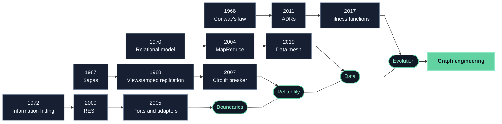
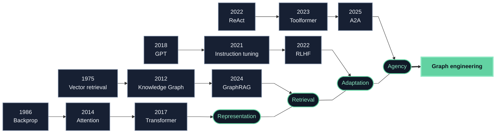
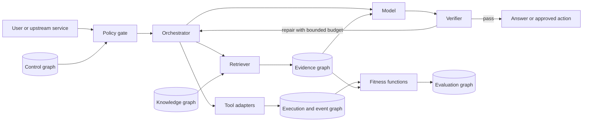

An LLM call is not an architecture. Architecture begins when the model is connected
to memory, retrieval, tools, state, policies, evaluators, people, and other models - and
when those connections must keep working after the demo.

At that point, the fashionable nouns change, but the hard questions do not. Where is
state authoritative? Which boundary contains a failure? Who may perform a side
effect? How can a decision be replayed? What quality must remain invariant while the
system evolves?

> **Thesis:** modern AI architecture is neither a clean break with software history
> nor merely old wine in new bottles. It is a recombination of durable systems ideas
> around a genuinely unusual component: a general-purpose, probabilistic interpreter
> whose behavior is shaped at runtime by natural-language context.

This essay maps that recombination, identifies what is actually new, and proposes a
name for the discipline that follows prompt engineering: **graph engineering**.

## How to read the map

This chronology is exhaustive **for the stated review protocol**, not for the whole
literature. The discovery pass inspected all 56 books in the local expert library: 18
software-engineering books and 38 data-science, AI, and machine-learning books.
Broad retrieval was followed by title-specific queries for every source that the broad
pass missed. Candidate dates were then checked against the linked primary paper,
first-party publication, or publisher record. Recent protocol milestones that postdate
the books were added from current primary sources. The evidence cutoff is August 2,
2026.

A heatmap cell counts **distinct, first-dated milestones**, not every paper published
that year and not every time a book repeats an idea. Reprints, surveys, and duplicate
citations collapse into one entry. Inclusion requires a named paper, concept, pattern,
practice, book, or protocol that changed how software/data architecture or LLM systems
are designed. This makes the counts reproducible, but they are not measures of research
volume, impact, or importance. The 1986 backpropagation entry, for example, marks a
landmark demonstration rather than an uncontested priority claim for reverse-mode
differentiation.

The two tracks contain 60 milestones: 29 in architecture and 31 in LLM systems. Click
any populated year to inspect it. The full, linked annual inventory immediately below
the heatmap is open by default so the same evidence remains visible in print and PDF.
The 2026 proposal in this essay is deliberately excluded from the count because it is
editorial synthesis, not an independently dated discovery.

```d3
{
  "type": "annual-milestone-heatmap",
  "title": "First-dated architecture and LLM milestones by year",
  "description": "Annual heatmap of 60 distinct, publicly dated milestones found through a complete audit of 56 local expert books and verified against linked primary or first-party sources. Rows compare architecture with LLM systems; color and labels report the number of milestones first dated in each year.",
  "yearStart": 1943,
  "yearEnd": 2026,
  "domains": ["Architecture", "LLM systems"],
  "booksAudited": 56,
  "initial": { "year": 2020, "domain": "LLM systems" },
  "data": [
    {
      "year": 1968,
      "domain": "Architecture",
      "category": "organization",
      "kind": "paper",
      "title": "Conway's law",
      "note": "Conway connects communication structures with the systems organizations are able to design.",
      "url": "https://www.melconway.com/Home/Committees_Paper.html"
    },
    {
      "year": 1970,
      "domain": "Architecture",
      "category": "data architecture",
      "kind": "paper",
      "title": "Relational model",
      "note": "Codd separates logical data relationships from physical representation and access paths.",
      "url": "https://doi.org/10.1145/362384.362685"
    },
    {
      "year": 1972,
      "domain": "Architecture",
      "category": "boundaries",
      "kind": "paper",
      "title": "Information hiding",
      "note": "Parnas decomposes systems around decisions likely to change rather than around processing steps.",
      "url": "https://doi.org/10.1145/361598.361623"
    },
    {
      "year": 1973,
      "domain": "Architecture",
      "category": "coordination",
      "kind": "paper",
      "title": "Actor model",
      "note": "Actors unite local state, message handling, and autonomous behavior in a concurrent computation model.",
      "url": "https://doi.org/10.1145/512927.512942"
    },
    {
      "year": 1976,
      "domain": "Architecture",
      "category": "evolution",
      "kind": "paper",
      "title": "Program families",
      "note": "Parnas frames related systems through commonalities and planned variation rather than one-off reuse.",
      "url": "https://doi.org/10.1109/TSE.1976.233797"
    },
    {
      "year": 1980,
      "domain": "Architecture",
      "category": "coordination",
      "kind": "paper",
      "title": "Hearsay-II blackboard",
      "note": "Independent knowledge sources cooperate through a shared blackboard and an explicit control structure.",
      "url": "https://mas.cs.umass.edu/pub/paper_detail.php/229"
    },
    {
      "year": 1987,
      "domain": "Architecture",
      "category": "reliability",
      "kind": "paper",
      "title": "Sagas",
      "note": "Long-lived transactions become sequences of smaller transactions with compensating actions.",
      "url": "https://doi.org/10.1145/38713.38742"
    },
    {
      "year": 1988,
      "domain": "Architecture",
      "category": "distributed systems",
      "kind": "paper",
      "title": "Viewstamped replication",
      "note": "Primary-copy replication coordinates replicated state across view changes and failures.",
      "url": "https://doi.org/10.1145/62546.62549"
    },
    {
      "year": 1992,
      "domain": "Architecture",
      "category": "architecture theory",
      "kind": "paper",
      "title": "Elements, form, and rationale",
      "note": "Perry and Wolf frame software architecture through components, relationships, constraints, and the rationale behind them.",
      "url": "https://www.cerias.purdue.edu/apps/reports_and_papers/view/1334"
    },
    {
      "year": 1995,
      "domain": "Architecture",
      "category": "documentation",
      "kind": "paper",
      "title": "4+1 view model",
      "note": "Kruchten organizes architectural description into complementary stakeholder views tied together by scenarios.",
      "url": "https://doi.org/10.1109/52.469759"
    },
    {
      "year": 1996,
      "domain": "Architecture",
      "category": "patterns",
      "kind": "book",
      "title": "Pattern-Oriented Software Architecture",
      "note": "A system of architectural patterns turns recurring large-scale design structures into a reusable vocabulary.",
      "url": "https://uat.store.wiley.com/en-us/pattern-oriented-software-architecture-volume-1-a-system-of-patterns-p-9781118725269"
    },
    {
      "year": 2000,
      "domain": "Architecture",
      "category": "interfaces",
      "kind": "paper",
      "title": "REST",
      "note": "Fielding defines a network architecture style through constraints such as statelessness, cacheability, and a uniform interface.",
      "url": "https://ics.uci.edu/~fielding/pubs/dissertation/top.htm"
    },
    {
      "year": 2002,
      "domain": "Architecture",
      "category": "distributed systems",
      "kind": "paper",
      "title": "CAP formalization",
      "note": "Gilbert and Lynch formalize the consistency, availability, and partition-tolerance trade-off under network partitions.",
      "url": "https://doi.org/10.1145/564585.564601"
    },
    {
      "year": 2003,
      "domain": "Architecture",
      "category": "integration",
      "kind": "book",
      "title": "Enterprise integration patterns",
      "note": "Messages, channels, routers, translators, and endpoints become a shared integration vocabulary.",
      "url": "https://www.enterpriseintegrationpatterns.com/"
    },
    {
      "year": 2003,
      "domain": "Architecture",
      "category": "domain modeling",
      "kind": "book",
      "title": "Domain-Driven Design",
      "note": "Evans connects a shared domain language, explicit models, bounded contexts, and strategic design.",
      "url": "https://www.informit.com/store/domain-driven-design-tackling-complexity-in-the-heart-9780321125217"
    },
    {
      "year": 2004,
      "domain": "Architecture",
      "category": "data architecture",
      "kind": "paper",
      "title": "MapReduce",
      "note": "A constrained map-and-reduce interface makes large-scale data processing distributable and fault tolerant.",
      "url": "https://research.google/pubs/mapreduce-simplified-data-processing-on-large-clusters/"
    },
    {
      "year": 2005,
      "domain": "Architecture",
      "category": "state",
      "kind": "practice",
      "title": "Event sourcing",
      "note": "Application state is reconstructed from an append-only sequence of domain events.",
      "url": "https://martinfowler.com/eaaDev/EventSourcing.html"
    },
    {
      "year": 2005,
      "domain": "Architecture",
      "category": "boundaries",
      "kind": "pattern",
      "title": "Hexagonal architecture",
      "note": "Ports and adapters isolate application logic from replaceable user, device, and infrastructure interfaces.",
      "url": "https://alistair.cockburn.us/hexagonal-architecture/"
    },
    {
      "year": 2006,
      "domain": "Architecture",
      "category": "privacy",
      "kind": "paper",
      "title": "Differential privacy",
      "note": "A formal privacy guarantee calibrates randomized noise to query sensitivity.",
      "url": "https://www.microsoft.com/en-us/research/publication/calibrating-noise-to-sensitivity-in-private-data-analysis/"
    },
    {
      "year": 2007,
      "domain": "Architecture",
      "category": "reliability",
      "kind": "pattern",
      "title": "Circuit breaker",
      "note": "Release It! codifies a fail-fast boundary that stops repeated calls to a troubled integration point.",
      "url": "https://media.pragprog.com/titles/mnee/mnee-antipatterns.pdf"
    },
    {
      "year": 2010,
      "domain": "Architecture",
      "category": "data architecture",
      "kind": "concept",
      "title": "Data lake",
      "note": "Dixon names a shared repository that retains data before imposing downstream schemas and uses.",
      "url": "https://jamesdixon.wordpress.com/2010/10/14/pentaho-hadoop-and-data-lakes/"
    },
    {
      "year": 2010,
      "domain": "Architecture",
      "category": "state",
      "kind": "pattern",
      "title": "CQRS",
      "note": "Command and query responsibilities are separated so write intent and read projections can evolve independently.",
      "url": "https://cqrs.files.wordpress.com/2010/11/cqrs_documents.pdf"
    },
    {
      "year": 2011,
      "domain": "Architecture",
      "category": "documentation",
      "kind": "practice",
      "title": "Architecture decision records",
      "note": "Nygard proposes small, versioned records that preserve the context, decision, status, and consequences of significant choices.",
      "url": "https://cognitect.com/blog/2011/11/15/documenting-architecture-decisions"
    },
    {
      "year": 2012,
      "domain": "Architecture",
      "category": "data architecture",
      "kind": "paper",
      "title": "Resilient distributed datasets",
      "note": "Spark's RDD abstraction supports fault-tolerant, in-memory parallel computation through lineage.",
      "url": "https://www.usenix.org/conference/nsdi12/technical-sessions/presentation/zaharia"
    },
    {
      "year": 2014,
      "domain": "Architecture",
      "category": "service architecture",
      "kind": "practice",
      "title": "Microservices definition",
      "note": "Lewis and Fowler describe independently deployable services organized around business capabilities.",
      "url": "https://martinfowler.com/articles/microservices.html"
    },
    {
      "year": 2014,
      "domain": "Architecture",
      "category": "resilience",
      "kind": "practice",
      "title": "Reactive Manifesto 2.0",
      "note": "The manifesto connects responsiveness with resilience, elasticity, and message-driven interaction.",
      "url": "https://reactivemanifesto.org/"
    },
    {
      "year": 2017,
      "domain": "Architecture",
      "category": "evolution",
      "kind": "practice",
      "title": "Architectural fitness functions",
      "note": "Executable checks make selected architectural characteristics continuously observable and enforceable.",
      "url": "https://www.thoughtworks.com/content/dam/thoughtworks/documents/books/bk_building_evolutionary_architectures_second_edition_free_chapter.pdf"
    },
    {
      "year": 2019,
      "domain": "Architecture",
      "category": "data architecture",
      "kind": "concept",
      "title": "Data mesh",
      "note": "Dehghani reframes analytical data around domain ownership, product thinking, self-service infrastructure, and federated governance.",
      "url": "https://martinfowler.com/articles/data-monolith-to-mesh.html"
    },
    {
      "year": 2021,
      "domain": "Architecture",
      "category": "data architecture",
      "kind": "paper",
      "title": "Lakehouse",
      "note": "The lakehouse proposal combines open data-lake storage with warehouse-style management and performance features.",
      "url": "https://www.cidrdb.org/cidr2021/papers/cidr2021_paper17.pdf"
    },
    {
      "year": 1943,
      "domain": "LLM systems",
      "category": "foundations",
      "kind": "paper",
      "title": "Formal neuron",
      "note": "McCulloch and Pitts give neural activity a computational and logical formulation.",
      "url": "https://doi.org/10.1007/BF02478259"
    },
    {
      "year": 1958,
      "domain": "LLM systems",
      "category": "foundations",
      "kind": "paper",
      "title": "Perceptron",
      "note": "Rosenblatt presents a probabilistic model for recognition, storage, and organization of information.",
      "url": "https://pubmed.ncbi.nlm.nih.gov/13602029/"
    },
    {
      "year": 1975,
      "domain": "LLM systems",
      "category": "retrieval",
      "kind": "paper",
      "title": "Vector-space retrieval",
      "note": "Documents and queries are represented in a common vector space for similarity-based retrieval.",
      "url": "https://doi.org/10.1145/361219.361220"
    },
    {
      "year": 1986,
      "domain": "LLM systems",
      "category": "learning",
      "kind": "paper",
      "title": "Back-propagated representations",
      "note": "Rumelhart, Hinton, and Williams demonstrate hidden units learning task-relevant internal representations.",
      "url": "https://doi.org/10.1038/323533a0"
    },
    {
      "year": 1997,
      "domain": "LLM systems",
      "category": "sequence modeling",
      "kind": "paper",
      "title": "Long short-term memory",
      "note": "LSTM addresses decaying error flow and learns to preserve information across longer intervals.",
      "url": "https://doi.org/10.1162/neco.1997.9.8.1735"
    },
    {
      "year": 2003,
      "domain": "LLM systems",
      "category": "language modeling",
      "kind": "paper",
      "title": "Neural probabilistic language model",
      "note": "Bengio and colleagues jointly learn distributed word representations and a neural next-word model.",
      "url": "https://www.jmlr.org/papers/v3/bengio03a.html"
    },
    {
      "year": 2012,
      "domain": "LLM systems",
      "category": "knowledge representation",
      "kind": "concept",
      "title": "Google Knowledge Graph",
      "note": "Google popularizes an entity-and-relationship layer for resolving things rather than matching only strings.",
      "url": "https://blog.google/products-and-platforms/products/search/introducing-knowledge-graph-things-not/"
    },
    {
      "year": 2013,
      "domain": "LLM systems",
      "category": "representation",
      "kind": "paper",
      "title": "word2vec",
      "note": "Efficient objectives make large-scale learning of useful continuous word representations practical.",
      "url": "https://research.google/pubs/efficient-estimation-of-word-representations-in-vector-space/"
    },
    {
      "year": 2014,
      "domain": "LLM systems",
      "category": "sequence modeling",
      "kind": "paper",
      "title": "Sequence-to-sequence learning",
      "note": "An encoder-decoder neural architecture maps variable-length input sequences to variable-length outputs.",
      "url": "https://research.google/pubs/sequence-to-sequence-learning-with-neural-networks/"
    },
    {
      "year": 2014,
      "domain": "LLM systems",
      "category": "model architecture",
      "kind": "paper",
      "title": "Learned attention",
      "note": "A translation model learns which source positions matter for each generated token.",
      "url": "https://arxiv.org/abs/1409.0473"
    },
    {
      "year": 2016,
      "domain": "LLM systems",
      "category": "tokenization",
      "kind": "paper",
      "title": "Subword BPE for neural translation",
      "note": "Byte-pair encoding provides an open-vocabulary compromise between word and character representations.",
      "url": "https://aclanthology.org/P16-1162/"
    },
    {
      "year": 2017,
      "domain": "LLM systems",
      "category": "model architecture",
      "kind": "paper",
      "title": "Transformer",
      "note": "The Transformer replaces recurrence with attention and becomes the core architecture of modern LLMs.",
      "url": "https://research.google/pubs/attention-is-all-you-need/"
    },
    {
      "year": 2018,
      "domain": "LLM systems",
      "category": "pretraining",
      "kind": "paper",
      "title": "GPT",
      "note": "Generative pretraining followed by supervised fine-tuning transfers one language model across tasks.",
      "url": "https://openai.com/index/language-unsupervised/"
    },
    {
      "year": 2018,
      "domain": "LLM systems",
      "category": "pretraining",
      "kind": "paper",
      "title": "BERT",
      "note": "Bidirectional Transformer pretraining produces contextual representations adaptable to many language tasks.",
      "url": "https://research.google/pubs/bert-pre-training-of-deep-bidirectional-transformers-for-language-understanding/"
    },
    {
      "year": 2019,
      "domain": "LLM systems",
      "category": "scaling",
      "kind": "paper",
      "title": "GPT-2",
      "note": "A larger autoregressive language model demonstrates broad zero-shot task behavior from next-token training.",
      "url": "https://cdn.openai.com/better-language-models/language-models.pdf"
    },
    {
      "year": 2020,
      "domain": "LLM systems",
      "category": "scaling",
      "kind": "paper",
      "title": "Neural scaling laws",
      "note": "Empirical power laws connect language-model loss with model size, data, and compute.",
      "url": "https://openai.com/index/scaling-laws-for-neural-language-models/"
    },
    {
      "year": 2020,
      "domain": "LLM systems",
      "category": "in-context learning",
      "kind": "paper",
      "title": "GPT-3 few-shot learning",
      "note": "GPT-3 shows task adaptation from instructions and demonstrations supplied in context without weight updates.",
      "url": "https://openai.com/index/language-models-are-few-shot-learners/"
    },
    {
      "year": 2020,
      "domain": "LLM systems",
      "category": "retrieval",
      "kind": "paper",
      "title": "Retrieval-augmented generation",
      "note": "RAG combines parametric generation with explicit non-parametric memory accessed by a retriever.",
      "url": "https://arxiv.org/abs/2005.11401"
    },
    {
      "year": 2021,
      "domain": "LLM systems",
      "category": "model paradigm",
      "kind": "paper",
      "title": "Foundation models",
      "note": "The Stanford report names broadly trained models that become adaptable bases for many downstream systems.",
      "url": "https://crfm.stanford.edu/report.html"
    },
    {
      "year": 2021,
      "domain": "LLM systems",
      "category": "adaptation",
      "kind": "paper",
      "title": "FLAN instruction tuning",
      "note": "Instruction tuning across many tasks improves zero-shot generalization to unseen tasks.",
      "url": "https://research.google/blog/introducing-flan-more-generalizable-language-models-with-instruction-fine-tuning/"
    },
    {
      "year": 2021,
      "domain": "LLM systems",
      "category": "adaptation",
      "kind": "paper",
      "title": "LoRA",
      "note": "Low-rank trainable updates adapt large models while leaving the base weights frozen.",
      "url": "https://arxiv.org/abs/2106.09685"
    },
    {
      "year": 2022,
      "domain": "LLM systems",
      "category": "prompting",
      "kind": "paper",
      "title": "Chain-of-thought prompting",
      "note": "Intermediate reasoning examples improve performance on multi-step tasks in sufficiently large models.",
      "url": "https://arxiv.org/abs/2201.11903"
    },
    {
      "year": 2022,
      "domain": "LLM systems",
      "category": "alignment",
      "kind": "paper",
      "title": "InstructGPT and RLHF",
      "note": "Supervised demonstrations and ranked human preferences align a pretrained model more closely with user intent.",
      "url": "https://openai.com/index/instruction-following/"
    },
    {
      "year": 2022,
      "domain": "LLM systems",
      "category": "agency",
      "kind": "paper",
      "title": "ReAct",
      "note": "Reasoning traces and actions are interleaved so a model can update plans from external observations.",
      "url": "https://arxiv.org/abs/2210.03629"
    },
    {
      "year": 2022,
      "domain": "LLM systems",
      "category": "decoding",
      "kind": "paper",
      "title": "Self-consistency decoding",
      "note": "Sampling multiple reasoning paths and aggregating answers improves chain-of-thought reliability.",
      "url": "https://arxiv.org/abs/2203.11171"
    },
    {
      "year": 2024,
      "domain": "LLM systems",
      "category": "retrieval",
      "kind": "paper",
      "title": "GraphRAG",
      "note": "An LLM-derived entity graph and community summaries support global questions over a document collection.",
      "url": "https://www.microsoft.com/en-us/research/publication/from-local-to-global-a-graph-rag-approach-to-query-focused-summarization/"
    },
    {
      "year": 2023,
      "domain": "LLM systems",
      "category": "agency",
      "kind": "paper",
      "title": "Toolformer",
      "note": "A language model learns when and how to call external APIs and incorporate their results.",
      "url": "https://arxiv.org/abs/2302.04761"
    },
    {
      "year": 2023,
      "domain": "LLM systems",
      "category": "adaptation",
      "kind": "paper",
      "title": "QLoRA",
      "note": "Quantization and low-rank adapters make high-quality fine-tuning feasible with much lower memory use.",
      "url": "https://arxiv.org/abs/2305.14314"
    },
    {
      "year": 2023,
      "domain": "LLM systems",
      "category": "agency",
      "kind": "paper",
      "title": "Reflexion",
      "note": "Agents use stored verbal feedback from prior attempts to improve later decisions without weight updates.",
      "url": "https://arxiv.org/abs/2303.11366"
    },
    {
      "year": 2024,
      "domain": "LLM systems",
      "category": "protocols",
      "kind": "protocol",
      "title": "Model Context Protocol",
      "note": "MCP standardizes how model applications negotiate and expose resources, prompts, and tools over a protocol boundary.",
      "url": "https://modelcontextprotocol.io/specification/2024-11-05/index"
    },
    {
      "year": 2025,
      "domain": "LLM systems",
      "category": "protocols",
      "kind": "protocol",
      "title": "Agent2Agent protocol",
      "note": "A2A defines capability discovery, task state, and message exchange for interoperating agents.",
      "url": "https://developers.googleblog.com/en/a2a-a-new-era-of-agent-interoperability/"
    }
  ]
}
```

The concentration of LLM-system milestones in the 2020s is partly real and partly a
selection effect: the review traces today's systems backward. It should not be read as
proof that recent work is more fundamental than the older architectural substrate.

## What AI systems are rediscovering

The strongest continuity is not between individual algorithms. It is between the
architectural problems that reappear as soon as a model becomes one component in a
larger system.

| Current label | Older systems mechanism | What the model changes |
| --- | --- | --- |
| Prompt and context engineering | Interface design and information hiding | The interface is natural language, underspecified, and interpreted probabilistically. |
| RAG and “long-term memory” | Information retrieval, indexes, caches, and external state | Learned embeddings add semantic matching; generation turns retrieved evidence into a new response. |
| Tool-using agent | Actor, workflow engine, command processor, or blackboard knowledge source | A foundation model can select actions and synthesize parameters without a fully enumerated decision tree. |
| Multi-agent system | Message-driven services, choreography, orchestration, and blackboards | Participants communicate in language and may generate their own intermediate plans, increasing both flexibility and ambiguity. |
| Agent memory | Session state, database, event log, materialized view, and cache | The system must decide which information belongs in model weights, the context window, or external stores. |
| Evals and guardrails | Tests, policy enforcement, runtime monitors, and architectural fitness functions | Outputs are open-ended and distributions drift, so examples, rubrics, and production traces become part of the specification. |

These comparisons are not dismissals. A bridge still relies on old mechanics; that
does not make a new bridge trivial. The point is that calling a component “agentic”
does not suspend the laws of state, coupling, authority, latency, or failure.

Two examples make the inheritance concrete.

First, RAG is a two-component architecture: a retriever selects external memory and
a generator conditions on the result. The [original RAG
paper](https://arxiv.org/abs/2005.11401) explicitly combines parametric and
non-parametric memory. Modern stacks add chunking, hybrid search, reranking, query
rewriting, and verification, but retrieval quality remains a bottleneck. GraphRAG
changes the index and the class of question it can answer; it does not make indexing,
provenance, cost, or relationship quality disappear.

Second, an agent loop is a distributed workflow even when every component runs in
one process. Planning, tool execution, observation, memory, and verification have
distinct failure modes. If a ten-step workflow is correct 95% of the time at each
independent step, its idealized end-to-end success is only about 60%. Independence is
usually an optimistic assumption; shared context can correlate failures.

## What is genuinely different

Reducing everything to familiar patterns would be as misleading as declaring all of
it unprecedented. Four changes matter.

### A probabilistic interpreter sits inside the control plane

Traditional orchestration chooses a branch from explicit code. An LLM can construct
the branch, tool arguments, and stopping condition at runtime. That makes the
controller more adaptable, but it also turns control flow into data that must be
validated. A parser error is visible; a plausible but wrong plan is not.

### Natural language becomes an executable interface

The same medium can carry requirements, data, examples, policy, and commands. This
compression is powerful, but it weakens the boundary between instructions and
untrusted content. Prompts therefore need the architectural treatment once reserved
for APIs: ownership, versioning, schemas where possible, compatibility tests, and
explicit trust zones.

### Representations and routing can be learned

Vector retrieval, attention, and foundation models let systems match and route by
learned similarity rather than only by hand-written keys. This is a real capability
shift. It is also why evaluation must be empirical: the effective interface is partly
encoded in data and weights, not just in source code.

### One model can occupy many roles

A single foundation model can extract, classify, translate, plan, generate code, and
judge another output. Reuse reduces integration cost, but shared failure modes create
a new kind of coupling. Two “agents” backed by the same model are not independent
just because they have different names and system prompts.

## From prompt engineering to graph engineering

Prompt engineering optimizes a local interaction. Production AI needs a wider unit
of design: the graph of durable relationships around that interaction.

Here, **graph engineering** does not mean “put everything in a graph database,” and
it is not presented as an established job title. It is a proposed architectural
discipline: make the system's knowledge, execution, evidence, authority, and
evaluation relationships explicit enough to inspect, test, replay, and govern.

### Architecture fishbone: the stable bones

The first Mermaid fishbone traces four architectural forces. The spine does not claim
that one branch caused another; it shows independent traditions that become necessary
at the same production boundary.



### LLM fishbone: the probabilistic bones

The second Mermaid fishbone adds the model-specific lineages. Representation,
retrieval, adaptation, and agency create new capabilities, but they still terminate in
an architectural system that must govern relationships and effects.



The proposal becomes concrete when each graph has typed nodes, typed edges, an
owner, and invariants.

| Graph | Typical nodes | Meaningful edges | Example invariant |
| --- | --- | --- | --- |
| Knowledge | Entity, claim, document, chunk | supports, contradicts, mentions, derived-from | Every externally stated claim has a reachable source and freshness policy. |
| Execution | Task, model call, tool call, event, state snapshot | planned-before, invoked, produced, compensated | Every side effect has an idempotency key and a replayable outcome. |
| Evidence | Answer span, observation, evaluation case | entails, disputes, lacks-support | A high-risk answer cannot pass without sufficient authoritative evidence. |
| Control | Principal, capability, policy, approval, budget | may-read, may-call, requires-approval, consumes | The planner cannot acquire a capability merely by naming it. |
| Evaluation | Requirement, dataset, test, metric, production incident | measures, failed-by, regressed-from, learned-from | Every critical failure mode maps to a pre-deployment test or runtime monitor. |

These graphs can share infrastructure, but they should not collapse semantically.
Similarity is not provenance. A planned tool call is not an authorized tool call. A
trace is not evidence of correctness. Explicit edge types prevent those category
errors.

## A production loop, not a clever prompt

The smallest useful production architecture separates proposal from authority and
generation from verification.



This diagram deliberately keeps deterministic components around the model. Policy
decides what may happen. Adapters translate and constrain tool calls. An event graph
records what did happen. Verification can request a repair, but only within an
explicit step, time, and cost budget. High-impact actions still require an authority
outside the model.

## Old ideas AI should adopt more deliberately

It would be reckless to claim that nobody has applied the following concepts to AI.
The narrower claim is that they are still underused in everyday agent designs.

| Durable idea | Application to AI systems | Failure it contains |
| --- | --- | --- |
| Information hiding and anti-corruption layers | Put provider-specific prompts, tool schemas, and response quirks behind owned adapters. | A model or vendor change rippling through the whole application. |
| Bulkheads, circuit breakers, and bounded retries | Isolate tools and models; stop calling unhealthy dependencies; cap repair loops. | Cascading latency, cost explosions, and repeated side effects. |
| Event sourcing and replay | Record normalized inputs, decisions, tool calls, approvals, outputs, model/version identity, and state transitions. | Incidents that cannot be reproduced or audited. |
| Sagas and compensating actions | Model a multi-tool task as a sequence with explicit undo or recovery steps. | Half-completed reservations, payments, deployments, or edits. |
| Architectural fitness functions | Encode latency, groundedness, authority, privacy, cost, and recovery objectives as continuous checks. | Architecture drifting while component demos still look successful. |
| Backpressure and load shedding | Bound concurrency, context growth, queue depth, fan-out, and token budgets. | An agent that amplifies demand faster than dependencies can absorb it. |
| Least authority | Give each agent only the tools, data, scope, and duration required for its current task. | Prompt injection or planning error becoming a broad compromise. |
| Conway-aware ownership | Align agent and service boundaries with teams that can operate, evaluate, and change them. | “Autonomous” components with no accountable human owner. |

The [circuit breaker](https://martinfowler.com/bliki/CircuitBreaker.html) is a useful
example. Model fallback is often implemented as “try another model,” but an
unbounded cascade of retries can multiply cost and repeat unsafe actions. A real
breaker observes failure, opens, returns a controlled result, and exposes its state to
operators.

Architectural fitness functions are equally important. An eval score in a notebook is
not yet an architectural control. A fitness function is tied to a quality attribute,
runs continuously, has an owner and threshold, and changes a delivery or runtime
decision when it fails.

## Design rules for the next system

1. **Name every source of state.** Distinguish model weights, request context,
   durable memory, caches, event history, and authoritative records.
2. **Bound every loop.** Set maximum steps, time, cost, retries, fan-out, and context
   growth before execution begins.
3. **Make authority non-linguistic.** A model may propose an action; code and policy
   decide whether the capability exists and whether approval is required.
4. **Evaluate parts and wholes.** Test retrieval, planning, tool translation, tool
   execution, verification, and end-to-end task completion independently.
5. **Choose choreography or orchestration deliberately.** Decentralized reactions fit
   limited, loosely coupled flows; complex multi-step work usually needs a visible
   coordinator and compensations.
6. **Preserve causality.** Keep stable identifiers from request to evidence, plan,
   action, result, evaluation, and incident so the graph can be replayed.
7. **Prefer the simplest sufficient component.** Do not ask a language model to do
   exact arithmetic, authorization, parsing, or deterministic routing when a smaller
   reliable mechanism fits.

## The durable unit is the relationship

Prompt engineering is not disappearing. It becomes one local craft inside a larger
discipline.

The prompt shapes one probabilistic call. The architecture shapes how that call
relates to evidence, state, tools, policy, cost, people, and time. Those relationships
decide whether the system is comprehensible after a failure and evolvable after the
model changes.

That is why **graph engineering** is a useful next frame. Not because every system
needs a graph database, and not because graph terminology makes a design modern,
but because AI systems already contain multiple overlapping graphs. Engineering
begins when we stop leaving them implicit.
