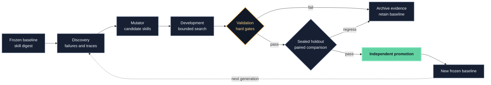

The difficult question is no longer “which model scored highest?” It is:

> Did this exact skill improve this exact agent on unseen work, under a controlled
> environment and a promotion rule that the optimizer could not game?

That change in question explains the evolution of evaluation tooling. Static answer
benchmarks established comparability. Evals-as-code made tests repeatable. Interactive
benchmarks added tools and state. Containerized task environments made complete work
verifiable. Trace-aware optimizers then turned failures into candidate prompts, harnesses,
and skills. The modern system is therefore not one leaderboard. It is a controlled
software experiment with an execution layer, evidence layer, and promotion layer.

This article compares those layers, with **skill evaluation** as the deciding use case.
Here, a skill means a versioned directory of instructions and optional scripts,
references, and assets—often rooted at `SKILL.md`—that is injected into an otherwise
frozen agent. A system prompt alone can be a treatment, but it is not automatically a
portable skill.

## Four objects that must not be confused

The word *harness* is overloaded. A useful evaluation names four different objects:

| Object | What it contains | Typical question |
| --- | --- | --- |
| Model | Weights or a fixed model API and decoding configuration | Did capability change? |
| Agent harness or scaffold | Loop, tools, memory, context policy, parser, recovery logic | Did orchestration change? |
| Skill | External instructions, scripts, references, and assets | Did procedural knowledge change? |
| Evaluation harness | Runner, tasks, environments, graders, logs, and aggregation | Was the comparison measured reliably? |

If a run changes the model, scaffold, skill, and sandbox at once, its score may be useful
as a product snapshot but cannot identify what caused the change. Skill evolution
requires the skill to be the treatment and the other three objects to be frozen—or their
changes to be modeled explicitly.

## How evaluation reached the skill era

The lineage is cumulative. New stages did not make earlier ones obsolete; they added
controls that previous stages could not express.

```mermaid
%%{init: {"flowchart": {"curve": "linear", "nodeSpacing": 18, "rankSpacing": 34}}}%%
flowchart LR
  E1["2018<br/>Experiment tracking"] --> E2["2022<br/>Holistic, multi-metric evals"]
  E2 --> E3["2023<br/>Evals as code"]
  E3 --> E4["2023–24<br/>Interactive agent tasks"]
  E4 --> E5["2025–26<br/>Containerized, stateful work"]
  E5 --> E6["2025–26<br/>Trace-guided evolution"]
  E6 --> E7["Modern target<br/>Model + harness + skill"]

  classDef past fill:#172033,stroke:#718099,color:#f3f6fb,stroke-width:1.5px;
  classDef transition fill:#111927,stroke:#62d2a2,color:#8ce8c2,stroke-width:2px;
  classDef target fill:#62d2a2,stroke:#8ce8c2,color:#0c111b,stroke-width:3px,font-weight:bold;
  class E1,E2,E3,E4 past;
  class E5,E6 transition;
  class E7 target;
```



### 1. From test sets to experiments

Classical ML evaluation coupled a frozen dataset to a metric. Experiment trackers such
as [MLflow](https://github.com/mlflow/mlflow) then made parameters, artifacts, runs, and
comparisons durable. This remains foundational: an agent score without the exact
configuration and artifacts that produced it is not reproducible evidence.

### 2. From one score to a measurement profile

[HELM](https://arxiv.org/abs/2211.09110) made the case for standardized scenarios,
multiple metrics, transparent prompts, and raw completions. This shifted the unit of
analysis from a benchmark number to a measurement profile: accuracy alongside
robustness, calibration, fairness, efficiency, and other constraints.

### 3. From papers to evals-as-code

[OpenAI Evals](https://github.com/openai/evals) popularized versioned datasets and
graders that could run alongside model development. Exact-match, custom, and
model-graded checks made evaluation easier to extend and automate. Its natural unit,
however, is still a model response. The proprietary, hosted
[OpenAI Evals API](https://platform.openai.com/docs/api-reference/evals) is a separate
service from the MIT-licensed repository.

### 4. From responses to trajectories

[AgentBench](https://arxiv.org/abs/2308.03688) evaluated agents across interactive
environments. [SWE-bench](https://arxiv.org/abs/2310.06770) tied natural-language issues
to real repositories and executable tests. The answer was no longer enough: the agent
had to inspect state, use tools, modify artifacts, and survive a multi-step loop.

### 5. From a shared process to an isolated world

[Terminal-Bench 2.0](https://arxiv.org/abs/2601.11868) packages 89 realistic terminal
tasks with task-specific environments, human solutions, and tests.
[Harbor](https://www.harborframework.com/docs) generalizes that machinery into an
agent/model evaluation and optimization framework. This matters for skills because
instructions can change file selection, dependency installation, tool choice, and
recovery—not merely final wording.

The environment is part of the treatment boundary. Anthropic measured a
six-percentage-point spread between its least- and most-resourced Terminal-Bench 2.0
setups, with `p < 0.01`. Small leaderboard gaps can therefore be infrastructure effects,
not agent improvements.

### 6. From evaluation to evolution

[DSPy](https://arxiv.org/abs/2310.03714) treats LM programs as optimizable rather than
hand-tuned strings. [GEPA](https://arxiv.org/abs/2507.19457) reflects on trajectories,
proposes textual changes, and retains complementary candidates on a Pareto frontier.
Its paper reports a six-task average gain over GRPO with up to 35× fewer rollouts; that is
evidence for those tasks, not a universal guarantee.

[Trace2Skill](https://arxiv.org/abs/2603.25158) takes the next step: it distills lessons
from pools of trajectories into transferable skill directories. These optimizers are
not substitutes for evaluation runners. They increase the need for hidden holdouts,
strong graders, and lineage because an optimizer will exploit whatever signal it sees.

## The ten pillars of a modern skill evaluation

A framework is only as trustworthy as the protocol built on it. For skill evolution,
the minimum credible design has ten pillars.

1. **One declared treatment.** Freeze the model, agent harness, task version, resource
   policy, and graders while varying the skill. Record any unavoidable interaction.
2. **Realistic, isolated tasks.** Evaluate the actions the skill is meant to improve.
   File-editing skills need repositories and tests; RAG skills need evidence corpora;
   UI skills need a browser state, not answer-only questions.
3. **Immutable identity.** Digest the skill's complete directory, task, environment,
   scorer, dataset manifest, model settings, and harness commit—not only its name.
4. **Layered scoring.** Prefer deterministic tests for observable outcomes, then add
   semantic or policy judges where correctness cannot be fully encoded. A judge should
   cite the evidence it used.
5. **Disjoint data roles.** Separate discovery, candidate development, validation, and
   holdout. Holdout release is one-way; once inspected, a cohort becomes development
   data for the next generation.
6. **Trajectory evidence.** Preserve messages, tool calls, state transitions, artifacts,
   verifier output, time, tokens, and cost. Final success alone cannot explain why a
   skill worked.
7. **Hard gates plus trade-offs.** Correctness and safety are gates. Cost, latency, and
   token use can be Pareto objectives. An aggregate mean must not hide a critical
   subgroup regression.
8. **Uncertainty and pairing.** Use repeated, paired runs when stochasticity matters.
   Report counts, effect sizes or intervals, and worst-domain results—not false decimal
   precision.
9. **Failure taxonomy.** Do not retry semantic failures until they pass. Recover only
   verified provider or infrastructure failures under a predeclared policy, retaining
   the original attempt.
10. **Independent promotion.** Separate mutator, executor, evaluator, selector, and
    release authority. Calibrate LLM judges against blinded human review before they
    become promotion gates.

This is the AI equivalent of using inexpensive, frequent feedback during development
and a deeper architecture evaluation when cost or risk warrants it. The
[ATAM tradition](https://www.sei.cmu.edu/library/architecture-tradeoff-analysis-method-collection/)
also reminds us that fitness is multi-attribute: improving one quality can degrade
another.



## Capability comparison: what the frameworks actually evaluate

No row below means “best overall.” It describes the framework's native center of
gravity as of August 24, 2026. *Adapter* means the behavior is possible, but the user
must define the skill boundary or glue code.

| Framework | Skill as treatment | Isolated, stateful world | Behavioral evidence | Scoring center | Built-in evolution |
| --- | --- | --- | --- | --- | --- |
| [Harbor](https://github.com/harbor-framework/harbor) | **Native:** local/Git `SKILL.md` directory, content digest, resolved commit | **Native:** Docker and cloud sandboxes | Trajectory, artifacts, verifier logs, time, tokens, cost | Executable tests, multi-reward verifiers, programmatic or model judges | GEPA and RL/SFT integrations; promotion governance is external |
| [Inspect AI](https://inspect.aisi.org.uk/) | Adapter through task, solver, package, or mounted files | **Native:** Docker, Kubernetes, Modal, Proxmox, Vagrant extensions | Transcripts, tools, limits, logs; logs can be rescored | Python scorers, model graders, human intervention | External optimizer |
| [Promptfoo](https://github.com/promptfoo/promptfoo) | Provider-specific skill or prompt configuration | Provider runtime; not a general task-world abstraction | Outputs, assertions, cost/latency; traces for supported agents | Declarative assertions, custom code, model graders, red teaming | Matrix search and external optimization |
| [OpenAI Evals](https://github.com/openai/evals) | Adapter; usually prompt/model configuration | No general agent sandbox | Primarily samples and outputs | Exact, custom, and model-graded evals | None in the runner |
| [DeepEval](https://github.com/confident-ai/deepeval) | Adapter in Python test fixtures | No general environment isolation | Agent trajectories, steps, tool and sub-agent behavior | Pytest-style metrics, custom/DAG and model judges | Prompt optimization, not generic skill population search |
| [Ragas](https://github.com/vibrantlabsai/ragas) | Adapter | No general environment isolation | RAG responses, messages, retrieved context, tools | Retrieval/generation quality and agent/tool metrics | Experiments and test generation; optimizer external |
| [Pydantic Evals](https://ai.pydantic.dev/evals/) | Adapter as typed input/configuration | Function runtime, not a task sandbox | Typed outputs and OpenTelemetry spans | Typed Python evaluators and span assertions | External optimizer |
| [MLflow](https://github.com/mlflow/mlflow) | Manual artifact/version convention | No task sandbox | Versioned datasets, traces, experiments, production feedback | Code, model, and human scorers | Experiment comparison; optimizer external |
| [Langfuse](https://github.com/langfuse/langfuse) | Manual metadata/version convention | No task sandbox | OpenTelemetry-style traces, datasets, online feedback | Code, model, human, and user scores | Experiment comparison; optimizer external |
| [Phoenix](https://github.com/Arize-ai/phoenix) | Manual metadata/version convention | No task sandbox | OpenInference/OpenTelemetry spans and datasets | Code, model, and human evaluation | Experiment comparison; optimizer external |
| [LangSmith](https://docs.langchain.com/langsmith/evaluation) | Manual dataset/metadata convention | Hosted integrations, not a portable task format | Full trajectories, datasets, online traces | Code, model, human, and pairwise evaluators | Dataset experiments; optimizer external |

Three conclusions follow.

First, **Harbor is the most direct open-source fit for evaluating complete skill
directories against stateful tasks**. Its skill lock records the source, SHA-256 content
digest, Git URL, and resolved commit. That is a provenance feature, not proof that the
experimental split or promotion policy is sound.

Second, **Inspect is the strongest general alternative when the evaluation itself needs
custom research logic, solver composition, rescoring, strict limits, or varied sandbox
backends**. It can evaluate a skill, but the skill is an experiment convention rather
than its first-class unit.

Third, **observability platforms answer a different question**. MLflow, Langfuse,
Phoenix, and LangSmith excel at datasets, traces, feedback, experiments, and production
monitoring. They complement a task runner; they do not automatically provide clean
terminal worlds, skill-directory locks, or holdout governance.

## License, deployment, and community

GitHub stars are a coarse adoption signal—not a measure of evaluation validity. The
snapshot below was taken on August 24, 2026 and is rounded. Pydantic's number covers the
whole `pydantic-ai` repository.

| Framework | License posture | Approx. GitHub stars | Operational fit |
| --- | --- | ---: | --- |
| Harbor | Apache-2.0 | 4.6k | Local or cloud container trials; agent and skill optimization |
| Inspect AI | MIT | 2.6k | Python research/evaluation runtime with several sandbox backends |
| Promptfoo | MIT | 24.5k | JS/TS CLI, YAML, CI, provider matrices, security testing |
| OpenAI Evals repository | MIT | 19.2k | Local OSS model/output evaluation; hosted API is proprietary |
| DeepEval | Apache-2.0 | 17.8k | Python/pytest evaluation and agent metrics |
| Ragas | Apache-2.0 | 15.5k | RAG and retrieval-centered evaluation |
| Pydantic Evals | MIT | 19.5k repo-wide | Typed Python applications and Pydantic AI |
| MLflow | Apache-2.0 | 27.7k | Broad experiment, trace, registry, and production lifecycle |
| Langfuse | MIT core; enterprise directories excluded | 33.6k | Self-hosted or managed observability and evaluation |
| Phoenix | Elastic License 2.0 | 11.2k | Free self-hosting with source available; **[not OSI open source](https://opensource.org/osd)** |
| LangSmith | Proprietary | Not comparable | Managed LangChain-centered evaluation and observability |

“Public on GitHub” is not a license. GitHub's own guidance states that, without a
license, default copyright applies and others do not receive permission to reproduce,
distribute, or create derivative works. That distinction matters in the local case
study below.

## What fits which software

Choose from the shape of the work, then add any missing layer.

- **Terminal, coding, data transformation, or artifact-producing agents:** start with
  Harbor. Use executable task verifiers and pin CPU, RAM, time, network, images, agent,
  model, and skill digests.
- **Safety research, custom agent loops, multi-agent studies, or heterogeneous
  sandboxes:** start with Inspect AI. Define a clear skill adapter and persist its
  content digest.
- **Prompt/provider matrices, CI assertions, and red teaming:** use Promptfoo. It is
  fast to adopt and especially natural in JavaScript/TypeScript delivery pipelines.
- **Python unit-test ergonomics and agent-path metrics:** use DeepEval. For strongly
  typed application functions and span assertions, Pydantic Evals is the cleaner fit.
- **RAG pipelines:** use Ragas for retrieval and answer-quality metrics, then pair it
  with Harbor or Inspect if the agent also manipulates stateful external artifacts.
- **Model-response registries and custom graders:** OpenAI Evals remains a compact OSS
  option. Use the hosted Evals API only when a proprietary OpenAI service is acceptable.
- **Production traces and continuous feedback:** use MLflow or Langfuse for an
  open-source core. Evaluate Phoenix's ELv2 terms against the deployment model. Choose
  LangSmith when managed service convenience and LangChain integration outweigh
  portability and license constraints.
- **Automatic prompt, harness, or skill evolution:** pair a runner with GEPA, DSPy, or
  a purpose-built mutator. The optimizer proposes; a disjoint evaluator and promotion
  gate decide.

In practice, a mature stack is often **Harbor or Inspect for offline task execution +
Langfuse or MLflow for lifecycle evidence + a controlled optimizer for candidate
generation**. One product rarely dominates all three layers.

## The local evolution: Skill Arena, Harbor, and Knowledge

The local repositories provide a useful small-scale case study because they preserve
failed promotions instead of presenting only winners.

The current [Skill Arena](https://github.com/mvk-001/skill-arena) is no longer a
maintained standalone Promptfoo translation runtime. It is a set of eleven atomic
workflow skills around native Harbor jobs: study organization, result analysis,
verified external-failure recovery, population search, trace distillation, reflective
Pareto search, operator coevolution, GEPA-guided evolution, candidate realization, and
meta-policy auditing.

Its frozen July 16, 2026 comparison contains **24 Harbor jobs and 78 trials** across
development and holdout, with no recorded errors or retries. Trace distillation and
reflective Pareto search tied for the strongest selected holdout mean. This is valuable
operational evidence for those tasks and budgets—not proof of a universal winner.
Follow-on reports correctly label causal gain as *not identifiable* when no comparable
execution exists.

The [Knowledge evaluation index](https://github.com/gvillarroel/knowledge/blob/main/evaluations/SKILL-EXPLORATION-AND-EVOLUTION.md)
shows why promotion gates matter:

- A Graphify Next candidate won both development datasets and the mean holdout, yet
  regressed the Astro holdout cell; the zero-regression rule retained the baseline.
- A Tantivy consultant passed all four development trials and then failed to qualify on
  the two-question holdout.
- A token-optimized Classical candidate reduced recorded tokens by **98.674426%** and
  passed its numeric metrics, but independent semantic review found regressions in four
  of six cases. It was rejected.

The lesson is not “never optimize.” It is that a cheaper or higher-mean candidate is
not an improvement when it crosses a predeclared quality boundary. Development selects
what deserves scrutiny; holdout decides what may be promoted.

There is also a legal distinction: both local repositories are public, but neither
currently has a detected license file. They are therefore **source-visible, not
open-source dependencies with granted reuse rights**. Their methods can inform this
analysis; adopting or redistributing their code requires the owners to add a license or
grant permission.

## A minimal, auditable study contract

The precise syntax is less important than freezing the contract before results exist.

```yaml
objective: improve-the-skill-without-quality-regression
treatment:
  kind: skill-directory
  baseline_digest: sha256:...
frozen:
  - model-and-decoding
  - agent-harness-commit
  - task-and-environment-digests
  - verifier-and-rubric-digests
  - cpu-ram-time-network-policy
splits:
  discovery: visible
  development: visible-to-optimizer
  validation: one-way-release
  holdout: sealed-until-finalist
metrics:
  gates: [task-correctness, safety, semantic-quality]
  objectives: [success-rate, latency, tokens, cost]
retries:
  semantic_failure: 0
  verified_external_failure: bounded-and-lineage-preserving
report:
  - paired-case-results
  - worst-domain-result
  - uncertainty
  - trajectories-and-artifacts
  - failure-taxonomy
  - candidate-lineage
promotion:
  rule: all-gates-pass-and-no-critical-cell-regresses
  authority: independent-reviewer
```

This contract prevents three common mistakes: optimizing against the test set, counting
retries as independent successes, and allowing a blended score to conceal a critical
regression.

## The selection rule

If the primary artifact is a **final response**, choose an output-evaluation framework.
If it is a **trace**, choose an agent-aware scorer and observability layer. If it is a
**changed world**, choose an isolated task runner. If it is an **evolving skill**, require
all three—and add immutable skill provenance, disjoint splits, and independent
promotion.

For the specific goal of open, reproducible skill evolution, the strongest default is
currently:

1. **Harbor** as the execution and artifact substrate;
2. **deterministic task tests plus calibrated semantic review** as the scoring layer;
3. **Skill Arena-style append-only study governance** as a methodology, after resolving
   its license if code will be reused;
4. **GEPA, trace distillation, Pareto search, or another bounded optimizer** only for
   proposing candidates; and
5. **MLflow or Langfuse** when long-lived experiment and production trace management is
   needed.

Inspect AI is the best open alternative when evaluation-program flexibility matters
more than first-class `SKILL.md` handling. Promptfoo is the pragmatic choice for
prompt/provider CI and red teaming. The remaining frameworks are valuable specialists,
not lesser products: they solve different layers of the measurement system.

The durable insight is simple: **skill evolution is experimental software engineering**.
The optimizer is allowed to be creative. The evaluator must be boring, versioned,
skeptical, and difficult to game.
