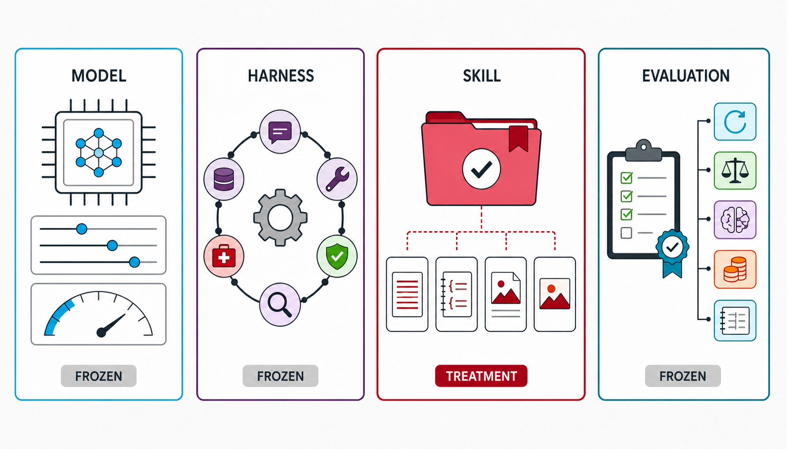
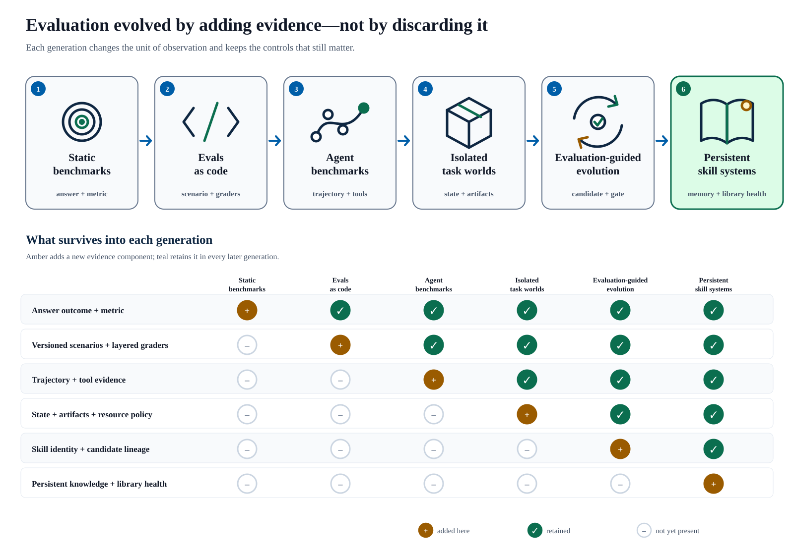
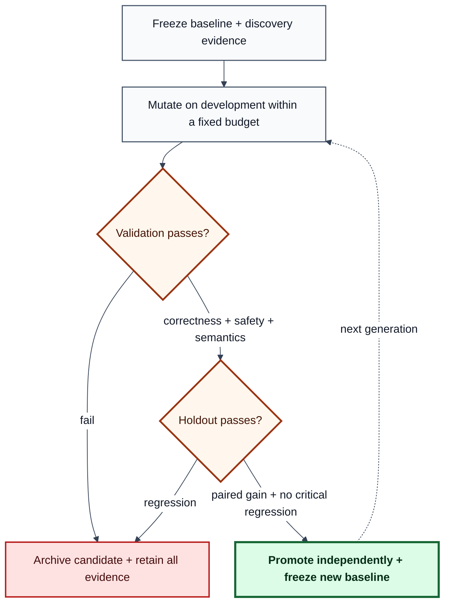

The difficult question is no longer “which model scored highest?” It is an attribution
question about a versioned treatment inside a model–harness configuration. ([Harness-Bench](https://arxiv.org/abs/2605.27922),
[NVIDIA SkillEvaluator reports](https://docs.nvidia.com/skills/skillevaluator/reports)).

> Did this exact skill improve this exact agent on unseen work, under a controlled
> environment and a promotion rule that the optimizer could not game? ([Reusable
> Holdout](https://arxiv.org/abs/1506.02629),
> [framework-at-scale study](https://arxiv.org/abs/2606.17819)).

That change in question explains the evolution of evaluation tooling. Static answer
benchmarks established comparability. Evals-as-code made tests repeatable. Interactive
benchmarks added tools and state. Containerized task environments made complete work
verifiable. Trace-aware optimizers then turned failures into candidate prompts, harnesses,
and skills. The modern system is therefore not one leaderboard. It is a controlled
software experiment with an execution layer, evidence layer, and promotion layer. This
lineage is an editorial synthesis. ([HELM](https://arxiv.org/abs/2211.09110),
[Harbor evaluation runs](https://www.harborframework.com/docs/run-jobs/run-evals)).

This article compares those layers, with **skill evaluation** as the deciding use case.
Here, a skill means a versioned directory of instructions and optional scripts,
references, and assets—often rooted at `SKILL.md`—that is injected into an otherwise
frozen agent. A system prompt alone can be a treatment, but it is not automatically a
portable skill. ([Agent Skills specification](https://agentskills.io/specification),
[Harness-Bench](https://arxiv.org/abs/2605.27922)).

**Attribution convention.** Substantive prose ends with primary public sources wherever
possible. Paired links state the evidence basis, not necessarily two independent
replications. Editorial taxonomies, diagrams, and recommendations are labeled as
synthesis; framework rows link to official documentation or repositories. ([Agent
Skills specification](https://agentskills.io/specification),
[Harness-Bench](https://arxiv.org/abs/2605.27922)).

**Evidence boundary.** Framework capabilities, licenses, and repository activity were
checked against primary documentation on August 30, 2026. They can change after that
date. Every recommendation is conditional on the declared model, harness, workload,
environment, grader, and budget; this article does not claim a universal winner.
([NIST AI measurement science](https://www.nist.gov/blogs/caisi-research-blog/accelerating-ai-innovation-through-measurement-science),
[GitHub repository API](https://docs.github.com/en/rest/repos/repos#get-a-repository)).

**PDF edition:** [download the revised framework-selection guide](https://github.com/gvillarroel/blog/releases/download/skill-evaluation-guide-2026-08-30/modern-skill-evaluation-framework-selection-guide.pdf).


*Immutable traces accumulate into persistent knowledge; knowledge proposes a versioned
skill; an independent evaluation gate either promotes the candidate or returns its
outcome to the evidence base. This is an editorial synthesis, not a reported result.
([WikiSkill](https://arxiv.org/abs/2608.27454),
[Harbor results and artifacts](https://www.harborframework.com/docs/run-jobs/results-and-artifacts)).*

## Four objects that must not be confused

The word *harness* is overloaded. A useful evaluation names four different objects. The
taxonomy below is a working synthesis, not a universal standard. ([Agent Skills
specification](https://agentskills.io/specification),
[Harness-Bench](https://arxiv.org/abs/2605.27922)).



*ImageGen-assisted editorial reconstruction of the treatment boundary. The image
communicates only the distinction: the skill is the varied treatment; model, harness,
and evaluation policy are frozen. Exact definitions and source boundaries are in the
table below. ([Agent Skills specification](https://agentskills.io/specification),
[Harness-Bench](https://arxiv.org/abs/2605.27922)).*

| Artifact | Operational definition used here | Experimental control | Source basis |
| --- | --- | --- | --- |
| **Model** | Parameterized predictor plus decoding and context-window settings | Freeze identity/version, context limit, and decoding | [Harness-Bench](https://arxiv.org/abs/2605.27922); [HELM](https://arxiv.org/abs/2211.09110) |
| **Agent harness** | Execution layer for context, tools, state, constraints, permissions, tracing, verification, and recovery | Freeze harness commit, configuration, permissions, and resources | [Harness-Bench](https://arxiv.org/abs/2605.27922); [Inspect AI](https://inspect.aisi.org.uk/) |
| **Skill** | Versioned `SKILL.md` directory with optional scripts, references, and assets | Vary the complete directory as the declared treatment and record its digest | [Agent Skills specification](https://agentskills.io/specification); [Harbor skills](https://www.harborframework.com/docs/run-jobs/skills) |
| **Evaluation protocol** | Versioned tasks, worlds, scorers, repetitions, budgets, evidence policy, and promotion rule | Freeze task/grader identities, split roles, retry policy, and gate | [Harbor evaluation runs](https://www.harborframework.com/docs/run-jobs/run-evals); [Reusable Holdout](https://arxiv.org/abs/1506.02629) |

[Formal RoadRails rendering](../../assets/images/modern-skill-evaluation/definition-railroads.static.svg)

If a run changes the model, scaffold, skill, and sandbox at once, its score may be useful
as a product snapshot but cannot identify what caused the change. Skill evolution
requires the skill to be the treatment and the other three objects to be frozen—or their
changes to be modeled explicitly. ([Harness-Bench](https://arxiv.org/abs/2605.27922),
[NVIDIA SkillEvaluator reports](https://docs.nvidia.com/skills/skillevaluator/reports)).

## How evaluation reached the skill era

The lineage is cumulative. New stages did not make earlier ones obsolete; they added
controls that previous stages could not express. The sequence is an editorial synthesis
of benchmark, evaluation-library, agent-runtime, and skill-evolution milestones.
([HELM](https://arxiv.org/abs/2211.09110),
[NVIDIA SkillEvaluator](https://github.com/NVIDIA/SkillEvaluator)).



*Each generation adds a new observable or experimental control while retaining the
useful components of earlier systems. Icons identify what was added; the matrix makes
what persists across generations explicit. The figure is a synthesis rather than a
chronology claimed by either source. ([AgentBench](https://arxiv.org/abs/2308.03688),
[Trace2Skill](https://arxiv.org/abs/2603.25158)).*

### 1. From test sets to experiments

Classical ML evaluation coupled a frozen dataset to a metric. Experiment trackers such
as [MLflow](https://github.com/mlflow/mlflow) then made parameters, artifacts, runs, and
comparisons durable. This remains foundational: an agent score without the exact
configuration and artifacts that produced it is not reproducible evidence. ([MLflow
datasets](https://mlflow.org/docs/latest/genai/datasets/),
[HELM](https://arxiv.org/abs/2211.09110)).

### 2. From one score to a measurement profile

[HELM](https://arxiv.org/abs/2211.09110) made the case for standardized scenarios,
multiple metrics, transparent prompts, and raw completions. This shifted the unit of
analysis from a benchmark number to a measurement profile: accuracy alongside
robustness, calibration, fairness, efficiency, and other constraints. ([HELM](https://arxiv.org/abs/2211.09110),
[OpenAI Evals](https://github.com/openai/evals)).

### 3. From papers to evals-as-code

[OpenAI Evals](https://github.com/openai/evals) popularized versioned datasets and
graders that could run alongside model development. Exact-match, custom, and
model-graded checks made evaluation easier to extend and automate. Its natural unit,
however, is still a model response. The proprietary, hosted
[OpenAI Evals API](https://platform.openai.com/docs/api-reference/evals) is a separate
service from the MIT-licensed repository. ([OpenAI Evals](https://github.com/openai/evals),
[OpenAI Evals API](https://platform.openai.com/docs/api-reference/evals)).

### 4. From responses to trajectories

The [AgentBench paper](https://arxiv.org/abs/2308.03688) evaluated agents across
interactive environments. The [SWE-bench paper](https://arxiv.org/abs/2310.06770) tied
natural-language issues to real repositories and executable tests. The answer was no
longer enough: the agent had to inspect state, use tools, modify artifacts, and survive
a multi-step loop. ([AgentBench](https://arxiv.org/abs/2308.03688),
[SWE-bench](https://arxiv.org/abs/2310.06770)).

### 5. From a shared process to an isolated world

The [Terminal-Bench 2.0 paper](https://arxiv.org/abs/2601.11868) packages 89 realistic
terminal tasks with task-specific environments, human solutions, and tests. The
[Harbor framework](https://www.harborframework.com/docs)
([repository](https://github.com/harbor-framework/harbor)) generalizes that machinery
into agent/model evaluation and optimization. Harbor is documented as a framework
rather than by a canonical Harbor-framework paper; similarly named HARBOR papers
describe different systems. This matters for skills because instructions can change
file selection, dependency installation, tool choice, and recovery—not merely final
wording. ([Terminal-Bench 2.0](https://arxiv.org/abs/2601.11868),
[Harbor](https://github.com/harbor-framework/harbor)).

The environment is part of the treatment boundary. Anthropic measured a
six-percentage-point spread between its least- and most-resourced Terminal-Bench 2.0
setups, with `p < 0.01`. Small leaderboard gaps can therefore be infrastructure effects,
not agent improvements. ([Anthropic infrastructure-noise study](https://www.anthropic.com/engineering/infrastructure-noise),
[Terminal-Bench 2.0](https://arxiv.org/abs/2601.11868)).

### 6. From evaluation to evolution

[DSPy](https://arxiv.org/abs/2310.03714) treats LM programs as optimizable rather than
hand-tuned strings. [GEPA](https://arxiv.org/abs/2507.19457) reflects on trajectories,
proposes textual changes, and retains complementary candidates on a Pareto frontier.
Its paper reports a six-task average gain over GRPO with up to 35× fewer rollouts; that is
evidence for those tasks, not a universal guarantee. ([DSPy](https://arxiv.org/abs/2310.03714),
[GEPA](https://arxiv.org/abs/2507.19457)).

[Trace2Skill](https://arxiv.org/abs/2603.25158) takes the next step: it distills lessons
from pools of trajectories into transferable skill directories. These optimizers are
not substitutes for evaluation runners. They increase the need for hidden holdouts,
strong graders, and lineage because an optimizer will exploit whatever signal it sees.
([Trace2Skill](https://arxiv.org/abs/2603.25158),
[Reusable Holdout](https://arxiv.org/abs/1506.02629)).

### 7. From total agent score to marginal skill utility

[SkillsBench](https://arxiv.org/abs/2602.12670) made the intervention explicit through
matched no-Skills and curated-Skills conditions with deterministic verifiers. Its v4
inventory reports 87 tasks, eight domains, 18 model–harness configurations, and an
average pass-rate change from 33.9% to 50.5%; configuration-level gains ranged from
+4.1 to +25.7 percentage points. These are benchmark-conditional results, not a prior
that any new skill will help. ([SkillsBench paper](https://arxiv.org/abs/2602.12670),
[SkillsBench repository](https://github.com/benchflow-ai/skillsbench)).

[SWE-Skills-Bench](https://arxiv.org/abs/2603.15401) moved the comparison into pinned
software repositories with requirements and execution-based acceptance tests. It
reports only +1.2% average gain, 39 of 49 skills with zero pass-rate improvement, token
overhead up to 451% without a pass-rate gain, and three skills that reduced success.
The contrast between the two suites makes model, harness, domain fit, and task sampling
part of the claim—not implementation detail. ([SWE-Skills-Bench](https://arxiv.org/abs/2603.15401),
[SkillsBench](https://arxiv.org/abs/2602.12670)).

The minimum attribution control is a matched no-skill/with-skill contrast on the same
task world. Preserve negative task-level effects and cost regressions: a later
differential study found 307 skill-induced failures across these two benchmarks,
including 125 functional failures and 182 efficiency regressions. ([Agent Skills Can
Be Harmful](https://arxiv.org/abs/2608.11888),
[NIST AI 800-3](https://www.nist.gov/publications/expanding-ai-evaluation-toolbox-statistical-models)).

### 8. From a fixed benchmark to continuous Skill Lift

The [ACES paper](https://arxiv.org/abs/2608.20614) and its open-source
[NVIDIA SkillEvaluator](https://github.com/NVIDIA/SkillEvaluator) implementation combine
deterministic structure and safety checks with paired live trials under the same task,
model, harness, workspace, and scorer. They normalize trajectories and report
triggering, behavior, cost, and **Skill Lift**, packaging attribution as an iterative
repository workflow rather than only a fixed benchmark release. ([ACES](https://arxiv.org/abs/2608.20614),
[NVIDIA SkillEvaluator reports](https://docs.nvidia.com/skills/skillevaluator/reports)).

ACES builds on, rather than originates, the paired design. A contemporaneous survey
likewise describes a plural field spanning skill benchmarks, execution feedback,
trajectory distillation, compression, and reinforcement-learning methods; no one runner
defines the category. ([Agent Skill Evaluation and Evolution survey](https://arxiv.org/abs/2606.11435),
[SkillsBench](https://arxiv.org/abs/2602.12670)).

### 9. From discarded trials to persistent knowledge

[WikiSkill](https://arxiv.org/abs/2608.27454), a Google Research and Virginia Tech
preprint submitted on August 27, 2026, adds a durable learning layer between execution
traces and executable skills. Its workspace separates an immutable **Raw Layer**, a
persistent **Wiki Layer**, and a gated **Skills Layer**. A Wiki Maintainer consolidates
failure patterns, successful strategies, proposal history, and validation outcomes. A
Skill Proposer uses that accumulated knowledge plus recent traces to produce candidates.
Validation can roll a skill back, but it does not roll the wiki back. ([WikiSkill](https://arxiv.org/abs/2608.27454),
[Google Research ReasoningBank](https://research.google/blog/reasoningbank-enabling-agents-to-learn-from-experience/)).



*Original reconstruction of WikiSkill Figure 2. Immutable traces feed a persistent
wiki; the proposer turns accumulated knowledge into gated skills; and the inference
agent receives active skills but never the wiki itself. The paper is the source for the
topology; ReasoningBank supplies adjacent Google Research context for persistent
experience. ([WikiSkill](https://arxiv.org/abs/2608.27454),
[ReasoningBank](https://research.google/blog/reasoningbank-enabling-agents-to-learn-from-experience/)).*

The separation is empirically consequential within the paper's protocol. In a
four-benchmark Gemini-3.5-Flash ablation, giving the Skill Proposer wiki access while
withholding it from the Inference Agent raised the reported average from **48.7% to
63.7%**. Giving the Inference Agent wiki access during training reduced that result to
**60.9%**. The paper also reports that evolved skills can transfer across models and
sometimes outperform self-evolved skills. This distinguishes the ability to discover
procedural knowledge from the ability to execute it. The reported numbers come from the
paper and its PDF, not from the contextual ReasoningBank article. ([WikiSkill abstract
and record](https://arxiv.org/abs/2608.27454),
[WikiSkill paper PDF](https://arxiv.org/pdf/2608.27454)).

WikiSkill is currently a research design, not a drop-in open-source evaluation
framework. The study directly injects active skills, so it does not evaluate skill
retrieval or triggering; validation accepts only immediately improving proposals; the
wiki has no automated pruning mechanism; and the arXiv record does not link a public
implementation or code license as of August 30, 2026. ([WikiSkill](https://arxiv.org/abs/2608.27454),
[Agent Skills specification](https://agentskills.io/specification)).

## The ten pillars of a modern skill evaluation


*ImageGen-assisted editorial reconstruction of the controlled evaluation flow. The
image is explanatory; the table below is the exact semantic contract. A study freezes
identities, runs baseline and candidate in equivalent task worlds, records evidence,
grades in layers, and promotes only through an independent gate. ([Harbor evaluation
runs](https://www.harborframework.com/docs/run-jobs/run-evals),
[Reusable Holdout](https://arxiv.org/abs/1506.02629)).*

| Layer | Exact responsibility | Boundary | Source basis |
| --- | --- | --- | --- |
| **Execution** | Freeze model, harness, task, environment, graders, resources, and baseline; run paired baseline/candidate trials | Only the complete skill bundle varies as treatment | [Harness-Bench](https://arxiv.org/abs/2605.27922); [Harbor skills](https://www.harborframework.com/docs/run-jobs/skills) |
| **Evidence** | Preserve outcomes, trajectories, artifacts, errors, time, tokens, and cost; apply deterministic checks before semantic judgment | Raw evidence is immutable; regrading creates a new view | [Harbor results and artifacts](https://www.harborframework.com/docs/run-jobs/results-and-artifacts); [Harbor regrading](https://www.harborframework.com/docs/run-jobs/regrade) |
| **Promotion** | Filter on validation, release the sealed holdout once, enforce hard gates, then approve or reject independently | Candidate generation cannot inspect holdout evidence or control release | [Reusable Holdout](https://arxiv.org/abs/1506.02629); [GEPA](https://arxiv.org/abs/2507.19457) |

### What Skill Lift actually estimates

Skill Lift is not one universal number. The primary deployment-relevant estimand here
is the effect of **making the exact skill bundle available** under a frozen
model–harness configuration. Average attempts inside each arm for each task, subtract
the baseline task mean from the candidate task mean, and aggregate those paired task
differences using weights fixed before results are observed. ([ACES](https://arxiv.org/abs/2608.20614),
[NIST AI 800-3](https://www.nist.gov/publications/expanding-ai-evaluation-toolbox-statistical-models)).

```text
task_lift_i       = mean(score_i | skill available)
                     - mean(score_i | skill withheld)
benchmark_lift   = weighted mean of task_lift_i on the frozen manifest
target_skill_lift = expected task_lift on the declared target task distribution
```

The availability effect includes failure to discover, read, or follow the skill. A
triggered-only slice is a mechanism diagnostic, not an interchangeable causal result,
because triggering happens after treatment assignment. If a protocol directly injects
the active skill—as WikiSkill does—the claim is conditional on forced exposure and says
nothing about discoverability. ([NVIDIA agents and sandboxes](https://docs.nvidia.com/skills/skillevaluator/agents-and-sandboxes),
[WikiSkill](https://arxiv.org/pdf/2608.27454)).

Natural-routing studies need both **trigger-positive** cases and close
**trigger-negative** cases where the skill should remain dormant. Report successful
discovery and adherence on the positive set, plus false activation, downstream failure,
latency, and cost on the negative set. The no-skill arm estimates the total availability
effect. An optional semantically matched alternate-skill or placebo arm can test whether
the content is specifically useful rather than merely adding context or procedure, but
that is a separate mechanism estimand. ([NVIDIA evaluation datasets](https://docs.nvidia.com/skills/skillevaluator/eval-datasets),
[Agent Skills Can Be Harmful](https://arxiv.org/abs/2608.11888)).

The benchmark estimand describes only the tested tasks. Generalizing to a production
workload additionally assumes that the manifest and its predeclared weights represent
the target task population. A narrow interval around an unrepresentative manifest is
precise but not externally valid. ([NIST AI 800-3](https://www.nist.gov/publications/expanding-ai-evaluation-toolbox-statistical-models),
[NIST AI measurement science](https://www.nist.gov/blogs/caisi-research-blog/accelerating-ai-innovation-through-measurement-science)).

### The task is the statistical unit

Repeated attempts estimate randomness **within a task**; they do not create more
independent tasks. Average attempts per task and resample paired tasks—or a higher
repository, user, or scenario cluster when cases share state—or fit a justified
mixed-effects model. Pooling every `task × attempt` observation and dividing by its
square root is pseudoreplication and produces overconfident intervals. ([NIST AI
800-3](https://www.nist.gov/publications/expanding-ai-evaluation-toolbox-statistical-models),
[NVIDIA SkillEvaluator reports](https://docs.nvidia.com/skills/skillevaluator/reports)).

SkillEvaluator now reports per-arm Wilson intervals and, for identified paired binary
`pass@k` cases, discordant-pair counts plus an exact McNemar diagnostic. Those are useful
case-level diagnostics, but they do not repair leakage, heterogeneous tasks, or an
unrepresentative manifest; with too few discordant pairs the exact test can be
resolution-limited. ([NVIDIA SkillEvaluator reports](https://docs.nvidia.com/skills/skillevaluator/reports),
[NIST AI 800-3](https://www.nist.gov/publications/expanding-ai-evaluation-toolbox-statistical-models)).

Missingness is an outcome too. Retry only externally classified provider or
infrastructure failures under the same capped rule in both arms, preserve the original,
and report arm-specific completion, timeout, and recovery rates. A skill-induced crash
or budget exhaustion is semantic evidence; if classification is ambiguous, fail closed
instead of rerunning until a score appears. ([Harbor results and
artifacts](https://www.harborframework.com/docs/run-jobs/results-and-artifacts),
[NVIDIA SkillEvaluator reports](https://docs.nvidia.com/skills/skillevaluator/reports)).

Predeclare the target population, strata weights, primary metric, practically meaningful
lift threshold, task and attempt budgets, candidate budget, and stopping rule. Simulate
power or expected precision at the task/cluster level from an independent pilot or
conservative variance assumptions; label an underpowered study exploratory instead of
treating “no significant difference” as equivalence. Report both arm means, paired
lift, a 95% cluster-aware interval, case and attempt counts, missing/unresolved cases,
trigger/adherence, and the worst declared stratum. Randomize or interleave arm order
when provider drift is plausible. ([How Many Tasks Are Enough?](https://arxiv.org/abs/2607.12338),
[NIST AI 800-3](https://www.nist.gov/publications/expanding-ai-evaluation-toolbox-statistical-models)).

Keep the promotion claim singular even when the report is broad. Predeclare one primary
utility decision and the hard gates. If many secondary metrics, strata, framework cells,
or candidate contrasts are used to claim improvement, use simultaneous intervals or a
declared multiplicity procedure; otherwise label them descriptive or exploratory. A
sealed holdout does not make post-hoc mining of many endpoints valid. When the proposal
trades quality for lower cost or latency, predeclare a quality floor and require the
paired interval to clear it; failure to detect a loss is not evidence of non-inferiority.
([NIST multiple comparisons](https://www.itl.nist.gov/div898/handbook/prc/section4/prc47.htm),
[NIST tests and confidence intervals](https://www.itl.nist.gov/div898/handbook/prc/section1/prc15.htm)).

### A validity ledger for every promotion claim

The same score can fail for different reasons. A release review should therefore record
the threat, the evidence that would falsify the claim, and the residual limitation—not
only the aggregate reward. ([NIST automated benchmark practices](https://www.nist.gov/news-events/news/2026/01/towards-best-practices-automated-benchmark-evaluations),
[NIST evaluation cheating](https://www.nist.gov/caisi/cheating-ai-agent-evaluations)).

| Dimension | Question | Invalidating failure | Minimum evidence |
| --- | --- | --- | --- |
| **Construct** | Do tasks and rubrics represent the claimed work? | Generated tasks restate the skill or reward a weak proxy | Coverage map, expert review, and adversarial cases |
| **Attribution** | Did only the skill bundle vary? | Harness, support skills, permissions, state, or grader also changed | Paired manifests and immutable identities |
| **Statistical** | Does uncertainty respect nesting and selection? | Attempts counted as tasks, optional stopping, or winner-only reporting | Cluster-aware interval, fixed rule, and complete candidate ledger |
| **Evaluator** | Does the grader recognize real success and resist gaming? | Judge drift, rubric leakage, contaminated truth, or exploitable tests | Executable checks, blinded calibration, disagreement analysis, transcript audit |
| **External** | Where should the result generalize? | One generated cohort/runtime is presented as universal evidence | Target population, strata, and required runtime replications |
| **Security** | Can the skill exceed its intended authority? | Malicious scripts, mutable references, secrets, or open egress | Full-bundle provenance, static scan, least-privilege sandbox, dynamic evidence |

A framework is only as trustworthy as the protocol built on it. For skill evolution,
the minimum credible design has ten pillars. The list is this article's synthesis of
open skill packaging, realistic execution, layered evaluation, experiment provenance,
adaptive-data controls, and independent promotion. ([Agent Skills specification](https://agentskills.io/specification),
[Harness-Bench](https://arxiv.org/abs/2605.27922)).

1. **One declared treatment.** Freeze the model, agent harness, task version, resource
   policy, and graders while varying the skill. Record any unavoidable interaction.
2. **Realistic, isolated tasks.** Evaluate the actions the skill is meant to improve.
   File-editing skills need repositories and tests; RAG skills need evidence corpora;
   UI skills need a browser state, not answer-only questions. Reset workspace state,
   caches, and persistent agent memory between arms unless carryover is the target.
3. **Immutable identity and integrity.** Digest the skill's complete directory, task,
   environment, scorer, dataset manifest, model settings, harness commit, and resolved
   dependencies—not only its name.
4. **Layered scoring.** Prefer deterministic tests for observable outcomes, then add
   semantic or policy judges where correctness cannot be fully encoded. A judge should
   cite the evidence it used.
5. **Disjoint data roles.** Separate discovery, candidate development, validation, and
   holdout. Holdout release is one-way; once inspected, a cohort becomes development
   data for the next generation.
6. **Trajectory evidence.** Preserve messages, tool calls, state transitions, artifacts,
   verifier output, time, tokens, and cost. Final success alone cannot explain why a
   skill worked.
7. **Hard gates plus trade-offs.** Correctness and safety are gates. Cost, latency, and
   token use can be Pareto objectives. An aggregate mean must not hide a critical
   subgroup regression.
8. **Uncertainty at the correct unit.** Pair arms on tasks and seeds when possible.
   Treat attempts as nested within tasks and resample tasks or declared higher-level
   clusters—not every attempt as an independent sample.
9. **Failure taxonomy.** Do not retry semantic failures until they pass. Recover only
   verified provider or infrastructure failures under a predeclared policy, retaining
   the original attempt.
10. **Independent promotion.** Separate mutator, executor, evaluator, selector, and
     release authority. Calibrate LLM judges against blinded human review before they
     become promotion gates.

The [Reusable Holdout](https://arxiv.org/abs/1506.02629) formalizes the broader risk:
adaptive reuse of evaluation data can overfit the evaluation itself. Skill optimizers
make that risk operational. WikiSkill adds one more identity boundary: immutable traces,
the accumulated wiki, and the executable skill must be separately versioned. Only the
skill is the test-time treatment; the wiki is optimizer state with an explicit access
policy. ([Reusable Holdout](https://arxiv.org/abs/1506.02629),
[WikiSkill](https://arxiv.org/abs/2608.27454)).

The paper's Reusable Holdout is a controlled disclosure mechanism—Thresholdout—not a
requirement to reveal an ordinary holdout only once. This article chooses a simpler
one-finalist, one-release policy when no such formal mechanism exists. Once detailed
outcomes are exposed, retire that cohort from later promotion claims. ([Reusable
Holdout](https://arxiv.org/abs/1506.02629),
[NIST sequestered evaluation](https://pages.nist.gov/ai-technology-evaluation/)).

A skill can contain scripts and mutable references, so a checksum is necessary but not
sufficient. Scan the resolved bundle, pin dependencies and external content, execute
candidates with least privilege and no production secrets, restrict network egress by
default, and retain observed filesystem, tool, and network behavior. If the task needs
authentication or a remote service, use synthetic or narrowly scoped non-production
credentials and an explicit destination allowlist. Static scanning and sandboxed trials
answer different security questions. ([Agent Skills specification](https://agentskills.io/specification),
[OWASP Agentic Skills Top 10](https://owasp.org/www-project-agentic-skills-top-10/)).

Treat model judges as measurement instruments: freeze their model, prompt, rubric,
evidence window, and decoding; calibrate them on blinded representative human review;
retain disagreement and false-positive/negative evidence; and create a new grading view
when the judge changes instead of rewriting execution. ([NIST transcript-review
practices](https://www.nist.gov/caisi/cheating-ai-agent-evaluations/4-practices-detecting-and-preventing-evaluation-cheating),
[Harbor regrading](https://www.harborframework.com/docs/run-jobs/regrade)).

This is the AI equivalent of using inexpensive, frequent feedback during development
and a deeper architecture evaluation when cost or risk warrants it. The
[ATAM tradition](https://www.sei.cmu.edu/library/architecture-tradeoff-analysis-method-collection/)
also reminds us that fitness is multi-attribute: improving one quality can degrade
another. ([ATAM collection](https://www.sei.cmu.edu/library/architecture-tradeoff-analysis-method-collection/),
[HELM](https://arxiv.org/abs/2211.09110)).



## Capability comparison: what the frameworks actually evaluate

No row means “best overall.” The map deliberately uses 17 reference frameworks to span
architectural roles; the broader skill-native catalogue follows in prose. *Adapter*
means the behavior is possible, but the user must define the skill boundary or glue
code. Categories are documentation judgments as of August 30, 2026, not measured
performance. ([Agent Skill Evaluation and Evolution survey](https://arxiv.org/abs/2606.11435),
[NVIDIA SkillEvaluator](https://github.com/NVIDIA/SkillEvaluator)).


*D3-generated ordinal capability map. Color encodes native/first-class, strong
documented, adapter/manual, or outside-center-of-gravity support. Repeated cell letters
were removed for legibility. The map is a dated documentation synthesis, not a benchmark
score, and row totals are intentionally meaningless. ([Inspect AI](https://inspect.aisi.org.uk/),
[Pydantic Evals](https://ai.pydantic.dev/evals/)).*

The exact coding is reproduced as text so the comparison remains accessible and
auditable without color or SVG tooltips. **N** = native/first-class, **S** = strong
documented support, **A** = adapter/manual protocol, and **—** = outside the primary
center of gravity. These symbols describe scope, not quality, and must not be summed
into a rank. ([NVIDIA SkillEvaluator](https://github.com/NVIDIA/SkillEvaluator),
[Harbor](https://github.com/harbor-framework/harbor)).

| Framework | Skill artifact | Paired lift | Stateful world | Trace evidence |
| --- | :---: | :---: | :---: | :---: |
| [NVIDIA SkillEvaluator](https://github.com/NVIDIA/SkillEvaluator) | N | N | N | N |
| [AWS sample skill-eval](https://github.com/aws-samples/sample-agent-skill-eval) | N | N | A | S |
| [SkillTester](https://github.com/skilltester-ai/skilltester) | N | N | A | S |
| [Harbor](https://github.com/harbor-framework/harbor) | N | A | N | N |
| [Inspect AI](https://inspect.aisi.org.uk/) | A | A | N | N |
| [Promptfoo](https://github.com/promptfoo/promptfoo) | A | A | A | S |
| [OpenAI Evals](https://github.com/openai/evals) | A | A | — | A |
| [DeepEval](https://github.com/confident-ai/deepeval) | A | A | — | N |
| [Ragas](https://github.com/vibrantlabsai/ragas) | A | A | — | S |
| [Pydantic Evals](https://ai.pydantic.dev/evals/) | A | A | — | S |
| [Microsoft SkillOpt](https://github.com/microsoft/SkillOpt) | N | S | A | N |
| [SkillOps](https://github.com/Hik289/SkillOps) | N | — | A | S |
| [MLflow](https://github.com/mlflow/mlflow) | A | A | — | N |
| [Langfuse](https://github.com/langfuse/langfuse) | A | A | — | N |
| [Phoenix](https://github.com/Arize-ai/phoenix) | A | A | — | N |
| [Opik](https://github.com/comet-ml/opik) | A | A | — | N |
| [LangSmith](https://docs.langchain.com/langsmith/evaluation) | A | A | A | N |

| Framework | Executable checks | Behavior / semantics | Safety / static | Search / evolution |
| --- | :---: | :---: | :---: | :---: |
| [NVIDIA SkillEvaluator](https://github.com/NVIDIA/SkillEvaluator) | N | N | N | A |
| [AWS sample skill-eval](https://github.com/aws-samples/sample-agent-skill-eval) | S | N | N | — |
| [SkillTester](https://github.com/skilltester-ai/skilltester) | S | S | N | — |
| [Harbor](https://github.com/harbor-framework/harbor) | N | S | A | N |
| [Inspect AI](https://inspect.aisi.org.uk/) | N | N | S | A |
| [Promptfoo](https://github.com/promptfoo/promptfoo) | N | N | N | S |
| [OpenAI Evals](https://github.com/openai/evals) | S | N | A | — |
| [DeepEval](https://github.com/confident-ai/deepeval) | S | N | S | S |
| [Ragas](https://github.com/vibrantlabsai/ragas) | S | N | A | A |
| [Pydantic Evals](https://ai.pydantic.dev/evals/) | N | S | A | — |
| [Microsoft SkillOpt](https://github.com/microsoft/SkillOpt) | A | S | A | N |
| [SkillOps](https://github.com/Hik289/SkillOps) | N | A | N | N |
| [MLflow](https://github.com/mlflow/mlflow) | N | N | A | A |
| [Langfuse](https://github.com/langfuse/langfuse) | S | N | A | A |
| [Phoenix](https://github.com/Arize-ai/phoenix) | S | N | A | A |
| [Opik](https://github.com/comet-ml/opik) | S | N | A | N |
| [LangSmith](https://docs.langchain.com/langsmith/evaluation) | S | N | A | A |

### Dedicated skill evaluators

| Framework | Native capabilities | Best reason to choose it | Critical caveat |
| --- | --- | --- | --- |
| [NVIDIA SkillEvaluator](https://github.com/NVIDIA/SkillEvaluator) | Deterministic structure, safety, PII and script checks; similarity/deduplication; paired live trials through Harbor | First-class skill directories; no-skill/with-skill Skill Lift, triggering, behavior, cost, Wilson intervals, paired outcomes, and exact McNemar diagnostics for identified `pass@k` cases | Young project; target-task sampling, cluster-aware lift inference, disjoint splits, and promotion authority remain study responsibilities |
| [agent-skill-eval](https://github.com/tardigrde/agent-skill-eval) | Real Claude Code, Codex, and OpenCode CLIs; fresh per-case Git workspaces; paired arms; repeated runs; state-delta and rubric grading | Natural discovery or forced invocation, negative controls, effective config, trajectories, budgets, and live side effects | Workspace separation is not process/credential isolation; add sandboxing and restricted credentials; inference and holdout remain external |
| [agent-skills-eval](https://github.com/darkrishabh/agent-skills-eval) | TypeScript CLI/SDK over OpenAI-compatible APIs; paired outputs, judge/tool-call assertions, JSON/JSONL, and HTML reports | Low-friction provider-portable CI for response and declared tool-call skills | Direct context loading bypasses product-harness discovery; no general stateful sandbox, cluster-aware inference, or holdout authority |
| [Skillgrade](https://github.com/mgechev/skillgrade) | Repeated real-agent trials through Gemini, Claude, Codex, ACP, OpenCode, or a custom command; Docker/local workspaces; deterministic and rubric graders | Unit-test-like discovery, file-state checks, live checks, grader validation, and CI thresholds | Primarily skill-present testing; add a paired no-skill estimand, immutable study manifest, and independent holdout |
| [SkillPortrait](https://github.com/SkillAudit/skillaudit) | Model-generated utility and adversarial-security schemes executed in Harbor, with trajectories, task tests, and model verdicts | Combines capability-lift and exploitability evidence; publishes a 226-skill artifact corpus | Schemes, static findings, and judges are model-generated from the skill; independent tasks and calibrated graders are still required for promotion |
| [AWS sample skill-eval](https://github.com/aws-samples/sample-agent-skill-eval) | Lightweight safety, quality, reliability, and cost checks | Permissive, small CI starter | Reference sample, not a general task runner or mature benchmark ecosystem |
| [SkillTester](https://github.com/skilltester-ai/skilltester) | Paired utility and security probes | Native baseline-versus-skill and adversarial testing | Repository has no detected license; source visibility does not grant reuse rights |
| [SkillBenchmark](https://github.com/TiesPetersen/SkillBenchmark) | Text-only paired calls, blind rubric judges, repeated runs, token counts, and confidence intervals | Simple pilot when the entire outcome is one textual response | Forced injection misses discovery/tools; documented pooling of runs × judge scores and an unpaired Welch interval do not respect the matched task design |

**Choice rule:** use NVIDIA SkillEvaluator for a composed static-plus-live gate;
agent-skill-eval for real cross-harness discovery and state deltas; Skillgrade for
Docker-backed unit-style agent tests; agent-skills-eval for portable TypeScript/API
responses; and SkillPortrait when generated utility and adversarial-security probes are
the research objective. A runnable CLI still needs a valid estimand, task sample,
uncertainty procedure, and independent release gate. ([agent-skill-eval](https://github.com/tardigrde/agent-skill-eval),
[Skillgrade](https://github.com/mgechev/skillgrade)).

#### Early or authoring-focused utilities

| Utility | Current scope | Why it remains outside the primary runner shortlist | License / repository signal on 2026-08-30 |
| --- | --- | --- | --- |
| [waxa](https://github.com/mizchi/skills) | Claude-CLI paired comparisons, self-report/model grading, variants, and an iteration ledger | Nested 0.x tool in a broad skills monorepo; no general isolated task world or independent promotion layer | [npm metadata](https://www.npmjs.com/package/@mizchi/waxa) reports MIT v0.1.1; parent repo 323 stars, 3 forks, pushed 2026-07-14 |
| [Effector skill-eval](https://github.com/effectorHQ/skill-eval) | Static structure, documentation, efficiency, dependency, and composability scoring | v0.1 is explicitly static-only; Docker execution and functional metrics are roadmap items | 7 stars, 0 forks, pushed 2026-03-23; root text says Apache-2.0 while [npm metadata](https://www.npmjs.com/package/@effectorhq/skill-eval) says MIT—resolve before reuse |
| [skill-evaluator](https://github.com/huajielong/skill-evaluator) | Agent-invoked five-dimension scorecard plus shell structure, security, line-count, and integrity checks | No matched live task execution, product-harness discovery evidence, or calibrated uncertainty | MIT; 6 stars, 1 fork, pushed 2026-06-10 |

These utilities can be valuable preflight gates or authoring diagnostics. Their scores
should feed a larger paired study rather than replace task outcomes; conflicting license
metadata should block redistribution until clarified. ([Effector skill-eval](https://github.com/effectorHQ/skill-eval),
[GitHub licensing guidance](https://docs.github.com/en/repositories/managing-your-repositorys-settings-and-features/customizing-your-repository/licensing-a-repository)).

The independent [framework-at-scale study](https://arxiv.org/abs/2606.17819) evaluated
500 skills, 1,000 generated tasks, and 19 agent-model configurations. Its central
operational lesson is that gains vary by runtime: a skill's quality is conditional on
the model and harness that execute it. ([framework-at-scale study](https://arxiv.org/abs/2606.17819),
[Harness-Bench](https://arxiv.org/abs/2605.27922)).

Generating cases from the skill body is useful for smoke tests and specification
conformance, but it is not independent evidence that the artifact improves its target
workload. A promotion holdout should come from requirements, blinded expert cases, or
production-like demand that was not created from the candidate text, and the report
should label generated cohorts honestly. This is an editorial validity rule, not a
limitation claimed by the tools. ([SkillEvaluator eval datasets](https://docs.nvidia.com/skills/skillevaluator/eval-datasets),
[NIST sequestered evaluation](https://pages.nist.gov/ai-technology-evaluation/)).

#### Reusable skill benchmark suites

| Suite | Public asset | Best use | Boundary to preserve |
| --- | --- | --- | --- |
| [SkillsBench](https://github.com/benchflow-ai/skillsbench) | Apache-2.0 repository with 87 current tasks, skills, stateful environments, deterministic verifiers, and matched conditions | Cross-domain comparison across model–harness configurations and reusable BenchFlow worlds | It estimates its fixed manifest, not every private workload; repeated tuning also disqualifies it as a fresh holdout |
| [SWE-Skills-Bench](https://arxiv.org/abs/2603.15401) | 49-skill MIT dataset with requirements, repo commits, test code, Docker images, and paired conditions; [dataset mirror](https://huggingface.co/datasets/GeniusHTX/SWE-Skills-Bench) remained accessible at the cutoff | Requirement-driven software-engineering replication and version-mismatch analysis | The GitHub implementation linked by the paper returned unavailable on August 30, 2026; pin and audit the surviving dataset and reconstruct the runner independently |

A benchmark suite supplies reusable tasks and reference evidence; an evaluator supplies
study machinery. Reusing one does not prove that its manifest represents a local
deployment population or that its runner enforces an independent promotion policy.
([SkillsBench](https://arxiv.org/abs/2602.12670),
[NIST AI measurement science](https://www.nist.gov/blogs/caisi-research-blog/accelerating-ai-innovation-through-measurement-science)).

### Task runners and evaluation libraries

| Framework | Best fit | Evidence and scoring | Skill-specific limitation |
| --- | --- | --- | --- |
| [Harbor](https://github.com/harbor-framework/harbor) | Containerized terminal, repository, browser, data, and artifact tasks | Complete trajectories, artifacts, executable verifiers, model judges, time, tokens, and cost | Strong skill identity and execution substrate; paired protocol and promotion governance remain study responsibilities |
| [Inspect AI](https://inspect.aisi.org.uk/) | Custom Python evaluation programs, safety studies, and varied sandbox backends | Solvers, scorers, limits, logs, rescoring, and human intervention | Skill bundle is an adapter or experiment convention, not the native unit |
| [Promptfoo](https://github.com/promptfoo/promptfoo) | Provider matrices, CI assertions, and red teaming | Declarative assertions, custom code, judges, latency, and cost | Provider runtime is not a general isolated task world |
| [OpenAI Evals](https://github.com/openai/evals) | Response datasets and custom graders | Exact, custom, and model-graded checks | No general skill bundle or agent sandbox in the OSS runner |
| [DeepEval](https://github.com/confident-ai/deepeval) | Python and pytest workflows, including agent paths | Task, tool, sub-agent, custom DAG, and model-judge metrics | Prompt optimization is not generic search over complete skill directories |
| [Ragas](https://github.com/vibrantlabsai/ragas) | RAG and retrieval-centered systems | Retrieval/generation quality, messages, context, and tool metrics | Pair with a runner when the agent changes external state |
| [Pydantic Evals](https://ai.pydantic.dev/evals/) | Typed Python applications | Typed evaluators and OpenTelemetry span assertions | Function runtime is not an isolated task-world abstraction |

**Runner rule:** use Harbor when the changed world or verifier must be bespoke, and
Inspect AI when evaluation-program flexibility, safety controls, rescoring, or sandbox
diversity matters most. Place a skill-native protocol above either runner when the
complete directory—not the total agent—is the treatment. ([Harbor](https://github.com/harbor-framework/harbor),
[Inspect AI](https://inspect.aisi.org.uk/)).

### Lifecycle platforms

| Framework | What it adds | What it does not replace |
| --- | --- | --- |
| [MLflow](https://github.com/mlflow/mlflow) | Runs, datasets, artifacts, traces, scorers, registry, and production feedback | A clean terminal or browser task world |
| [Langfuse](https://github.com/langfuse/langfuse) | Self-hosted or managed traces, datasets, experiments, scores, and user feedback | Skill locking and holdout governance |
| [Phoenix](https://github.com/Arize-ai/phoenix) | OpenInference/OpenTelemetry spans, datasets, and evaluation | OSI-open licensing and isolated execution |
| [Opik](https://github.com/comet-ml/opik) | Apache-2.0 traces, datasets, experiments, online evaluation, and prompt/agent optimization | Skill locking, isolated task worlds, and independent holdout governance |
| [LangSmith](https://docs.langchain.com/langsmith/evaluation) | Managed datasets, trajectories, pairwise evaluation, online traces, and feedback | An open-source, portable task runner |

These systems preserve lifecycle evidence; they do not by themselves prove that a
candidate skill caused a result. ([MLflow datasets](https://mlflow.org/docs/latest/genai/datasets/),
[NVIDIA SkillEvaluator reports](https://docs.nvidia.com/skills/skillevaluator/reports)).

#### Scope and adjacent alternatives

The D3 matrix is **representative, not exhaustive**: it retains reference
implementations for each architectural role, while the dedicated catalogue above covers
overlapping skill-native runners. Other credible products can replace the lifecycle
layer, but still need an explicit skill treatment, realistic runner, and independent
promotion protocol. ([Opik](https://github.com/comet-ml/opik),
[Braintrust evaluations](https://www.braintrust.dev/docs/evaluation-quickstart)).

| Adjacent tool | License / deployment | Useful capabilities | Skill-evaluation limit | Repository signal on 2026-08-30 |
| --- | --- | --- | --- | --- |
| [W&B Weave](https://github.com/wandb/weave) | Apache-2.0 toolkit connected to W&B | Function/agent traces, datasets, evaluations, scorers, production evidence | No native skill treatment, task world, or holdout authority | 1,122 stars; 166 forks; pushed 2026-08-28 |
| [TruLens](https://github.com/truera/trulens) | MIT; OpenTelemetry-native | Step traces, dataset/online evaluation, explanatory judges, version comparison | No native bundle locking, paired Skill Lift, or promotion governance | 3,530 stars; 334 forks; pushed 2026-08-28 |
| [Braintrust](https://www.braintrust.dev/docs/evaluation-quickstart) | Managed platform with open SDKs | Immutable experiments, datasets, scorers, CI, remote evals, sandboxes | Skill identity, paired arms, task isolation, and holdout remain user-defined | Platform usage is not comparable to one SDK repository |

Exclusion from the D3 core is not a quality judgment; these products do not add a
distinct skill-native treatment or promotion boundary beyond categories already
represented. ([W&B Weave](https://github.com/wandb/weave),
[TruLens](https://github.com/truera/trulens)).

### Evolution and library operations are not evaluation frameworks

| Method | Distinctive state | Evaluation still required | Adoption posture |
| --- | --- | --- | --- |
| [Microsoft SkillOpt](https://github.com/microsoft/SkillOpt) | Bounded add/delete/replace edits, rejected-edit memory, validation gates, and slow meta-updates | Real task execution, independent splits, calibrated scoring, and an untouched promotion holdout | MIT implementation and [paper](https://arxiv.org/abs/2605.23904) from Microsoft Research |
| [SkillOps](https://github.com/Hik289/SkillOps) | Typed skill contracts plus graph health, merge, repair, retirement, validators, and adapters | Utility, triggering, behavior, safety, and generalization evidence | Separate MIT project from Emory/UIUC; [paper](https://arxiv.org/abs/2605.13716) |
| [Hugging Face upskill](https://github.com/huggingface/upskill) | Teacher-to-student generation, synthetic tests, refinement, histories, and local/Hugging Face Jobs execution | Independent tasks, paired task-level inference, and a sealed promotion cohort | Apache-2.0; simple mode supports a baseline, but documented multi-model or repeated-run benchmark mode disables it |
| [Microsoft SkillLens](https://github.com/microsoft/SkillLens) | Experience generation, sequential/parallel extraction, and consumption across four research benchmarks | Deployment-matched triggering, external tasks, and promotion governance beyond committed splits | MIT research framework with held-out pools and with/without-injection inference |
| [SkillCompass](https://github.com/Evol-ai/SkillCompass) | Six-dimension local scorecard, usage signals, guided edits, version tracking, and iterative improvement | Independent executable outcomes and a paired deployment-effect estimate | MIT authoring/lifecycle assistant; model-mediated scores are diagnostics, not promotion evidence |
| [GEPA](https://arxiv.org/abs/2507.19457) | Reflective proposals plus a Pareto frontier | Task runner, case feedback, disjoint validation, and sealed holdout | Available through open DSPy tooling |
| [Trace2Skill](https://arxiv.org/abs/2603.25158) | Trajectory-local lessons consolidated into transferable skills | Independent evidence beyond the traces used to distill | Research method; verify the selected implementation and license |
| [WikiSkill](https://arxiv.org/abs/2608.27454) | Immutable traces, persistent wiki, proposal impact history, and gated skills | Real task worlds, calibrated graders, holdout governance, and retrieval evaluation | Public preprint; no public implementation or code license linked as of August 30, 2026 |

**Naming clarification:** **SkillOpt is Microsoft's optimizer. SkillOps is the separate
Emory/UIUC skill-library project.** Microsoft's ACES cyber repository is also distinct
from the ACES skill-evaluation method implemented by NVIDIA SkillEvaluator.
([Microsoft SkillOpt](https://github.com/microsoft/SkillOpt),
[NVIDIA SkillEvaluator](https://github.com/NVIDIA/SkillEvaluator)).

The optimizer proposes or selects treatments; it does not prove that they generalize.
Keep the evaluator and promotion authority independently specified. ([GEPA](https://arxiv.org/abs/2507.19457),
[Reusable Holdout](https://arxiv.org/abs/1506.02629)).

## License, deployment, and community

GitHub stars and forks are coarse attention signals—not active-user counts or measures
of evaluation validity. Counts and latest pushes below were read from the GitHub API on
August 30, 2026 and can change immediately. “Last push” does not establish release
quality, maintainer capacity, or compatibility. License governs reuse; none of these
columns establishes causal validity. ([GitHub repository API](https://docs.github.com/en/rest/repos/repos#get-a-repository),
[Open Source Definition](https://opensource.org/osd)).

| Framework | License posture | Stars | Forks | Last push (UTC) | Operational fit |
| --- | --- | ---: | ---: | --- | --- |
| NVIDIA SkillEvaluator | Apache-2.0 | 361 | 34 | 2026-08-30 | Open, dedicated skill evaluator |
| agent-skills-eval | MIT | 713 | 35 | 2026-08-05 | TypeScript/API paired-output runner; substantial early attention |
| Skillgrade | MIT | 692 | 47 | 2026-08-26 | Multi-agent Docker/local skill test runner |
| agent-skill-eval | MIT | 0 | 0 | 2026-07-10 | Feature-rich but adoption-immature cross-harness runner |
| SkillPortrait | Apache-2.0 | 7 | 0 | 2026-07-31 | Research harness and utility/security artifact corpus |
| SkillBenchmark | MIT | 13 | 1 | 2026-05-26 | Text-only paired evaluator; statistical protocol needs correction |
| AWS sample skill-eval | MIT-0 | 14 | 3 | 2026-05-27 | Small reference implementation |
| SkillTester | No detected repository license | 36 | 2 | 2026-07-01 | Source-visible; permission required for reuse |
| SkillsBench | Apache-2.0 | 1,733 | 363 | 2026-07-23 | Open benchmark/task community, not a general lifecycle platform |
| Hugging Face upskill | Apache-2.0 | 738 | 91 | 2026-05-26 | Skill generation, evaluation, and remote-run workflow |
| SkillCompass | MIT | 216 | 8 | 2026-04-23 | Local authoring scorecard and guided evolution workflow |
| Microsoft SkillLens | MIT | 159 | 19 | 2026-05-25 | Research extraction and cross-benchmark consumption framework |
| Harbor | Apache-2.0 | 4,783 | 1,686 | 2026-08-29 | Task execution and optimization substrate |
| Inspect AI | MIT | 2,664 | 681 | 2026-08-30 | Open Python research/evaluation runtime |
| Promptfoo | MIT | 24,678 | 2,250 | 2026-08-30 | Large JS/TS, CI, and security community |
| OpenAI Evals repository | MIT code; individual datasets retain their own terms | 19,307 | 3,069 | 2026-04-14 | OSS runner distinct from hosted services |
| DeepEval | Apache-2.0 | 17,971 | 1,878 | 2026-08-30 | Python/pytest and agent metrics |
| Ragas | Apache-2.0 | 15,547 | 1,663 | 2026-02-24 | RAG and retrieval-centered ecosystem |
| Pydantic AI repository | MIT | 19,592 | 2,617 | 2026-08-30 | Repo-wide count includes Pydantic Evals |
| Microsoft SkillOpt | MIT | 16,494 | 1,550 | 2026-08-29 | Large early skill-optimization community |
| SkillOps | MIT | 63 | 6 | 2026-07-28 | Early typed skill-library project |
| MLflow | Apache-2.0 | 27,739 | 6,234 | 2026-08-30 | Broad experiment and lifecycle platform |
| Langfuse | MIT core; enterprise directories have separate terms | 33,938 | 3,666 | 2026-08-30 | Self-hosted or managed observability |
| Phoenix | Elastic License 2.0 | 11,248 | 1,084 | 2026-08-29 | Source available, **[not OSI open source](https://opensource.org/osd)** |
| Opik | Apache-2.0 | 21,694 | 1,741 | 2026-08-30 | Open, self-hostable evaluation, tracing, and optimization |
| LangSmith | Proprietary | Not comparable | Not comparable | Not comparable | Managed LangChain-centered platform |

“Public on GitHub” is not a license. GitHub's own guidance states that, without a
license, default copyright applies and others do not receive permission to reproduce,
distribute, or create derivative works. ([GitHub licensing guidance](https://docs.github.com/en/repositories/managing-your-repositorys-settings-and-features/customizing-your-repository/licensing-a-repository),
[Open Source Definition](https://opensource.org/osd)).

## What fits which software

Choose from the shape of the work, then add any missing layer. The decision guide is an
editorial synthesis of artifact fidelity and framework center of gravity. ([Harness-Bench](https://arxiv.org/abs/2605.27922),
[ATAM collection](https://www.sei.cmu.edu/library/architecture-tradeoff-analysis-method-collection/)).



*Start with the artifact that must be correct, not with a vendor feature list. An
evolving skill requires response, trajectory, and changed-world evidence. ([AgentBench](https://arxiv.org/abs/2308.03688),
[Harbor evaluation runs](https://www.harborframework.com/docs/run-jobs/run-evals)).*

- **Terminal, coding, data transformation, or artifact-producing agents:** start with
  NVIDIA SkillEvaluator over Harbor when the paired skill protocol fits. Use Harbor
  directly for a bespoke evaluator. Pin CPU, RAM, time, network, images, agent, model,
  and skill digests. ([NVIDIA SkillEvaluator](https://github.com/NVIDIA/SkillEvaluator),
  [Harbor skills](https://www.harborframework.com/docs/run-jobs/skills)).
- **Authoring-time or CI quality gate for a skill directory:** use NVIDIA SkillEvaluator
  for the fuller three-tier workflow; use the AWS sample when a compact starter is more
  appropriate. ([NVIDIA SkillEvaluator](https://github.com/NVIDIA/SkillEvaluator),
  [AWS sample](https://github.com/aws-samples/sample-agent-skill-eval)).
- **Real product-harness discovery across Claude Code, Codex, and OpenCode:** use
  agent-skill-eval, then place the CLI inside a stronger sandbox when the candidate is
  untrusted. ([agent-skill-eval](https://github.com/tardigrde/agent-skill-eval),
  [OWASP Agentic Skills Top 10](https://owasp.org/www-project-agentic-skills-top-10/)).
- **Unit-test-like agent capability checks:** use Skillgrade when Docker/local
  workspaces, deterministic graders, reference-solution validation, and several agent
  adapters matter; add a no-skill arm for causal lift. ([Skillgrade](https://github.com/mgechev/skillgrade),
  [NIST AI 800-3](https://www.nist.gov/publications/expanding-ai-evaluation-toolbox-statistical-models)).
- **Text/API-only skill responses:** use agent-skills-eval for a TypeScript SDK,
  portable artifacts, and tool-call assertions. SkillBenchmark is a smaller text-only
  pilot, but replace its documented unpaired interval with task-level paired analysis.
  ([agent-skills-eval](https://github.com/darkrishabh/agent-skills-eval),
  [SkillBenchmark](https://github.com/TiesPetersen/SkillBenchmark)).
- **Reusable public skill tasks:** use SkillsBench for cross-domain worlds and
  SWE-Skills-Bench for requirement-driven software-engineering replication; neither is
  automatically a representative or still-sealed local holdout. ([SkillsBench](https://arxiv.org/abs/2602.12670),
  [SWE-Skills-Bench](https://arxiv.org/abs/2603.15401)).
- **Safety research, custom agent loops, multi-agent studies, or heterogeneous
  sandboxes:** start with Inspect AI. Define a clear skill adapter and persist its
  content digest. ([Inspect AI docs](https://inspect.aisi.org.uk/),
  [Inspect AI repository](https://github.com/UKGovernmentBEIS/inspect_ai)).
- **Prompt/provider matrices, CI assertions, and red teaming:** use Promptfoo. It is
  fast to adopt and especially natural in JavaScript/TypeScript delivery pipelines.
  ([Promptfoo](https://github.com/promptfoo/promptfoo),
  [OpenAI Evals](https://github.com/openai/evals)).
- **Python unit-test ergonomics and agent-path metrics:** use DeepEval. For strongly
  typed application functions and span assertions, Pydantic Evals is the cleaner fit.
  ([DeepEval](https://github.com/confident-ai/deepeval),
  [Pydantic Evals](https://ai.pydantic.dev/evals/)).
- **RAG pipelines:** use Ragas for retrieval and answer-quality metrics, then pair it
  with Harbor or Inspect if the agent also manipulates stateful external artifacts.
  ([Ragas](https://github.com/vibrantlabsai/ragas),
  [Harbor](https://github.com/harbor-framework/harbor)).
- **Model-response registries and custom graders:** OpenAI Evals remains a compact OSS
  option. Use the hosted Evals API only when a proprietary OpenAI service is acceptable.
  ([OpenAI Evals](https://github.com/openai/evals),
  [OpenAI Evals API](https://platform.openai.com/docs/api-reference/evals)).
- **Production traces and continuous feedback:** use MLflow, Langfuse, or [Opik](https://github.com/comet-ml/opik) for an
  open-source core. Evaluate Phoenix's ELv2 terms against the deployment model. Choose
  LangSmith when managed service convenience and LangChain integration outweigh
  portability and license constraints. ([MLflow](https://github.com/mlflow/mlflow),
  [Langfuse](https://github.com/langfuse/langfuse)).
- **Automatic prompt, harness, or skill evolution:** pair a runner with SkillOpt, GEPA,
  DSPy, Hugging Face upskill, SkillLens, or a purpose-built mutator. SkillOps and
  SkillCompass are useful for library/authoring operations, not independent proof of
  runtime improvement. The optimizer proposes; a disjoint evaluator and promotion gate
  decide. ([SkillOpt](https://arxiv.org/abs/2605.23904),
  [Hugging Face upskill](https://github.com/huggingface/upskill)).

In practice, a mature stack is often **NVIDIA SkillEvaluator for the skill-native gate +
Harbor or Inspect for offline execution + Langfuse, Opik, or MLflow for lifecycle evidence + a
controlled optimizer for candidate generation**. One product rarely dominates every
layer. ([NVIDIA SkillEvaluator reports](https://docs.nvidia.com/skills/skillevaluator/reports),
[Harbor evaluation runs](https://www.harborframework.com/docs/run-jobs/run-evals)).

## The local evolution: Skill Arena, Harbor, and Knowledge

The local repositories provide a useful small-scale case study because they preserve
failed promotions instead of presenting only winners. ([Skill Arena comparison](https://github.com/mvk-001/skill-arena/blob/main/evaluations/harbor-evolution-comparison/results/20260716/report.md),
[Knowledge evaluation index](https://github.com/gvillarroel/knowledge/blob/main/evaluations/SKILL-EXPLORATION-AND-EVOLUTION.md)).

The current [Skill Arena](https://github.com/mvk-001/skill-arena) is no longer a
maintained standalone Promptfoo translation runtime. It is a set of eleven atomic
workflow skills around native Harbor jobs: study organization, result analysis,
verified external-failure recovery, population search, trace distillation, reflective
Pareto search, operator coevolution, GEPA-guided evolution, candidate realization, and
meta-policy auditing. ([Skill Arena](https://github.com/mvk-001/skill-arena),
[Harbor](https://github.com/harbor-framework/harbor)).

Its frozen July 16, 2026 comparison contains **24 Harbor jobs and 78 trials** across
development and holdout, with no recorded errors or retries. Trace distillation and
reflective Pareto search tied for the strongest selected holdout mean. This is valuable
operational evidence for those tasks and budgets—not proof of a universal winner.
Follow-on reports correctly label causal gain as *not identifiable* when no comparable
execution exists. ([Skill Arena comparison](https://github.com/mvk-001/skill-arena/blob/main/evaluations/harbor-evolution-comparison/results/20260716/report.md),
[Harbor results and artifacts](https://www.harborframework.com/docs/run-jobs/results-and-artifacts)).

The [Knowledge evaluation index](https://github.com/gvillarroel/knowledge/blob/main/evaluations/SKILL-EXPLORATION-AND-EVOLUTION.md)
shows why promotion gates matter. ([Knowledge evaluation
index](https://github.com/gvillarroel/knowledge/blob/main/evaluations/SKILL-EXPLORATION-AND-EVOLUTION.md),
[Reusable Holdout](https://arxiv.org/abs/1506.02629)).

- A Graphify Next candidate won both development datasets and the mean holdout, yet
  regressed the Astro holdout cell; the zero-regression rule retained the baseline.
- A Tantivy consultant passed all four development trials and then failed to qualify on
  the two-question holdout.
- A token-optimized Classical candidate reduced recorded tokens by **98.7%** and
  passed its numeric metrics, but independent semantic review found regressions in four
  of six cases. It was rejected.

The lesson is not “never optimize.” It is that a cheaper or higher-mean candidate is
not an improvement when it crosses a predeclared quality boundary. Development selects
what deserves scrutiny; holdout decides what may be promoted. ([Knowledge evaluation
index](https://github.com/gvillarroel/knowledge/blob/main/evaluations/SKILL-EXPLORATION-AND-EVOLUTION.md),
[Reusable Holdout](https://arxiv.org/abs/1506.02629)).

Both supporting repositories and the reports cited above are public. No private
knowledge-corpus text, retrieval output, or unpublished evaluation artifact is copied
into this article. ([Skill Arena](https://github.com/mvk-001/skill-arena),
[Knowledge evaluation index](https://github.com/gvillarroel/knowledge/blob/main/evaluations/SKILL-EXPLORATION-AND-EVOLUTION.md)).

## The selection rule

If the primary artifact is a **final response**, choose an output-evaluation framework.
If it is a **trace**, choose an agent-aware scorer and observability layer. If it is a
**changed world**, choose an isolated task runner. If it is an **evolving skill**, require
all three—and add immutable skill provenance, disjoint splits, and independent
promotion. ([Harness-Bench](https://arxiv.org/abs/2605.27922),
[NVIDIA SkillEvaluator reports](https://docs.nvidia.com/skills/skillevaluator/reports)).

For open, reproducible skill evolution, the **most complete ready-made composition
identified under this article's criteria** is the following. This is a conditional
editorial recommendation, not a head-to-head vendor benchmark result.
([NVIDIA SkillEvaluator reports](https://docs.nvidia.com/skills/skillevaluator/reports),
[Harbor evaluation runs](https://www.harborframework.com/docs/run-jobs/run-evals)).

1. **NVIDIA SkillEvaluator** as the skill-native quality gate;
2. **Harbor** as the isolated paired-execution and artifact substrate;
3. **deterministic task tests plus calibrated semantic review** as the scoring layer;
4. **a predeclared availability-effect estimand, task/cluster-level paired inference,
   absolute arm scores, uncertainty, trigger/adherence, and worst-stratum reporting**;
5. **SkillOpt, GEPA, trace distillation, Pareto search, or another bounded optimizer**
   only for proposing candidates;
6. **disjoint development, validation, and sealed holdout evidence** plus an independent
   promotion authority;
7. **full-bundle provenance, scanning, least-privilege sandboxing, restricted egress,
   and no production secrets during candidate trials**; and
8. **MLflow, Langfuse, or Opik** when long-lived experiment and production trace management is
   needed.

Inspect AI is the preferred open alternative when evaluation-program flexibility matters
more than first-class `SKILL.md` handling. For a narrower skill-native workflow,
agent-skill-eval, Skillgrade, and agent-skills-eval are credible choices according to
the runtime question above; Promptfoo remains the pragmatic choice for prompt/provider
CI and red teaming. These are specialists in different layers, not a single ordered
leaderboard. ([Inspect AI](https://inspect.aisi.org.uk/),
[agent-skill-eval](https://github.com/tardigrde/agent-skill-eval)).

The durable insight is simple: **skill evolution is experimental software engineering**.
The optimizer is allowed to be creative. The evaluator must be boring, versioned,
skeptical, and difficult to game. ([Reusable Holdout](https://arxiv.org/abs/1506.02629),
[Harness-Bench](https://arxiv.org/abs/2605.27922)).
