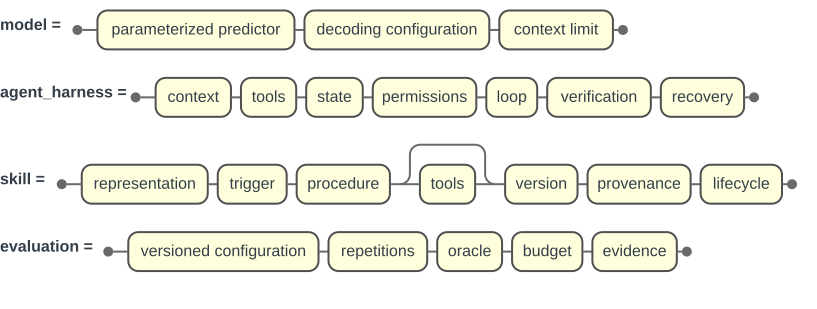
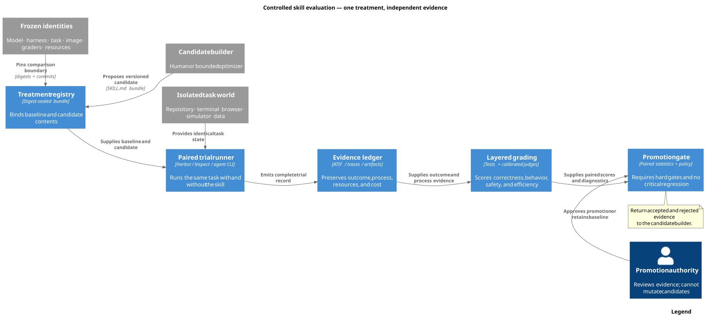
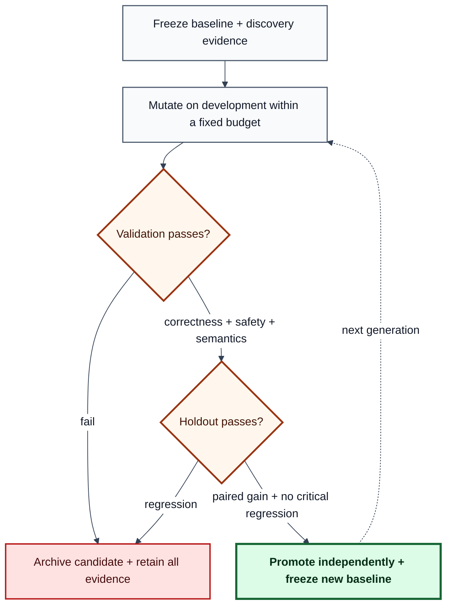

The difficult question is no longer “which model scored highest?” It is:

> Did this exact skill improve this exact agent on unseen work, under a controlled
> environment and a promotion rule that the optimizer could not game?

That change in question explains the evolution of evaluation tooling. Static answer
benchmarks established comparability. Evals-as-code made tests repeatable. Interactive
benchmarks added tools and state. Containerized task environments made complete work
verifiable. Trace-aware optimizers then turned failures into candidate prompts, harnesses,
and skills. The modern system is therefore not one leaderboard. It is a controlled
software experiment with an execution layer, evidence layer, and promotion layer.

This article compares those layers, with **skill evaluation** as the deciding use case.
Here, a skill means a versioned directory of instructions and optional scripts,
references, and assets—often rooted at `SKILL.md`—that is injected into an otherwise
frozen agent. A system prompt alone can be a treatment, but it is not automatically a
portable skill.

**PDF edition:** [download the revised 16-page framework-selection guide](../../reports/modern-skill-evaluation-framework-selection-guide.pdf).

*Immutable traces accumulate into persistent knowledge; knowledge proposes a versioned
skill; an independent evaluation gate either promotes the candidate or returns its
outcome to the evidence base.*

## Four objects that must not be confused

The word *harness* is overloaded. A useful evaluation names four different objects:

*The RoadRails view uses Mermaid Railroad productions to define each artifact by its
operational components. It keeps model capability, orchestration, reusable procedure,
and measurement policy conceptually separate.*

If a run changes the model, scaffold, skill, and sandbox at once, its score may be useful
as a product snapshot but cannot identify what caused the change. Skill evolution
requires the skill to be the treatment and the other three objects to be frozen—or their
changes to be modeled explicitly.

## How evaluation reached the skill era

The lineage is cumulative. New stages did not make earlier ones obsolete; they added
controls that previous stages could not express.

*Each generation adds a new observable or experimental control while retaining the
useful components of earlier systems. Icons identify what was added; the matrix makes
what persists across generations explicit.*

### 1. From test sets to experiments

Classical ML evaluation coupled a frozen dataset to a metric. Experiment trackers such
as [MLflow](https://github.com/mlflow/mlflow) then made parameters, artifacts, runs, and
comparisons durable. This remains foundational: an agent score without the exact
configuration and artifacts that produced it is not reproducible evidence.

### 2. From one score to a measurement profile

[HELM](https://arxiv.org/abs/2211.09110) made the case for standardized scenarios,
multiple metrics, transparent prompts, and raw completions. This shifted the unit of
analysis from a benchmark number to a measurement profile: accuracy alongside
robustness, calibration, fairness, efficiency, and other constraints.

### 3. From papers to evals-as-code

[OpenAI Evals](https://github.com/openai/evals) popularized versioned datasets and
graders that could run alongside model development. Exact-match, custom, and
model-graded checks made evaluation easier to extend and automate. Its natural unit,
however, is still a model response. The proprietary, hosted
[OpenAI Evals API](https://platform.openai.com/docs/api-reference/evals) is a separate
service from the MIT-licensed repository.

### 4. From responses to trajectories

The [AgentBench paper](https://arxiv.org/abs/2308.03688) evaluated agents across
interactive environments. The [SWE-bench paper](https://arxiv.org/abs/2310.06770) tied
natural-language issues to real repositories and executable tests. The answer was no
longer enough: the agent had to inspect state, use tools, modify artifacts, and survive
a multi-step loop.

### 5. From a shared process to an isolated world

The [Terminal-Bench 2.0 paper](https://arxiv.org/abs/2601.11868) packages 89 realistic
terminal tasks with task-specific environments, human solutions, and tests. The
[Harbor framework](https://www.harborframework.com/docs)
([repository](https://github.com/harbor-framework/harbor)) generalizes that machinery
into agent/model evaluation and optimization. Harbor is documented as a framework
rather than by a canonical Harbor-framework paper; similarly named HARBOR papers
describe different systems. This matters for skills because instructions can change
file selection, dependency installation, tool choice, and recovery—not merely final
wording.

The environment is part of the treatment boundary. Anthropic measured a
six-percentage-point spread between its least- and most-resourced Terminal-Bench 2.0
setups, with `p < 0.01`. Small leaderboard gaps can therefore be infrastructure effects,
not agent improvements.

### 6. From evaluation to evolution

[DSPy](https://arxiv.org/abs/2310.03714) treats LM programs as optimizable rather than
hand-tuned strings. [GEPA](https://arxiv.org/abs/2507.19457) reflects on trajectories,
proposes textual changes, and retains complementary candidates on a Pareto frontier.
Its paper reports a six-task average gain over GRPO with up to 35× fewer rollouts; that is
evidence for those tasks, not a universal guarantee.

[Trace2Skill](https://arxiv.org/abs/2603.25158) takes the next step: it distills lessons
from pools of trajectories into transferable skill directories. These optimizers are
not substitutes for evaluation runners. They increase the need for hidden holdouts,
strong graders, and lineage because an optimizer will exploit whatever signal it sees.

### 7. From total agent score to incremental Skill Lift

The [ACES paper](https://arxiv.org/abs/2608.20614) and its open-source
[NVIDIA SkillEvaluator](https://github.com/NVIDIA/SkillEvaluator) implementation make
the skill itself the first-class evaluation target. Deterministic structure and safety
checks are followed by paired live trials with and without the skill under the same
task, model, harness, workspace, and scorer. The resulting **Skill Lift** estimates the
skill's contribution rather than reporting only total agent capability.

This is the decisive attribution control for skill evaluation. A strong agent score
does not show that the skill helped; the no-skill/with-skill contrast does.

### 8. From discarded trials to persistent knowledge

[WikiSkill](https://arxiv.org/abs/2608.27454), a Google Research and Virginia Tech
preprint submitted on August 27, 2026, adds a durable learning layer between execution
traces and executable skills. Its workspace separates an immutable **Raw Layer**, a
persistent **Wiki Layer**, and a gated **Skills Layer**. A Wiki Maintainer consolidates
failure patterns, successful strategies, proposal history, and validation outcomes. A
Skill Proposer uses that accumulated knowledge plus recent traces to produce candidates.
Validation can roll a skill back, but it does not roll the wiki back.

*Original reconstruction of WikiSkill Figure 2. Immutable traces feed a persistent
wiki; the proposer turns accumulated knowledge into gated skills; and the inference
agent receives active skills but never the wiki itself.*

The separation is empirically consequential within the paper's protocol. In a
four-benchmark Gemini-3.5-Flash ablation, giving the Skill Proposer wiki access while
withholding it from the Inference Agent raised the reported average from **48.7% to
63.7%**. Giving the Inference Agent wiki access during training reduced that result to
**60.9%**. The paper also reports that evolved skills can transfer across models and
sometimes outperform self-evolved skills. This distinguishes the ability to discover
procedural knowledge from the ability to execute it.

WikiSkill is currently a research design, not a drop-in open-source evaluation
framework. The study directly injects active skills, so it does not evaluate skill
retrieval or triggering; validation accepts only immediately improving proposals; the
wiki has no automated pruning mechanism; and the arXiv record does not link a public
implementation or code license as of August 30, 2026.

## The ten pillars of a modern skill evaluation

*Horizontal C4 container view. A study owner freezes the experiment; the orchestrator
runs paired baseline and candidate trials in an isolated task world; evidence and
scoring remain separate from the independent promotion authority.*

A framework is only as trustworthy as the protocol built on it. For skill evolution,
the minimum credible design has ten pillars.

1. **One declared treatment.** Freeze the model, agent harness, task version, resource
   policy, and graders while varying the skill. Record any unavoidable interaction.
2. **Realistic, isolated tasks.** Evaluate the actions the skill is meant to improve.
   File-editing skills need repositories and tests; RAG skills need evidence corpora;
   UI skills need a browser state, not answer-only questions.
3. **Immutable identity.** Digest the skill's complete directory, task, environment,
   scorer, dataset manifest, model settings, and harness commit—not only its name.
4. **Layered scoring.** Prefer deterministic tests for observable outcomes, then add
   semantic or policy judges where correctness cannot be fully encoded. A judge should
   cite the evidence it used.
5. **Disjoint data roles.** Separate discovery, candidate development, validation, and
   holdout. Holdout release is one-way; once inspected, a cohort becomes development
   data for the next generation.
6. **Trajectory evidence.** Preserve messages, tool calls, state transitions, artifacts,
   verifier output, time, tokens, and cost. Final success alone cannot explain why a
   skill worked.
7. **Hard gates plus trade-offs.** Correctness and safety are gates. Cost, latency, and
   token use can be Pareto objectives. An aggregate mean must not hide a critical
   subgroup regression.
8. **Uncertainty and pairing.** Use repeated, paired runs when stochasticity matters.
   Report counts, effect sizes or intervals, and worst-domain results—not false decimal
   precision.
9. **Failure taxonomy.** Do not retry semantic failures until they pass. Recover only
   verified provider or infrastructure failures under a predeclared policy, retaining
   the original attempt.
10. **Independent promotion.** Separate mutator, executor, evaluator, selector, and
     release authority. Calibrate LLM judges against blinded human review before they
     become promotion gates.

The [Reusable Holdout](https://arxiv.org/abs/1506.02629) formalizes the broader risk:
adaptive reuse of evaluation data can overfit the evaluation itself. Skill optimizers
make that risk operational. WikiSkill adds one more identity boundary: immutable traces,
the accumulated wiki, and the executable skill must be separately versioned. Only the
skill is the test-time treatment; the wiki is optimizer state with an explicit access
policy.

This is the AI equivalent of using inexpensive, frequent feedback during development
and a deeper architecture evaluation when cost or risk warrants it. The
[ATAM tradition](https://www.sei.cmu.edu/library/architecture-tradeoff-analysis-method-collection/)
also reminds us that fitness is multi-attribute: improving one quality can degrade
another.

## Capability comparison: what the frameworks actually evaluate

No row means “best overall.” The map describes each framework's native center of gravity
as of August 30, 2026. *Adapter* means the behavior is possible, but the user must define
the skill boundary or glue code.

*D3-generated ordinal capability map. `N` means native or first-class, `S` means strong
documented support, `A` means an adapter or manual convention, and `-` means outside the
framework's center of gravity. Dedicated evaluators are separated from runners,
libraries, evolution methods, and lifecycle platforms. Row totals are intentionally
meaningless.*

### Dedicated skill evaluators

| Framework | Native capabilities | Best reason to choose it | Critical caveat |
| --- | --- | --- | --- |
| [NVIDIA SkillEvaluator](https://github.com/NVIDIA/SkillEvaluator) | Deterministic structure, safety, PII and script checks; similarity/deduplication; paired live trials through Harbor | First-class skill directories, no-skill/with-skill Skill Lift, triggering, behavior, and cost evidence | Young project; live trials still need a provider, agent runtime, sandbox, task workspace, and reviewed task generation |
| [AWS sample skill-eval](https://github.com/aws-samples/sample-agent-skill-eval) | Lightweight safety, quality, reliability, and cost checks | Permissive, small CI starter | Reference sample, not a general task runner or mature benchmark ecosystem |
| [SkillTester](https://github.com/skilltester-ai/skilltester) | Paired utility and security probes | Native baseline-versus-skill and adversarial testing | Repository has no detected license; source visibility does not grant reuse rights |

The independent [framework-at-scale study](https://arxiv.org/abs/2606.17819) evaluated
500 skills, 1,000 generated tasks, and 19 agent-model configurations. Its central
operational lesson is that gains vary by runtime: a skill's quality is conditional on
the model and harness that execute it.

### Task runners and evaluation libraries

| Framework | Best fit | Evidence and scoring | Skill-specific limitation |
| --- | --- | --- | --- |
| [Harbor](https://github.com/harbor-framework/harbor) | Containerized terminal, repository, browser, data, and artifact tasks | Complete trajectories, artifacts, executable verifiers, model judges, time, tokens, and cost | Strong skill identity and execution substrate; paired protocol and promotion governance remain study responsibilities |
| [Inspect AI](https://inspect.aisi.org.uk/) | Custom Python evaluation programs, safety studies, and varied sandbox backends | Solvers, scorers, limits, logs, rescoring, and human intervention | Skill bundle is an adapter or experiment convention, not the native unit |
| [Promptfoo](https://github.com/promptfoo/promptfoo) | Provider matrices, CI assertions, and red teaming | Declarative assertions, custom code, judges, latency, and cost | Provider runtime is not a general isolated task world |
| [OpenAI Evals](https://github.com/openai/evals) | Response datasets and custom graders | Exact, custom, and model-graded checks | No general skill bundle or agent sandbox in the OSS runner |
| [DeepEval](https://github.com/confident-ai/deepeval) | Python and pytest workflows, including agent paths | Task, tool, sub-agent, custom DAG, and model-judge metrics | Prompt optimization is not generic search over complete skill directories |
| [Ragas](https://github.com/vibrantlabsai/ragas) | RAG and retrieval-centered systems | Retrieval/generation quality, messages, context, and tool metrics | Pair with a runner when the agent changes external state |
| [Pydantic Evals](https://ai.pydantic.dev/evals/) | Typed Python applications | Typed evaluators and OpenTelemetry span assertions | Function runtime is not an isolated task-world abstraction |

**Choice rule:** use NVIDIA SkillEvaluator for a ready-made skill gate; Harbor when the
task world or evaluator must be bespoke; and Inspect AI when evaluation-program
flexibility, safety controls, rescoring, or sandbox diversity matters most.

### Lifecycle platforms

| Framework | What it adds | What it does not replace |
| --- | --- | --- |
| [MLflow](https://github.com/mlflow/mlflow) | Runs, datasets, artifacts, traces, scorers, registry, and production feedback | A clean terminal or browser task world |
| [Langfuse](https://github.com/langfuse/langfuse) | Self-hosted or managed traces, datasets, experiments, scores, and user feedback | Skill locking and holdout governance |
| [Phoenix](https://github.com/Arize-ai/phoenix) | OpenInference/OpenTelemetry spans, datasets, and evaluation | OSI-open licensing and isolated execution |
| [LangSmith](https://docs.langchain.com/langsmith/evaluation) | Managed datasets, trajectories, pairwise evaluation, online traces, and feedback | An open-source, portable task runner |

These systems preserve lifecycle evidence; they do not by themselves prove that a
candidate skill caused a result.

### Evolution and library operations are not evaluation frameworks

| Method | Distinctive state | Evaluation still required | Adoption posture |
| --- | --- | --- | --- |
| [Microsoft SkillOpt](https://github.com/microsoft/SkillOpt) | Bounded add/delete/replace edits, rejected-edit memory, validation gates, and slow meta-updates | Real task execution, independent splits, calibrated scoring, and an untouched promotion holdout | MIT implementation and [paper](https://arxiv.org/abs/2605.23904) from Microsoft Research |
| [SkillOps](https://github.com/Hik289/SkillOps) | Typed skill contracts plus graph health, merge, repair, retirement, validators, and adapters | Utility, triggering, behavior, safety, and generalization evidence | Separate MIT project from Emory/UIUC; [paper](https://arxiv.org/abs/2605.13716) |
| [GEPA](https://arxiv.org/abs/2507.19457) | Reflective proposals plus a Pareto frontier | Task runner, case feedback, disjoint validation, and sealed holdout | Available through open DSPy tooling |
| [Trace2Skill](https://arxiv.org/abs/2603.25158) | Trajectory-local lessons consolidated into transferable skills | Independent evidence beyond the traces used to distill | Research method; verify the selected implementation and license |
| [WikiSkill](https://arxiv.org/abs/2608.27454) | Immutable traces, persistent wiki, proposal impact history, and gated skills | Real task worlds, calibrated graders, holdout governance, and retrieval evaluation | Public preprint; no public implementation or code license linked as of August 30, 2026 |

**Naming clarification:** **SkillOpt is Microsoft's optimizer. SkillOps is the separate
Emory/UIUC skill-library project.** Microsoft's ACES cyber repository is also distinct
from the ACES skill-evaluation method implemented by NVIDIA SkillEvaluator.

The optimizer proposes or selects treatments; it does not prove that they generalize.
Keep the evaluator and promotion authority independently specified.

## License, deployment, and community

GitHub stars and forks are coarse adoption signals—not measures of evaluation validity.
This snapshot is from the GitHub API on August 30, 2026.

| Framework | License posture | Stars | Forks | Operational fit |
| --- | --- | ---: | ---: | --- |
| NVIDIA SkillEvaluator | Apache-2.0 | 354 | 34 | Open, dedicated skill-evaluation implementation |
| AWS sample skill-eval | MIT-0 | 14 | 3 | Small reference implementation |
| SkillTester | No detected license | 36 | 2 | Source-visible; permission required for reuse |
| Harbor | Apache-2.0 | 4,774 | 1,683 | Local or cloud task execution and optimization substrate |
| Inspect AI | MIT | 2,663 | 682 | Open Python research/evaluation runtime |
| Promptfoo | MIT | 24,672 | 2,250 | Large JS/TS, CI, and security community |
| OpenAI Evals repository | MIT code; dataset terms vary | 19,307 | 3,069 | OSS runner distinct from hosted services |
| DeepEval | Apache-2.0 | 17,962 | 1,875 | Python/pytest and agent metrics |
| Ragas | Apache-2.0 | 15,544 | 1,662 | RAG and retrieval-centered ecosystem |
| Pydantic AI repository | MIT | 19,583 | 2,616 | Repo-wide count includes Pydantic Evals |
| Microsoft SkillOpt | MIT | 16,484 | 1,549 | Large early skill-optimization community |
| SkillOps | MIT | 62 | 6 | Early typed skill-library project |
| MLflow | Apache-2.0 | 27,735 | 6,234 | Broad experiment and lifecycle platform |
| Langfuse | MIT core; enterprise terms differ | 33,923 | 3,666 | Self-hosted or managed observability |
| Phoenix | Elastic License 2.0 | 11,247 | 1,084 | Source available, **[not OSI open source](https://opensource.org/osd)** |
| LangSmith | Proprietary | Not comparable | Not comparable | Managed LangChain-centered platform |

“Public on GitHub” is not a license. GitHub's own guidance states that, without a
license, default copyright applies and others do not receive permission to reproduce,
distribute, or create derivative works.

## What fits which software

Choose from the shape of the work, then add any missing layer.

*Start with the artifact that must be correct, not with a vendor feature list. An
evolving skill requires response, trajectory, and changed-world evidence.*

- **Terminal, coding, data transformation, or artifact-producing agents:** start with
  NVIDIA SkillEvaluator over Harbor when the paired skill protocol fits. Use Harbor
  directly for a bespoke evaluator. Pin CPU, RAM, time, network, images, agent, model,
  and skill digests.
- **Authoring-time or CI quality gate for a skill directory:** use NVIDIA SkillEvaluator
  for the fuller three-tier workflow; use the AWS sample when a compact starter is more
  appropriate.
- **Safety research, custom agent loops, multi-agent studies, or heterogeneous
  sandboxes:** start with Inspect AI. Define a clear skill adapter and persist its
  content digest.
- **Prompt/provider matrices, CI assertions, and red teaming:** use Promptfoo. It is
  fast to adopt and especially natural in JavaScript/TypeScript delivery pipelines.
- **Python unit-test ergonomics and agent-path metrics:** use DeepEval. For strongly
  typed application functions and span assertions, Pydantic Evals is the cleaner fit.
- **RAG pipelines:** use Ragas for retrieval and answer-quality metrics, then pair it
  with Harbor or Inspect if the agent also manipulates stateful external artifacts.
- **Model-response registries and custom graders:** OpenAI Evals remains a compact OSS
  option. Use the hosted Evals API only when a proprietary OpenAI service is acceptable.
- **Production traces and continuous feedback:** use MLflow or Langfuse for an
  open-source core. Evaluate Phoenix's ELv2 terms against the deployment model. Choose
  LangSmith when managed service convenience and LangChain integration outweigh
  portability and license constraints.
- **Automatic prompt, harness, or skill evolution:** pair a runner with SkillOpt, GEPA,
  DSPy, or a purpose-built mutator. SkillOps is useful for library operations, not as
  proof of runtime improvement. The optimizer proposes; a disjoint evaluator and
  promotion gate decide.

In practice, a mature stack is often **NVIDIA SkillEvaluator for the skill-native gate +
Harbor or Inspect for offline execution + Langfuse or MLflow for lifecycle evidence + a
controlled optimizer for candidate generation**. One product rarely dominates every
layer.

## The local evolution: Skill Arena, Harbor, and Knowledge

The local repositories provide a useful small-scale case study because they preserve
failed promotions instead of presenting only winners.

The current [Skill Arena](https://github.com/mvk-001/skill-arena) is no longer a
maintained standalone Promptfoo translation runtime. It is a set of eleven atomic
workflow skills around native Harbor jobs: study organization, result analysis,
verified external-failure recovery, population search, trace distillation, reflective
Pareto search, operator coevolution, GEPA-guided evolution, candidate realization, and
meta-policy auditing.

Its frozen July 16, 2026 comparison contains **24 Harbor jobs and 78 trials** across
development and holdout, with no recorded errors or retries. Trace distillation and
reflective Pareto search tied for the strongest selected holdout mean. This is valuable
operational evidence for those tasks and budgets—not proof of a universal winner.
Follow-on reports correctly label causal gain as *not identifiable* when no comparable
execution exists.

The [Knowledge evaluation index](https://github.com/gvillarroel/knowledge/blob/main/evaluations/SKILL-EXPLORATION-AND-EVOLUTION.md)
shows why promotion gates matter:

- A Graphify Next candidate won both development datasets and the mean holdout, yet
  regressed the Astro holdout cell; the zero-regression rule retained the baseline.
- A Tantivy consultant passed all four development trials and then failed to qualify on
  the two-question holdout.
- A token-optimized Classical candidate reduced recorded tokens by **98.674426%** and
  passed its numeric metrics, but independent semantic review found regressions in four
  of six cases. It was rejected.

The lesson is not “never optimize.” It is that a cheaper or higher-mean candidate is
not an improvement when it crosses a predeclared quality boundary. Development selects
what deserves scrutiny; holdout decides what may be promoted.

Both supporting repositories and the reports cited above are public. No private
knowledge-corpus text, retrieval output, or unpublished evaluation artifact is copied
into this article.

## The selection rule

If the primary artifact is a **final response**, choose an output-evaluation framework.
If it is a **trace**, choose an agent-aware scorer and observability layer. If it is a
**changed world**, choose an isolated task runner. If it is an **evolving skill**, require
all three—and add immutable skill provenance, disjoint splits, and independent
promotion.

For open, reproducible skill evolution, the strongest ready-made default is currently:

1. **NVIDIA SkillEvaluator** as the skill-native quality gate;
2. **Harbor** as the isolated paired-execution and artifact substrate;
3. **deterministic task tests plus calibrated semantic review** as the scoring layer;
4. **SkillOpt, GEPA, trace distillation, Pareto search, or another bounded optimizer**
   only for proposing candidates;
5. **disjoint development, validation, and sealed holdout evidence** plus an independent
   promotion authority; and
6. **MLflow or Langfuse** when long-lived experiment and production trace management is
   needed.

Inspect AI is the best open alternative when evaluation-program flexibility matters
more than first-class `SKILL.md` handling. Promptfoo is the pragmatic choice for
prompt/provider CI and red teaming. The remaining frameworks are valuable specialists,
not lesser products: they solve different layers of the measurement system.

The durable insight is simple: **skill evolution is experimental software engineering**.
The optimizer is allowed to be creative. The evaluator must be boring, versioned,
skeptical, and difficult to game.
