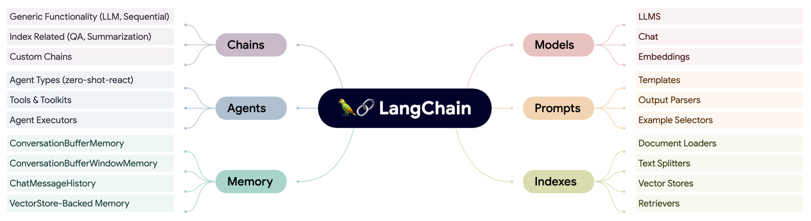

> Editorial status: this note was migrated from the original repository layout. It is
> intentionally a draft because the ecosystem, APIs, and comparison data need a fresh
> primary-source review before publication.

LangChain is a framework for composing applications around language models. Its useful
idea is not a single abstraction but the boundary it draws between model invocation,
prompt construction, retrieval, tool use, state, and orchestration. That decomposition
can make experiments faster, but each abstraction also adds a dependency and a choice
about where application logic should live.

## A working component map

- **Models** normalize access to language and embedding models.
- **Prompts** make model inputs explicit and reusable.
- **Retrieval** connects model calls to external information.
- **Tools** expose constrained application capabilities to a model-driven workflow.
- **Memory or state** carries information across steps or interactions.
- **Chains and agents** coordinate fixed or model-selected sequences of work.

The practical design question is where the framework removes accidental complexity and
where it hides behavior that the application needs to observe, test, or control. A
publishable revision of this note should evaluate those trade-offs with current API
examples, failure modes, and alternatives rather than relying on feature lists.

## Revision checklist

1. Rebuild the component map from current LangChain documentation.
2. Compare fixed workflows with agent-selected control flow.
3. Add an observable, testable example with explicit failure handling.
4. Compare at least two alternatives using the same requirements.
5. Verify every time-sensitive claim immediately before publication.
