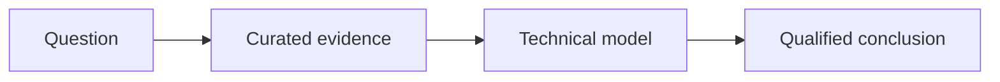

> Copy this file into `src/content/posts/`, rename it with a durable slug, and remove
> this note. Keep the post as a draft until its evidence and rendered output pass review.

State the question and the conclusion early. Explain why the question matters and name
the constraints under which the conclusion holds.

## The model

Synthesize the shared mechanism across sources. Separate observations, interpretations,
and recommendations. Preserve disagreements instead of averaging them away.

## Trade-offs

Describe costs, failure modes, and situations where the recommendation changes.

## Verification

Give the reader a reproducible way to test the important claim. Link each consequential
or time-sensitive assertion to a reference, and re-check current facts before publishing.
